    ## Loading tidyverse: ggplot2
    ## Loading tidyverse: tibble
    ## Loading tidyverse: tidyr
    ## Loading tidyverse: readr
    ## Loading tidyverse: purrr
    ## Loading tidyverse: dplyr

    ## Conflicts with tidy packages ----------------------------------------------

    ## filter(): dplyr, stats
    ## lag():    dplyr, stats

Understanding the dependent variable
====================================

My first step was to explore the dependent variable, G3. I calculated its mean and median, I made a histogram in order to understand its distribution, and I made a variety of plots and calculations to understand how Portuguese grades compare with math grades.

``` r
# Distribution of G3 grades
mean(d_total$G3, na.rm = TRUE) # ~11.34
```

    ## [1] 11.34195

``` r
median(d_total$G3, na.rm = TRUE) # 11
```

    ## [1] 11

``` r
ggplot(d_total, aes(x = G3)) +
  geom_histogram(aes(y = ..density..), binwidth = 1) +
  stat_function(fun = dnorm,
                args = list(mean = mean(d_total$G3, na.rm = TRUE), sd = sd(d_total$G3, na.rm = TRUE)),
                lwd = 1,
                col = "red") +
  xlab("Final Grade")
```

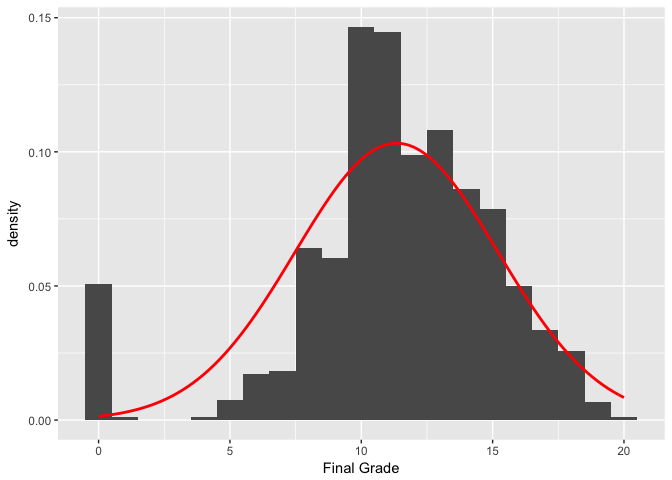

``` r
# How do distributions of math and Portuguese grades compare?
ggplot(d_total, aes(x = G3)) +
  geom_histogram(aes(y = ..density..), binwidth = 1) +
  stat_function(fun = dnorm,
                args = list(mean = mean(d_total$G3, na.rm = TRUE), sd = sd(d_total$G3, na.rm = TRUE)),
                lwd = 1,
                col = "red") +
  xlab("Final Grade") +
  facet_grid(. ~ course) 
```

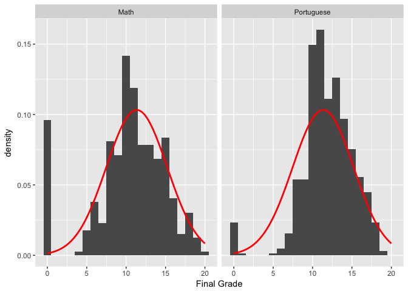

``` r
ggplot(d_total, aes(x = G3, y = ..density.., col = course)) +
  geom_freqpoly(binwidth = 1, position = "identity") +
  xlab("Final Grade")
```

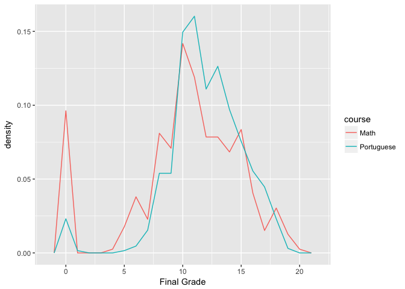

``` r
ggplot(d_total, aes(x=course, y=G3,colour=course)) + 
  geom_boxplot(notch = T) +
  xlab("Math vs. Portuguese") + ylab("Final Grade")+
  geom_jitter(shape=16, position=position_jitter(0.1))
```

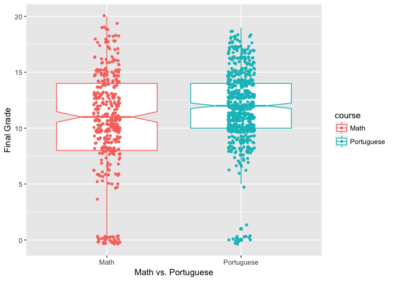

``` r
mean(d_math$G3, na.rm = TRUE) # ~10.42
```

    ## [1] 10.41519

``` r
median(d_math$G3, na.rm = TRUE) # 11
```

    ## [1] 11

``` r
mean(d_port$G3, na.rm = TRUE) # ~11.91
```

    ## [1] 11.90601

``` r
median(d_port$G3, na.rm = TRUE) # 12
```

    ## [1] 12

``` r
nrow(d_math[d_math$G3 < 2, ]) / nrow(d_math) # ~9.6% 
```

    ## [1] 0.09620253

``` r
nrow(d_port[d_port$G3 < 2, ]) / nrow(d_port) # ~2.5% 
```

    ## [1] 0.02465331

``` r
nrow(d_math[d_math$G3 >= 18, ]) / nrow(d_math) # ~4.6%
```

    ## [1] 0.04556962

``` r
nrow(d_port[d_port$G3 >= 18, ]) / nrow(d_port) # ~2.6%
```

    ## [1] 0.02619414

I learned that the distribution of G3 approximates a normal curve. Math grades averaged lower than Portuguese grades, and students were more likely to fail math than Portuguese, but a higher percentage of math students got very high grades than did Portuguese students.

G1 and G2 as predictor variables
================================

I assumed that a student's interim grades at G1 and G2 would be very strong predictors of final grade G3. This was easy to confirm with scatterplots, which show a strong linear relationship between interim grades and final grades.

``` r
ggplot(d_total, aes(x=G1, y=G3)) +
         geom_point(position = "jitter", alpha=0.6) +
         xlab("First period grade") + ylab("Final grade")
```

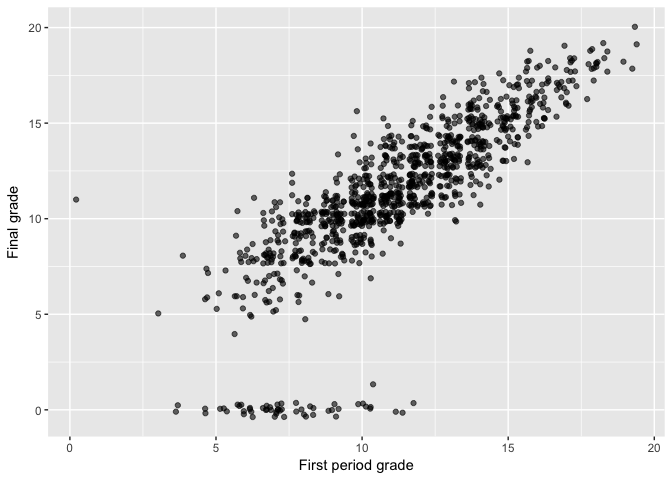

``` r
ggplot(d_total, aes(x=G2, y=G3)) +
  geom_point(position = "jitter", alpha=0.6) +
  xlab("Second period grade") + ylab("Final grade")
```

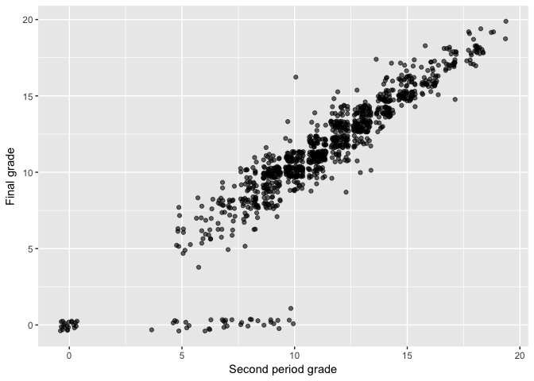

``` r
summary(aov(G3 ~ G1 + G2, data = d_total)) # ANOVA confirms significance of G1 and G2.
```

    ##               Df Sum Sq Mean Sq F value Pr(>F)    
    ## G1             1  10200   10200    4063 <2e-16 ***
    ## G2             1   2766    2766    1102 <2e-16 ***
    ## Residuals   1041   2614       3                   
    ## ---
    ## Signif. codes:  0 '***' 0.001 '**' 0.01 '*' 0.05 '.' 0.1 ' ' 1

Predictor variables that are particular to the course (math or Portuguese)
==========================================================================

There are five variables that are particular to the course of study: studytime, failures, schoolsup, famsup, and paid. For each of these variables, I made boxplots in order to compare the mean and median scores for each level of the variable, and I made various other scatterplots. I also did either the one-way ANOVA test or the Student T-test to understand more about the statistical significance of each variable.

Studytime: weekly study time for the course
-------------------------------------------

``` r
ggplot(d_total, aes(x=studytime, y=G3,colour=studytime)) + 
  geom_boxplot(notch = T) +
  xlab("Study Time Per Week") + ylab("Final Grade")+
  geom_jitter(shape=16, position=position_jitter(0.1))
```

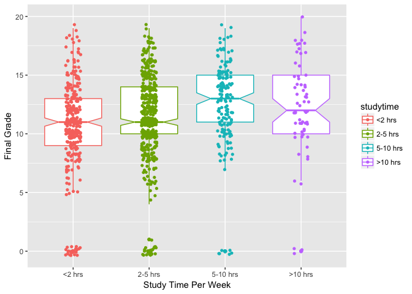

``` r
# Highest median grades among students who study 5-10 hrs/week.

summary(aov(G3 ~ studytime, data = d_total)) # p-value is 9.92e-07, significant.
```

    ##               Df Sum Sq Mean Sq F value   Pr(>F)    
    ## studytime      3    453  150.89   10.37 9.92e-07 ***
    ## Residuals   1040  15126   14.54                     
    ## ---
    ## Signif. codes:  0 '***' 0.001 '**' 0.01 '*' 0.05 '.' 0.1 ' ' 1

``` r
# Is it different for math and Portuguese?
summary(aov(G3 ~ studytime, data = d_math)) # p-value = ~5.2%, not significant (barely)
```

    ##              Df Sum Sq Mean Sq F value Pr(>F)
    ## studytime     3    108   36.07   1.728  0.161
    ## Residuals   391   8162   20.87

``` r
summary(aov(G3 ~ studytime, data = d_port)) # p-value = 1.09e-10, significant
```

    ##              Df Sum Sq Mean Sq F value   Pr(>F)    
    ## studytime     3    465  155.03   15.88 5.71e-10 ***
    ## Residuals   645   6298    9.76                     
    ## ---
    ## Signif. codes:  0 '***' 0.001 '**' 0.01 '*' 0.05 '.' 0.1 ' ' 1

``` r
# Study time has a bigger impact on Portuguese grades than on math grades.
summary(aov(G3 ~ studytime*course, data = d_total)) # Confirmed.
```

    ##                    Df Sum Sq Mean Sq F value   Pr(>F)    
    ## studytime           3    453   150.9  10.811 5.36e-07 ***
    ## course              1    606   606.3  43.439 6.95e-11 ***
    ## studytime:course    3     60    20.0   1.434    0.231    
    ## Residuals        1036  14460    14.0                     
    ## ---
    ## Signif. codes:  0 '***' 0.001 '**' 0.01 '*' 0.05 '.' 0.1 ' ' 1

Failures: previous failures in the subject area
-----------------------------------------------

``` r
ggplot(d_total, aes(x=failures, y=G3,colour=failures)) + 
  geom_boxplot(notch = T) +
  xlab("# Courses Previously Failed") + ylab("Final Grade")+
  geom_jitter(shape=16, position=position_jitter(0.3))
```

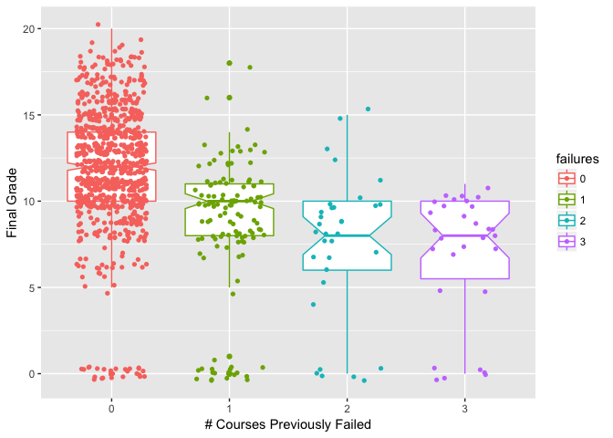

``` r
# Higher median grades among students with 0 failures. No high grades among students with several failures.

# Previous failures appear rare. What % of students never previously failed?
nrow(d_total[d_total$failures == 0, ]) / nrow(d_total) # ~82.5% of students.
```

    ## [1] 0.8247126

``` r
# A portion of students absolutely fail regardless of whether they've failed before, 
# but this is much more likely for students who have previously failed.
nrow(d_total[d_total$G3 < 2 & d_total$failures == 0, ]) / nrow(d_total[d_total$failures == 0, ]) # ~2.8%
```

    ## [1] 0.02787456

``` r
nrow(d_total[d_total$G3 < 2 & d_total$failures == 1, ]) / nrow(d_total[d_total$failures == 1, ]) # 15%
```

    ## [1] 0.15

``` r
nrow(d_total[d_total$G3 < 2 & d_total$failures == 2, ]) / nrow(d_total[d_total$failures == 2, ]) # ~18.2%
```

    ## [1] 0.1818182

``` r
nrow(d_total[d_total$G3 < 2 & d_total$failures == 3, ]) / nrow(d_total[d_total$failures == 3, ]) # 20%
```

    ## [1] 0.2

``` r
summary(aov(G3 ~ failures, data = d_total)) # p-value < 2e-16, significant.
```

    ##               Df Sum Sq Mean Sq F value Pr(>F)    
    ## failures       3   2568   856.0   68.43 <2e-16 ***
    ## Residuals   1040  13011    12.5                   
    ## ---
    ## Signif. codes:  0 '***' 0.001 '**' 0.01 '*' 0.05 '.' 0.1 ' ' 1

Schoolsup: extra educational support in the subject area
--------------------------------------------------------

``` r
ggplot(d_total, aes(x=schoolsup, y=G3,color=schoolsup)) + 
  geom_boxplot(notch = T) +
  xlab("Extra Educational Support") + ylab("Final Grade")+
  geom_jitter(shape=16, position=position_jitter(0.3))
```

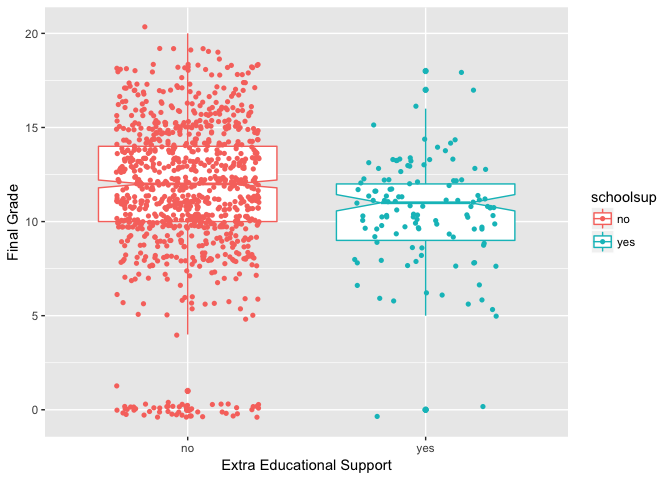

``` r
# Students not getting support have higher median and mean grades.

t.test(G3 ~ schoolsup, data = d_total) # p-value = 0.0007223, significant.
```

    ## 
    ##  Welch Two Sample t-test
    ## 
    ## data:  G3 by schoolsup
    ## t = 3.4369, df = 190.66, p-value = 0.0007223
    ## alternative hypothesis: true difference in means is not equal to 0
    ## 95 percent confidence interval:
    ##  0.4109605 1.5180334
    ## sample estimates:
    ##  mean in group no mean in group yes 
    ##          11.45189          10.48739

Famsup: family educational support in the subject area
------------------------------------------------------

``` r
ggplot(d_total, aes(x=famsup, y=G3, col = course)) +
  geom_point(position = "jitter", alpha = 0.6) +
  xlab("Family Educational Support") + ylab("Final Grade")
```

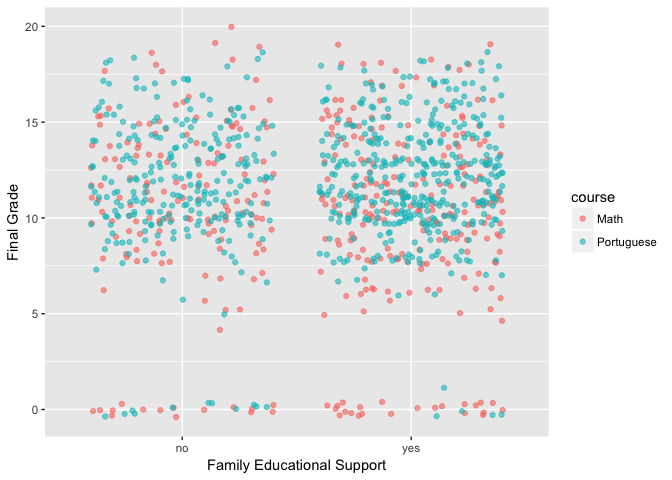

``` r
# No apparent correlations here, confirmed by t-test giving p-value = 67.3%.
t.test(G3 ~ famsup, data = d_total)
```

    ## 
    ##  Welch Two Sample t-test
    ## 
    ## data:  G3 by famsup
    ## t = -0.42225, df = 807.22, p-value = 0.673
    ## alternative hypothesis: true difference in means is not equal to 0
    ## 95 percent confidence interval:
    ##  -0.5964167  0.3852471
    ## sample estimates:
    ##  mean in group no mean in group yes 
    ##          11.27723          11.38281

Paid: paid tutoring in the subject area
---------------------------------------

``` r
ggplot(d_total, aes(x=paid, y=G3,color=paid)) + 
  geom_boxplot(notch = T) +
  xlab("Extra Paid Classes") + ylab("Final Grade")+
  geom_jitter(shape=16, position=position_jitter(0.3))
```

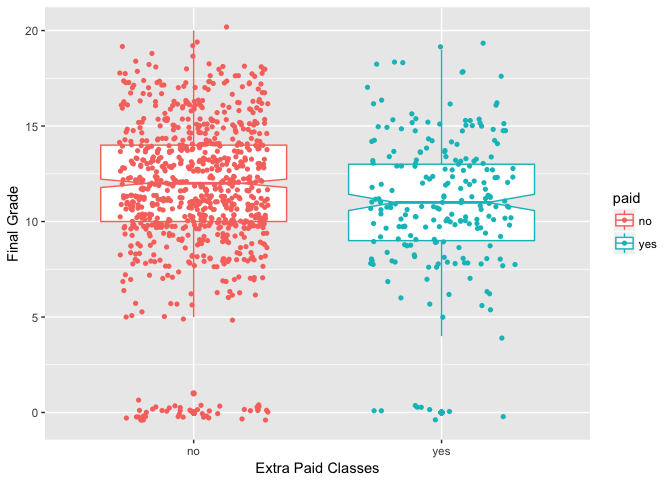

``` r
# Higher median grades among students who don't get support.

ggplot(d_total, aes(x=paid, y=G3, col = course)) +
  geom_point(position = "jitter", alpha = 0.6) +
  xlab("Extra Paid Classes") + ylab("Final Grade")
```

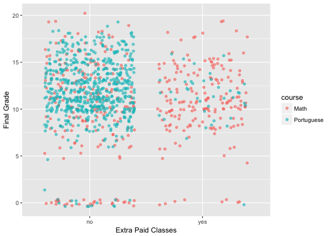

``` r
# A lot of math students pay for extra help! What percent? Compared to Portuguese students?
sum(d_math$paid == "yes") / nrow(d_math) # ~46%
```

    ## [1] 0.4582278

``` r
sum(d_port$paid == "yes") / nrow(d_port) # ~6%
```

    ## [1] 0.06009245

``` r
# Does paid help improve outcomes for math students?
nrow(d_math[d_math$G3 < 2 & d_math$paid == "yes", ]) / sum(d_math$paid == "yes") # ~4.4%
```

    ## [1] 0.0441989

``` r
nrow(d_math[d_math$G3 < 2 & d_math$paid == "no", ]) / sum(d_math$paid == "no") # ~14%
```

    ## [1] 0.1401869

``` r
# Yes, paid math help decreases the rate of math failure substantially.

# T-test analysis of impact of paid help shows it only helps for math.
t.test(G3 ~ paid, data = d_total) # p-value = 9.6%, not significant.
```

    ## 
    ##  Welch Two Sample t-test
    ## 
    ## data:  G3 by paid
    ## t = 1.6666, df = 366.44, p-value = 0.09645
    ## alternative hypothesis: true difference in means is not equal to 0
    ## 95 percent confidence interval:
    ##  -0.08416777  1.01978119
    ## sample estimates:
    ##  mean in group no mean in group yes 
    ##          11.44053          10.97273

``` r
t.test(G3 ~ paid, data = d_math) # p-value = ~3.8%, significant.
```

    ## 
    ##  Welch Two Sample t-test
    ## 
    ## data:  G3 by paid
    ## t = -2.0831, df = 386.36, p-value = 0.0379
    ## alternative hypothesis: true difference in means is not equal to 0
    ## 95 percent confidence interval:
    ##  -1.82075017 -0.05259108
    ## sample estimates:
    ##  mean in group no mean in group yes 
    ##          9.985981         10.922652

``` r
t.test(G3 ~ paid, data = d_port) # p-value = ~12.3%, not significant.
```

    ## 
    ##  Welch Two Sample t-test
    ## 
    ## data:  G3 by paid
    ## t = 1.5707, df = 44.571, p-value = 0.1233
    ## alternative hypothesis: true difference in means is not equal to 0
    ## 95 percent confidence interval:
    ##  -0.2107643  1.7021472
    ## sample estimates:
    ##  mean in group no mean in group yes 
    ##          11.95082          11.20513

I learned that all of these variables except famsup have some correlation with G3. Failures are an especially significant variable. Paid tutoring has much more impact on math grades than on Portuguese grades. Interestingly, students receiving schoolsup average lower grades, but this may be explained because weaker students are more likely to seek out extra academic support. Another interesting outcome is that the students in the second-highest bin for studytime average higher grades than those in the highest bin.

Predictor variables that are not particular to the course
=========================================================

With 25 more variables to explore, I made dozens of plots and ran many, many T-tests and ANOVA tests.

Here are some of my most interesting observations and the code that reveals them:

Students at the school GP were significantly more likely to fail math; students at the school MS were significantly more likely to fail Portuguese.
---------------------------------------------------------------------------------------------------------------------------------------------------

``` r
ggplot(d_total, aes(x=school, y=G3, col = course)) +
  geom_point(position = "jitter", alpha = 0.6) +
  xlab("School") + ylab("Final Grade")
```

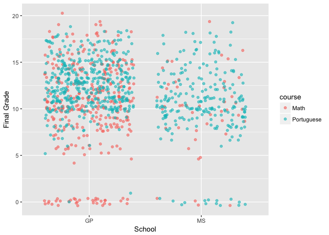

``` r
# It looks like a lot more students fail math at GP than at MS
nrow(d_total[d_total$school == "GP" & d_total$course == "Math" & d_total$G3 < 2, ]) / nrow(d_total[d_total$school == "GP", ]) # ~4.4%
```

    ## [1] 0.04404145

``` r
nrow(d_total[d_total$school == "MS" & d_total$course == "Math" & d_total$G3 < 2, ]) / nrow(d_total[d_total$school == "MS", ]) # ~1.5%
```

    ## [1] 0.01470588

``` r
# GP has about 3 times the math failure rate of MS.
nrow(d_total[d_total$school == "GP" & d_total$course == "Portuguese" & d_total$G3 < 2, ]) / nrow(d_total[d_total$school == "GP", ]) # ~.26%
```

    ## [1] 0.002590674

``` r
nrow(d_total[d_total$school == "MS" & d_total$course == "Portuguese" & d_total$G3 < 2, ]) / nrow(d_total[d_total$school == "MS", ]) # ~5.1%
```

    ## [1] 0.05147059

``` r
t.test(G3 ~ school, data = d_total) # p-value = 5.168e-05, significant
```

    ## 
    ##  Welch Two Sample t-test
    ## 
    ## data:  G3 by school
    ## t = 4.0861, df = 464.45, p-value = 5.168e-05
    ## alternative hypothesis: true difference in means is not equal to 0
    ## 95 percent confidence interval:
    ##  0.5806997 1.6567279
    ## sample estimates:
    ## mean in group GP mean in group MS 
    ##         11.63342         10.51471

Female students average higher grades in Portuguese; male students average higher grades in math.
-------------------------------------------------------------------------------------------------

``` r
ggplot(d_total, aes(x=sex, y=G3, color=sex)) +
  geom_boxplot(notch = T) +
  xlab("Sex") + ylab("Final Grade")+
  geom_jitter(shape=16, position=position_jitter(0.3)) +
  facet_grid(. ~ course) 
```

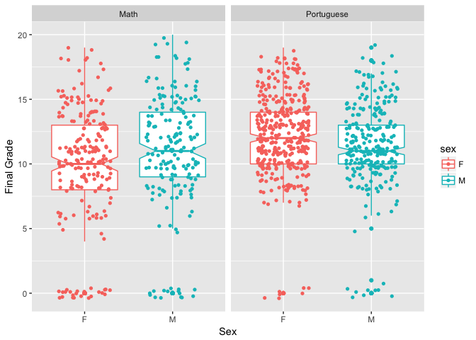

Average grades are higher among students with urban addresses than rural addresses.
-----------------------------------------------------------------------------------

``` r
ggplot(d_total, aes(x=address, y=G3, color=address)) +
  geom_boxplot(notch = T) +
  xlab("Rural or Urban") + ylab("Final Grade")+
  geom_jitter(shape=16, position=position_jitter(0.3))
```

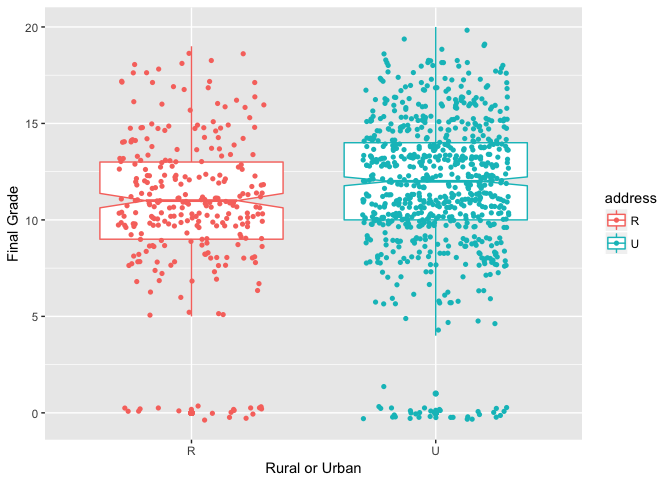

``` r
t.test(G3 ~ address, data = d_total) # p-value = 0.0002071, significant
```

    ## 
    ##  Welch Two Sample t-test
    ## 
    ## data:  G3 by address
    ## t = -3.7384, df = 488.26, p-value = 0.0002071
    ## alternative hypothesis: true difference in means is not equal to 0
    ## 95 percent confidence interval:
    ##  -1.556940 -0.484167
    ## sample estimates:
    ## mean in group R mean in group U 
    ##        10.60000        11.62055

Average grades are higher among students with smaller family size.
------------------------------------------------------------------

``` r
ggplot(d_total, aes(x=famsize, y=G3,color=famsize)) +
  geom_boxplot(notch = T) +
  xlab("Family Size") + ylab("Final Grade")+
  geom_jitter(shape=16, position=position_jitter(0.3))
```

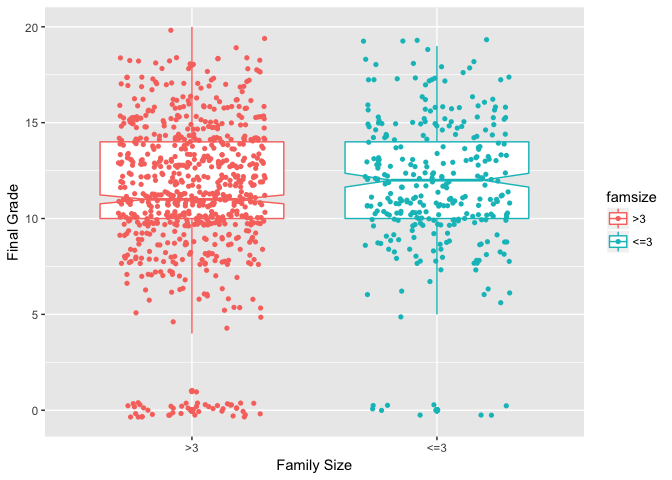

Both mother's and father's level of education is significant to students' grades, on average. Interestingly, among students whose mother's have little or no education, many more are female than male.
-------------------------------------------------------------------------------------------------------------------------------------------------------------------------------------------------------

``` r
ggplot(d_total, aes(x=Medu, y=G3,color=Medu)) +
  geom_boxplot(notch = F) +
  xlab("Mother's Education") + ylab("Final Grade")+
  geom_jitter(shape=16, position=position_jitter(0.1))
```

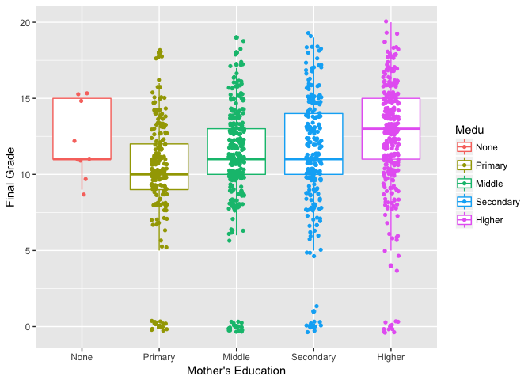

``` r
ggplot(d_total, aes(x=Fedu, y=G3,color=Fedu)) +
  geom_boxplot(notch = F) +
  xlab("Father's Education") + ylab("Final Grade")+
  geom_jitter(shape=16, position=position_jitter(0.1))
```

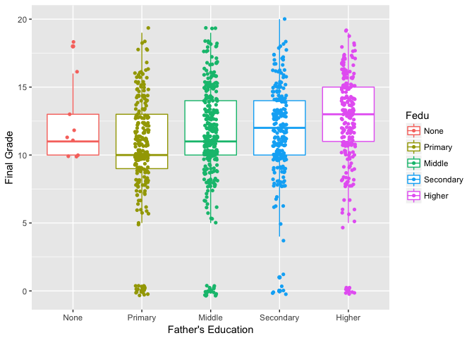

``` r
nrow(d_total[d_total$Medu %in% c("none", "primary", "upper primary") & d_total$sex == "F", ]) / nrow(d_total[d_total$Medu %in% c("none", "primary", "upper primary"), ])
```

    ## [1] NaN

``` r
# 62% of students whose mothers have little education are female.
```

Not surprisingly, average grades are significantly higher among students who intend to pursue higher education.
---------------------------------------------------------------------------------------------------------------

``` r
ggplot(d_total, aes(x=higher, y=G3,color=higher)) +
  geom_boxplot(notch = T) +
  xlab("Wants to Pursue Higher Ed") + ylab("Final Grade")+
  geom_jitter(shape=16, position=position_jitter(0.3))
```

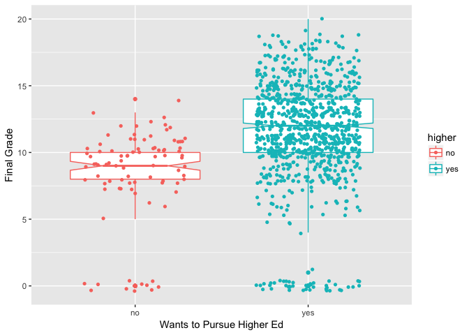

``` r
t.test(G3 ~ higher, data = d_total) # p-value = 3.68e-13, significant
```

    ## 
    ##  Welch Two Sample t-test
    ## 
    ## data:  G3 by higher
    ## t = -8.2813, df = 107.47, p-value = 3.68e-13
    ## alternative hypothesis: true difference in means is not equal to 0
    ## 95 percent confidence interval:
    ##  -4.055993 -2.489263
    ## sample estimates:
    ##  mean in group no mean in group yes 
    ##          8.348315         11.620942

Students who report higher levels of free time or going out with friends receive lower grades, on average.
----------------------------------------------------------------------------------------------------------

``` r
ggplot(d_total, aes(x=freetime, y=G3,color=freetime)) +
  geom_boxplot(notch = T) +
  xlab("Free Time After School") + ylab("Final Grade")+
  geom_jitter(shape=16, position=position_jitter(0.1))
```

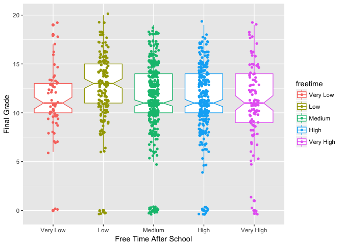

``` r
summary(aov(G3 ~ freetime, data = d_total)) # p-value = 3.61%, significant
```

    ##               Df Sum Sq Mean Sq F value Pr(>F)  
    ## freetime       4    188   46.88   3.165 0.0134 *
    ## Residuals   1039  15391   14.81                 
    ## ---
    ## Signif. codes:  0 '***' 0.001 '**' 0.01 '*' 0.05 '.' 0.1 ' ' 1

``` r
ggplot(d_total, aes(x=goout, y=G3,color=goout)) +
  geom_boxplot(notch = T) +
  xlab("Going Out with Friends") + ylab("Final Grade")+
  geom_jitter(shape=16, position=position_jitter(0.1))
```

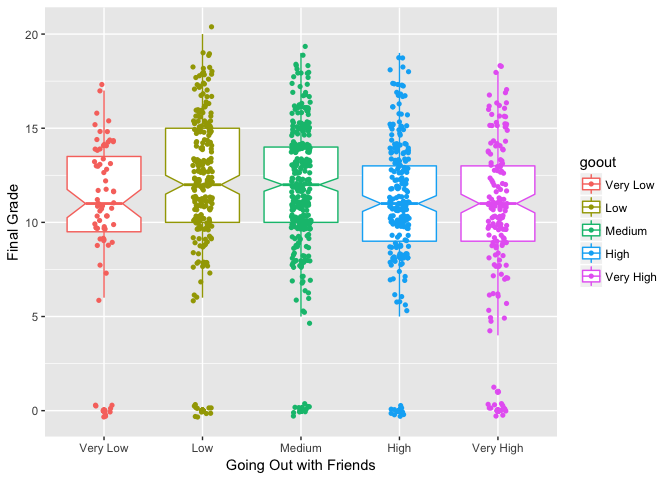

``` r
summary(aov(G3 ~ goout, data = d_total)) # p-value = ~0.15%, significant
```

    ##               Df Sum Sq Mean Sq F value   Pr(>F)    
    ## goout          4    423  105.70   7.246 9.36e-06 ***
    ## Residuals   1039  15156   14.59                     
    ## ---
    ## Signif. codes:  0 '***' 0.001 '**' 0.01 '*' 0.05 '.' 0.1 ' ' 1

Alcohol consumption seems to be inversely correlated with grades.
-----------------------------------------------------------------

``` r
ggplot(d_total, aes(x=Dalc, y=G3,color=Dalc)) +
  geom_boxplot(notch = F) +
  xlab("Workday Alcohol Consumption") + ylab("Final Grade")+
  geom_jitter(shape=16, position=position_jitter(0.1))
```

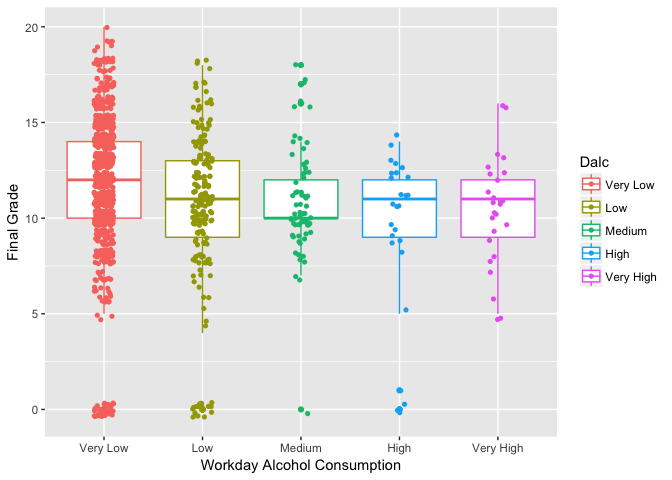

``` r
summary(aov(G3 ~ Dalc, data = d_total)) # p-value = 2.65e-05, significant
```

    ##               Df Sum Sq Mean Sq F value   Pr(>F)    
    ## Dalc           4    366   91.39   6.242 5.79e-05 ***
    ## Residuals   1039  15213   14.64                     
    ## ---
    ## Signif. codes:  0 '***' 0.001 '**' 0.01 '*' 0.05 '.' 0.1 ' ' 1

``` r
ggplot(d_total, aes(x=Walc, y=G3,color=Walc)) +
  geom_boxplot(notch = T) +
  xlab("Weekend Alcohol Consumption") + ylab("Final Grade")+
  geom_jitter(shape=16, position=position_jitter(0.1))
```

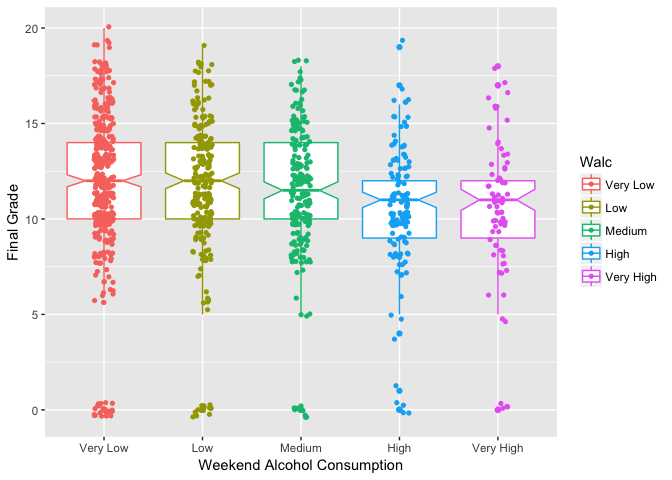

``` r
summary(aov(G3 ~ Walc, data = d_total)) # p-value = ~0.02%, significant
```

    ##               Df Sum Sq Mean Sq F value  Pr(>F)   
    ## Walc           4    224   55.88   3.781 0.00464 **
    ## Residuals   1039  15355   14.78                   
    ## ---
    ## Signif. codes:  0 '***' 0.001 '**' 0.01 '*' 0.05 '.' 0.1 ' ' 1
