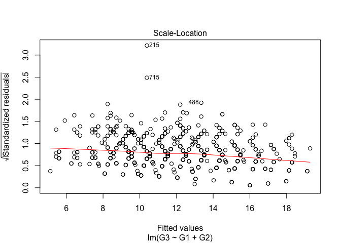

    ## Loading tidyverse: ggplot2
    ## Loading tidyverse: tibble
    ## Loading tidyverse: tidyr
    ## Loading tidyverse: readr
    ## Loading tidyverse: purrr
    ## Loading tidyverse: dplyr

    ## Conflicts with tidy packages ----------------------------------------------

    ## filter(): dplyr, stats
    ## lag():    dplyr, stats

This is a supervised regression problem, in which the goal is to predict a student's final grade from a variety of independent variables.

A STRONG LINEAR RELATIONSHIP
============================

There is a strong linear relationship between the first and second period grades (G1 and G2) and the final grade (G3), as is apparent in these scatterplots. 

There are obvious outliers -- students who had nonzero grades (mostly in the range of 5-10) at G1 and/or G2, but then at G3 received grades of 0. Presumably these are students who dropped out before the end of the term. However, even with this group of outliers, the linear relationship between G1/G2 and G3 appears very strong, so it makes sense to try using linear regression to build a model.

First I'll split the data into a training set and test set.

``` r
set.seed(123)
dt = sort(sample(nrow(d_total), nrow(d_total)*.7))
Train.reg <- d_total[dt,]
Test.reg <- d_total[-dt,]
```

Then I'll build the model.

``` r
lin.model <- lm(G3 ~ G1 + G2, data = Train.reg)
summary(lin.model) 
```

    ## 
    ## Call:
    ## lm(formula = G3 ~ G1 + G2, data = Train.reg)
    ## 
    ## Residuals:
    ##     Min      1Q  Median      3Q     Max 
    ## -9.9540 -0.4039  0.0648  0.8305  6.0460 
    ## 
    ## Coefficients:
    ##             Estimate Std. Error t value Pr(>|t|)    
    ## (Intercept) -1.12379    0.22368  -5.024 6.37e-07 ***
    ## G1           0.12656    0.03746   3.379 0.000766 ***
    ## G2           0.98121    0.03381  29.022  < 2e-16 ***
    ## ---
    ## Signif. codes:  0 '***' 0.001 '**' 0.01 '*' 0.05 '.' 0.1 ' ' 1
    ## 
    ## Residual standard error: 1.578 on 727 degrees of freedom
    ## Multiple R-squared:  0.8433, Adjusted R-squared:  0.8428 
    ## F-statistic:  1956 on 2 and 727 DF,  p-value: < 2.2e-16

Adjusted R-squ value is 0.84, good fit.

How is the model on test data?

``` r
lm.pred <- predict(lin.model, newdata = Test.reg)
# Calculate R-squared
SSE = sum((Test.reg$G3 - lm.pred)^2)
SST = sum((Test.reg$G3 - mean(Train.reg$G3))^2)
1 - SSE/SST 
```

    ## [1] 0.8004423

Adjusted R-squ value is 0.80, also a good fit.

With good R-squared values, I'll now look at the diagnostic plots for this model.

``` r
plot(lin.model)
```


The Residuals vs. Fitted plot shows the strong linear relationship for typical students, and also the sizeable group of outlier students who were passing at midterm but failed at G3. The Normal Q-Q plot shows that the residuals in the lowest quantile are not normally distributed. This also makes sense given the group of students who were passing at midterm but failed at G3. The Scale Location plot also reveals the outlier group. The Residuals vs. Leverage plot shows no data outside Cook's distance, which means that there aren't any individual data points that are unduly influencing the model.

The diagnostic plots reveal that observations of particular concern are 265, 342, 559.

``` r
d_total[265, 31:33]
```

    ##     G1 G2 G3
    ## 265  9 10  0

``` r
d_total[342, 31:33]
```

    ##     G1 G2 G3
    ## 342 10 10  0

``` r
d_total[559, 31:33]
```

    ##     G1 G2 G3
    ## 559 11  9  0

All have G1 + G2 &gt;= 19 and G3 = 0, students who were doing fairly well at midterm but dropped out completely. Along with these three, how many students in the dataset fall into this category, and who are they?

``` r
nrow(d_total[d_total$G1 + d_total$G2 >= 19 & d_total$G3 == 0, ])
subset(d_total, d_total$G1 + d_total$G2 >= 19 & d_total$G3 == 0, select = c(G1, G2, G3))
```

This code identifies 6 students in this group: 260, 265, 297, 335, 342, and 559.

How much better would the model be without these students?

``` r
dropouts <- subset(d_total, d_total$G1 + d_total$G2 >= 19 & d_total$G3 == 0)
d_adjusted <- anti_join(d_total, dropouts)
lin.model.adj <- lm(G3 ~ G1 + G2, data = d_adjusted)
summary(lin.model.adj)
plot(lin.model.adj)
```

This code (not evaluated here) reveals an improved adjusted R-squared value (0.8588) and F-statistic (3155) over the original linear model, but the diagnostic plots show all the same anomalies of the original model.

I'll create one more linear model, this one removing all the students for whom G3 = 0 but G1 and/or G2 &gt; 0 ("dropouts").

``` r
zeroes <- subset(d_total, d_total$G3 == 0) # Subset students for whom G3=0 
dropouts.all <- subset(zeroes, zeroes$G1 != 0 | zeroes$G2 != 0) # Subset students among these for whom G1 and/or G2 > 0
d_adj.all <- anti_join(d_total, dropouts.all) # Create dataset of all students except the dropouts.
```

    ## Joining, by = c("school", "sex", "age", "address", "famsize", "Pstatus", "Medu", "Fedu", "Mjob", "Fjob", "reason", "guardian", "traveltime", "studytime", "failures", "schoolsup", "famsup", "paid", "activities", "nursery", "higher", "internet", "romantic", "famrel", "freetime", "goout", "Dalc", "Walc", "health", "absences", "G1", "G2", "G3", "course")

``` r
lin.model.adj.all <- lm(G3 ~ G1 + G2, data = d_adj.all) # Create linear model on this dataset.
summary(lin.model.adj.all)
```

    ## 
    ## Call:
    ## lm(formula = G3 ~ G1 + G2, data = d_adj.all)
    ## 
    ## Residuals:
    ##     Min      1Q  Median      3Q     Max 
    ## -9.3857 -0.4872 -0.1718  0.6143  5.6143 
    ## 
    ## Coefficients:
    ##             Estimate Std. Error t value Pr(>|t|)    
    ## (Intercept)  0.49811    0.12329   4.040 5.75e-05 ***
    ## G1           0.15767    0.02189   7.204 1.16e-12 ***
    ## G2           0.83109    0.02238  37.128  < 2e-16 ***
    ## ---
    ## Signif. codes:  0 '***' 0.001 '**' 0.01 '*' 0.05 '.' 0.1 ' ' 1
    ## 
    ## Residual standard error: 0.9085 on 988 degrees of freedom
    ## Multiple R-squared:  0.9029, Adjusted R-squared:  0.9027 
    ## F-statistic:  4592 on 2 and 988 DF,  p-value: < 2.2e-16

``` r
plot(lin.model.adj.all)
```

 So, removing the dropouts from the dataset makes a linear model with an even better adjusted R-squared (0.9027) and F-statistic (4592). This adjustment also eliminates all the irregularities in the diagnostic plots.

To conclude, the linear model is great at predicting G3 for students whose performance is quite consistent from one grading period to the next, but it fails to anticipate the dropouts (students who start out passing but ultimately fail). Any educator could tell you that this outcome is neither surprising (most students who are doing poorly at midterm are likely to have low final grades, and the converse) nor very useful (since it doesn't identify which students are at risk of failure until they are already failing). My question, then, is whether I can find a model that predicts G3 without the variables G1 or G2.

SEEKING LINEAR RELATIONSHIPS BETWEEN G3 AND PREDICTORS OTHER THAN G1 AND G2
===========================================================================

Exploratory data analysis suggests that nearly all the predictor variables have at least some correlation with G3, so I used forward- and backward- stepwise selection to try to identify the most likely combination of predictor variables for a good model.

Here is my code, and the outcomes:

``` r
library(leaps)
regfit.fwd.1 <- regsubsets(G3 ~ . -G1 -G2, data = d_total, method = "forward")
regfit.bwd.1 <- regsubsets(G3 ~ . -G1 -G2, data = d_total, method = "backward")

summary(regfit.fwd.1) 
# Best 1 var mod = failures1
# Best 2 var mod = + failures3
# Best 3 var mod = + failures2 
# Best 4 var mod = + coursePortuguese
# Best 5 var mod = + higheryes
# Best 6 var mod = + schoolMS
# Best 7 var mod = + MeduHigher
# Best 8 var mod = + schoolsupyes
summary(regfit.bwd.1) 
# Best 1 var mod = failures1
# Best 2 var mod = + failures3
# Best 3 var mod = + failures2 
# Best 4 var mod = + coursePortuguese
# Best 5 var mod = + higheryes
# Best 6 var mod = + schoolMS
# Best 7 var mod = + schoolsupyes
# Best 8 var mod = + studytime5-10 hrs
```

Stepwise variable selection suggests that the variables "failures", "course", "higher", and "school" are most likely to be significant. However, the adjusted R-squared values of models built with these variables are all very low. Without G1 and G2, linear regression fails to calculate a good predictive model.

``` r
lin.model.2 <- lm(G3 ~ failures, data = Train.reg)
summary(lin.model.2) # Adjusted R-squared:  0.1458
lin.model.3 <- lm(G3 ~ failures + course, data = Train.reg)
summary(lin.model.3) # Adjusted R-squared:  0.1604 
lin.model.4 <- lm(G3 ~ failures + course + higher, data = Train.reg)
summary(lin.model.4) # Adjusted R-squared:  0.1747
lin.model.5 <- lm(G3 ~ failures + course + higher + school, data = Train.reg)
summary(lin.model.5) # Adjusted R-squared:  0.1917
```

REFRAME THE SITUATION AS A CLASSIFICATION PROBLEM
=================================================

From the perspective of educators, it is not actually so important to predict students' final numerical grades G3. Educators are most concerned with identifying students who are at risk of failing early enough to intervene with extra support. Therefore, I decided to reframe the situation as a classification problem: Can I build a model that predicts which students are at risk of failing without depending on G1 and G2?

In order to accomplish this, I converted G3 to a categorical factor variable called "outcome" with two levels, "pass" and "fail".

Here is my code:

``` r
d_math_cat <- d_math %>% mutate(outcome=ifelse(G3<8,"fail","pass")) %>%
  select(-G3)
d_port_cat <- d_port %>% mutate(outcome=ifelse(G3<8,"fail","pass")) %>%
  select(-G3)
d_math_cat$outcome <- as.factor(d_math_cat$outcome)
d_port_cat$outcome <- as.factor(d_port_cat$outcome)
d_total_cat <- rbind(d_math_cat, d_port_cat)
```

The dataset is unbalanced between the two outcomes; less than 10% are "fail".

``` r
nrow(d_total_cat[d_total_cat$outcome == "fail", ])/nrow(d_total_cat)
```

    ## [1] 0.09578544

First I'll split the data into a training set and a test set.

``` r
library(caTools)
set.seed(77)
split <- sample.split(d_total_cat$outcome, SplitRatio = 0.75)
Train.cat <- subset(d_total_cat, split == TRUE) 
Test.cat <- subset(d_total_cat, split == FALSE)
```

Then I'll balance the dataset using various techniques from package ROSE (note: only the training set!) 1. Oversample the minority class "fail" 2. Undersample the majority class "pass" 3. Both of the above 4. Use synthetically generated "fail" data

``` r
library(ROSE)
```

    ## Loaded ROSE 0.0-3

``` r
# Unbalanced dataset
table(Train.cat$outcome)
```

    ## 
    ## fail pass 
    ##   75  708

``` r
# Oversample
Train.cat.over <- ovun.sample(outcome ~., data = Train.cat, method = "over", N=1416)$data
table(Train.cat.over$outcome)
```

    ## 
    ## pass fail 
    ##  708  708

``` r
# Undersample
Train.cat.under <- ovun.sample(outcome ~., data = Train.cat, method = "under", N=150)$data
table(Train.cat.under$outcome)
```

    ## 
    ## pass fail 
    ##   75   75

``` r
# Both over and undersample
Train.cat.both <- ovun.sample(outcome ~., data = Train.cat, method = "both", p=0.5, N=783, seed = 1)$data
table(Train.cat.both$outcome)
```

    ## 
    ## pass fail 
    ##  401  382

``` r
# Synthetic
Train.cat.syn <- ROSE(outcome ~., data = Train.cat, seed = 1)$data
table(Train.cat.syn$outcome)
```

    ## 
    ## pass fail 
    ##  401  382

LOGISTIC REGRESSION
===================

First, calculate baseline to beat (percent of total outcomes that are the most likely outcome, "pass").

``` r
nrow(d_total_cat[d_total_cat$outcome == "pass", ])/nrow(d_total_cat) # 90.4%
```

    ## [1] 0.9042146

Because the majority outcome "pass" is so much more common than the minority outcome "fail", accuracy is not that great a measure of goodness of fit. Used "balanced accuracy" instead (arithmetic mean of accuracy of prediction of each class).

Presumably G1 and G2 would be very effective predictors of outcome.

``` r
log.model.1 <- glm(outcome ~ G1 + G2, data = Train.cat, family = binomial)
summary(log.model.1) # AIC: 190.57
```

    ## 
    ## Call:
    ## glm(formula = outcome ~ G1 + G2, family = binomial, data = Train.cat)
    ## 
    ## Deviance Residuals: 
    ##      Min        1Q    Median        3Q       Max  
    ## -2.89871   0.00740   0.04215   0.18568   2.11885  
    ## 
    ## Coefficients:
    ##             Estimate Std. Error z value Pr(>|z|)    
    ## (Intercept) -10.0121     1.3165  -7.605 2.85e-14 ***
    ## G1            0.2601     0.1439   1.807   0.0708 .  
    ## G2            1.1598     0.1733   6.694 2.18e-11 ***
    ## ---
    ## Signif. codes:  0 '***' 0.001 '**' 0.01 '*' 0.05 '.' 0.1 ' ' 1
    ## 
    ## (Dispersion parameter for binomial family taken to be 1)
    ## 
    ##     Null deviance: 494.42  on 782  degrees of freedom
    ## Residual deviance: 184.57  on 780  degrees of freedom
    ## AIC: 190.57
    ## 
    ## Number of Fisher Scoring iterations: 8

``` r
log.pred.1 <- predict(log.model.1, newdata = Test.cat, type = "response")
table(Test.cat$outcome, log.pred.1 > 0.5) # Confusion matrix
```

    ##       
    ##        FALSE TRUE
    ##   fail    17    8
    ##   pass     2  234

``` r
(17+234)/261 # Accuracy: 0.96
```

    ## [1] 0.9616858

``` r
((17/(17+8))+(234/(234+2)))/2 # Balanced accuracy: 0.84
```

    ## [1] 0.8357627

``` r
17/(17+8) # Specificity: 0.68
```

    ## [1] 0.68

Well, this model does a good job identifying students who pass, but not so much students who fail.

Would it do better if the data were better balanced? Use the ROSE package to balance the dataset by four methods

``` r
library(ROSE)

# Unbalanced dataset
table(Train.cat$outcome) # How many pass, how many fail in unbalanced training set?
```

    ## 
    ## fail pass 
    ##   75  708

``` r
# Balance training set by oversampling "fail"
Train.cat.over <- ovun.sample(outcome ~., data = Train.cat, method = "over", N=1416)$data
table(Train.cat.over$outcome) # Numbers in each class
```

    ## 
    ## pass fail 
    ##  708  708

``` r
# Balance training set by undersampling "pass"
Train.cat.under <- ovun.sample(outcome ~., data = Train.cat, method = "under", N=150)$data
table(Train.cat.under$outcome) # Numbers in each class
```

    ## 
    ## pass fail 
    ##   75   75

``` r
# Balance training set by both over- and undersampling
Train.cat.both <- ovun.sample(outcome ~., data = Train.cat, method = "both", p=0.5, N=783, seed = 1)$data
table(Train.cat.both$outcome) # Numbers in each class
```

    ## 
    ## pass fail 
    ##  401  382

``` r
# Balance training set by creating synthetic minority class observations
Train.cat.syn <- ROSE(outcome ~., data = Train.cat, seed = 1)$data
table(Train.cat.syn$outcome) # Numbers in each class
```

    ## 
    ## pass fail 
    ##  401  382

Recreate logistic regression model using each of the four balanced datasets. Which has best results?

Using dataset with "fail" oversampled

``` r
log.model.1.over <- glm(outcome ~ G1 + G2, data = Train.cat.over, family = binomial)
summary(log.model.1.over) # AIC: 646.71
```

    ## 
    ## Call:
    ## glm(formula = outcome ~ G1 + G2, family = binomial, data = Train.cat.over)
    ## 
    ## Deviance Residuals: 
    ##      Min        1Q    Median        3Q       Max  
    ## -3.04472  -0.15614   0.00184   0.24005   1.97738  
    ## 
    ## Coefficients:
    ##             Estimate Std. Error z value Pr(>|z|)    
    ## (Intercept) 11.87889    0.73003  16.272   <2e-16 ***
    ## G1          -0.13761    0.07292  -1.887   0.0591 .  
    ## G2          -1.23051    0.09953 -12.364   <2e-16 ***
    ## ---
    ## Signif. codes:  0 '***' 0.001 '**' 0.01 '*' 0.05 '.' 0.1 ' ' 1
    ## 
    ## (Dispersion parameter for binomial family taken to be 1)
    ## 
    ##     Null deviance: 1962.99  on 1415  degrees of freedom
    ## Residual deviance:  654.68  on 1413  degrees of freedom
    ## AIC: 660.68
    ## 
    ## Number of Fisher Scoring iterations: 7

``` r
log.pred.1.over <- predict(log.model.1.over, newdata = Test.cat, type = "response")
table(Test.cat$outcome, log.pred.1.over > 0.5) # Confusion matrix
```

    ##       
    ##        FALSE TRUE
    ##   fail     1   24
    ##   pass   220   16

``` r
(24+220)/261 # Accuracy: 0.935
```

    ## [1] 0.9348659

``` r
((24/(24+1))+(220/(220+16)))/2 # Balanced accuracy: 0.946
```

    ## [1] 0.9461017

``` r
24/(24+1) # Specificity: 0.96
```

    ## [1] 0.96

Using dataset with "pass" undersampled

``` r
log.model.1.under <- glm(outcome ~ G1 + G2, data = Train.cat.under, family = binomial)
summary(log.model.1.under) # AIC: 68.06
```

    ## 
    ## Call:
    ## glm(formula = outcome ~ G1 + G2, family = binomial, data = Train.cat.under)
    ## 
    ## Deviance Residuals: 
    ##      Min        1Q    Median        3Q       Max  
    ## -2.30493  -0.13007  -0.00031   0.17101   2.05886  
    ## 
    ## Coefficients:
    ##             Estimate Std. Error z value Pr(>|z|)    
    ## (Intercept)  12.8761     2.4992   5.152 2.58e-07 ***
    ## G1            0.1640     0.2355   0.696    0.486    
    ## G2           -1.6343     0.3686  -4.434 9.24e-06 ***
    ## ---
    ## Signif. codes:  0 '***' 0.001 '**' 0.01 '*' 0.05 '.' 0.1 ' ' 1
    ## 
    ## (Dispersion parameter for binomial family taken to be 1)
    ## 
    ##     Null deviance: 207.944  on 149  degrees of freedom
    ## Residual deviance:  61.597  on 147  degrees of freedom
    ## AIC: 67.597
    ## 
    ## Number of Fisher Scoring iterations: 8

``` r
log.pred.1.under <- predict(log.model.1.under, newdata = Test.cat, type = "response")
table(Test.cat$outcome, log.pred.1.under > 0.5) # Confusion matrix
```

    ##       
    ##        FALSE TRUE
    ##   fail     1   24
    ##   pass   220   16

``` r
(24+220)/261 # Accuracy: 0.935
```

    ## [1] 0.9348659

``` r
((24/(24+1))+(220/(220+16)))/2 # Balanced accuracy: 0.946
```

    ## [1] 0.9461017

``` r
24/(24+1) # Specificity: 0.96
```

    ## [1] 0.96

Using dataset with both over- and undersampling

``` r
log.model.1.both <- glm(outcome ~ G1 + G2, data = Train.cat.both, family = binomial)
summary(log.model.1.both) # AIC: 357.95
```

    ## 
    ## Call:
    ## glm(formula = outcome ~ G1 + G2, family = binomial, data = Train.cat.both)
    ## 
    ## Deviance Residuals: 
    ##      Min        1Q    Median        3Q       Max  
    ## -2.98571  -0.14204  -0.00193   0.26096   2.10582  
    ## 
    ## Coefficients:
    ##             Estimate Std. Error z value Pr(>|z|)    
    ## (Intercept) 11.96498    0.99850  11.983   <2e-16 ***
    ## G1          -0.16198    0.09484  -1.708   0.0877 .  
    ## G2          -1.24471    0.13134  -9.477   <2e-16 ***
    ## ---
    ## Signif. codes:  0 '***' 0.001 '**' 0.01 '*' 0.05 '.' 0.1 ' ' 1
    ## 
    ## (Dispersion parameter for binomial family taken to be 1)
    ## 
    ##     Null deviance: 1085.01  on 782  degrees of freedom
    ## Residual deviance:  351.95  on 780  degrees of freedom
    ## AIC: 357.95
    ## 
    ## Number of Fisher Scoring iterations: 7

``` r
log.pred.1.both <- predict(log.model.1.both, newdata = Test.cat, type = "response")
table(Test.cat$outcome, log.pred.1.both > 0.5) # Confusion matrix
```

    ##       
    ##        FALSE TRUE
    ##   fail     1   24
    ##   pass   220   16

``` r
(24+220)/261 # Accuracy: 0.935
```

    ## [1] 0.9348659

``` r
((24/(24+1))+(220/(220+16)))/2 # Balanced accuracy: 0.946
```

    ## [1] 0.9461017

``` r
24/(24+1) # Specificity: 0.96
```

    ## [1] 0.96

Using dataset with synthetic "fail" observations

``` r
log.model.1.syn <- glm(outcome ~ G1 + G2, data = Train.cat.syn, family = binomial)
summary(log.model.1.syn) # AIC: 463.2
```

    ## 
    ## Call:
    ## glm(formula = outcome ~ G1 + G2, family = binomial, data = Train.cat.syn)
    ## 
    ## Deviance Residuals: 
    ##      Min        1Q    Median        3Q       Max  
    ## -2.39908  -0.30623  -0.01879   0.42871   2.58583  
    ## 
    ## Coefficients:
    ##             Estimate Std. Error z value Pr(>|z|)    
    ## (Intercept)  8.55546    0.65443  13.073  < 2e-16 ***
    ## G1          -0.35902    0.06084  -5.901  3.6e-09 ***
    ## G2          -0.64172    0.06455  -9.941  < 2e-16 ***
    ## ---
    ## Signif. codes:  0 '***' 0.001 '**' 0.01 '*' 0.05 '.' 0.1 ' ' 1
    ## 
    ## (Dispersion parameter for binomial family taken to be 1)
    ## 
    ##     Null deviance: 1085.0  on 782  degrees of freedom
    ## Residual deviance:  457.2  on 780  degrees of freedom
    ## AIC: 463.2
    ## 
    ## Number of Fisher Scoring iterations: 6

``` r
log.pred.1.syn <- predict(log.model.1.syn, newdata = Test.cat, type = "response")
table(Test.cat$outcome, log.pred.1.syn > 0.5) # Confusion matrix
```

    ##       
    ##        FALSE TRUE
    ##   fail     1   24
    ##   pass   220   16

``` r
(24+220)/261 # Accuracy: 0.935
```

    ## [1] 0.9348659

``` r
((24/(24+1))+(220/(220+16)))/2 # Balanced accuracy: 0.946
```

    ## [1] 0.9461017

``` r
24/(24+1) # Specificity: 0.96
```

    ## [1] 0.96

All four of these models make identical predictions, according to the confusion matrixes, so their accuracy and specificity are the same. However, the model made from the dataset with undersampling has the lowest AIC, so it is the best.

How about logistic regression models built on combinations of the same variables that I tried in the linear regression models? Try each of these with the balanced datasets.

With "failures" as only predictor

``` r
log.model.2 <- glm(outcome ~ failures, data = Train.cat, family = binomial)
summary(log.model.2) # AIC: 452.03
```

    ## 
    ## Call:
    ## glm(formula = outcome ~ failures, family = binomial, data = Train.cat)
    ## 
    ## Deviance Residuals: 
    ##     Min       1Q   Median       3Q      Max  
    ## -2.3758   0.3502   0.3502   0.3502   1.0383  
    ## 
    ## Coefficients:
    ##             Estimate Std. Error z value Pr(>|z|)    
    ## (Intercept)   2.7610     0.1673  16.506  < 2e-16 ***
    ## failures1    -1.2694     0.3099  -4.096 4.20e-05 ***
    ## failures2    -2.4245     0.4466  -5.429 5.65e-08 ***
    ## failures3    -2.3933     0.4648  -5.149 2.61e-07 ***
    ## ---
    ## Signif. codes:  0 '***' 0.001 '**' 0.01 '*' 0.05 '.' 0.1 ' ' 1
    ## 
    ## (Dispersion parameter for binomial family taken to be 1)
    ## 
    ##     Null deviance: 494.42  on 782  degrees of freedom
    ## Residual deviance: 444.03  on 779  degrees of freedom
    ## AIC: 452.03
    ## 
    ## Number of Fisher Scoring iterations: 5

``` r
log.model.2.over <- glm(outcome ~ failures, data = Train.cat.over, family = binomial)
summary(log.model.2.over) # AIC: 1762.7
```

    ## 
    ## Call:
    ## glm(formula = outcome ~ failures, family = binomial, data = Train.cat.over)
    ## 
    ## Deviance Residuals: 
    ##     Min       1Q   Median       3Q      Max  
    ## -2.0486  -0.9624  -0.2254   0.9939   1.4088  
    ## 
    ## Coefficients:
    ##             Estimate Std. Error z value Pr(>|z|)    
    ## (Intercept)  -0.5293     0.0670  -7.900 2.78e-15 ***
    ## failures1     1.3458     0.1500   8.969  < 2e-16 ***
    ## failures2     2.2723     0.2974   7.642 2.14e-14 ***
    ## failures3     2.4970     0.3036   8.225  < 2e-16 ***
    ## ---
    ## Signif. codes:  0 '***' 0.001 '**' 0.01 '*' 0.05 '.' 0.1 ' ' 1
    ## 
    ## (Dispersion parameter for binomial family taken to be 1)
    ## 
    ##     Null deviance: 1963  on 1415  degrees of freedom
    ## Residual deviance: 1739  on 1412  degrees of freedom
    ## AIC: 1747
    ## 
    ## Number of Fisher Scoring iterations: 4

``` r
log.model.2.under <- glm(outcome ~ failures, data = Train.cat.under, family = binomial)
summary(log.model.2.under) # AIC: 196.43
```

    ## 
    ## Call:
    ## glm(formula = outcome ~ failures, family = binomial, data = Train.cat.under)
    ## 
    ## Deviance Residuals: 
    ##     Min       1Q   Median       3Q      Max  
    ## -2.1460  -0.9537  -0.2473   1.2539   1.4190  
    ## 
    ## Coefficients:
    ##             Estimate Std. Error z value Pr(>|z|)   
    ## (Intercept)  -0.5521     0.2036  -2.711  0.00671 **
    ## failures1     1.6507     0.5135   3.215  0.00131 **
    ## failures2     2.1615     0.8009   2.699  0.00696 **
    ## failures3     2.7493     1.0735   2.561  0.01044 * 
    ## ---
    ## Signif. codes:  0 '***' 0.001 '**' 0.01 '*' 0.05 '.' 0.1 ' ' 1
    ## 
    ## (Dispersion parameter for binomial family taken to be 1)
    ## 
    ##     Null deviance: 207.94  on 149  degrees of freedom
    ## Residual deviance: 180.85  on 146  degrees of freedom
    ## AIC: 188.85
    ## 
    ## Number of Fisher Scoring iterations: 4

``` r
log.model.2.both <- glm(outcome ~ failures, data = Train.cat.both, family = binomial)
summary(log.model.2.both) # AIC: 970.73
```

    ## 
    ## Call:
    ## glm(formula = outcome ~ failures, family = binomial, data = Train.cat.both)
    ## 
    ## Deviance Residuals: 
    ##     Min       1Q   Median       3Q      Max  
    ## -1.9087  -0.9335  -0.9335   0.8434   1.4428  
    ## 
    ## Coefficients:
    ##             Estimate Std. Error z value Pr(>|z|)    
    ## (Intercept) -0.60515    0.09166  -6.602 4.06e-11 ***
    ## failures1    1.45592    0.20787   7.004 2.49e-12 ***
    ## failures2    2.25030    0.34184   6.583 4.61e-11 ***
    ## failures3    1.92690    0.33758   5.708 1.14e-08 ***
    ## ---
    ## Signif. codes:  0 '***' 0.001 '**' 0.01 '*' 0.05 '.' 0.1 ' ' 1
    ## 
    ## (Dispersion parameter for binomial family taken to be 1)
    ## 
    ##     Null deviance: 1085.01  on 782  degrees of freedom
    ## Residual deviance:  962.73  on 779  degrees of freedom
    ## AIC: 970.73
    ## 
    ## Number of Fisher Scoring iterations: 4

``` r
log.model.2.syn <- glm(outcome ~ failures, data = Train.cat.syn, family = binomial)
summary(log.model.2.syn) # AIC: 970.73
```

    ## 
    ## Call:
    ## glm(formula = outcome ~ failures, family = binomial, data = Train.cat.syn)
    ## 
    ## Deviance Residuals: 
    ##     Min       1Q   Median       3Q      Max  
    ## -1.9087  -0.9335  -0.9335   0.8434   1.4428  
    ## 
    ## Coefficients:
    ##             Estimate Std. Error z value Pr(>|z|)    
    ## (Intercept) -0.60515    0.09166  -6.602 4.06e-11 ***
    ## failures1    1.45592    0.20787   7.004 2.49e-12 ***
    ## failures2    2.25030    0.34184   6.583 4.61e-11 ***
    ## failures3    1.92690    0.33758   5.708 1.14e-08 ***
    ## ---
    ## Signif. codes:  0 '***' 0.001 '**' 0.01 '*' 0.05 '.' 0.1 ' ' 1
    ## 
    ## (Dispersion parameter for binomial family taken to be 1)
    ## 
    ##     Null deviance: 1085.01  on 782  degrees of freedom
    ## Residual deviance:  962.73  on 779  degrees of freedom
    ## AIC: 970.73
    ## 
    ## Number of Fisher Scoring iterations: 4

Best version uses undersampling

"Failures" and "course" as predictors

``` r
log.model.3 <- glm(outcome ~ failures + course, data = Train.cat, family = binomial)
summary(log.model.3) # AIC: 434.15
```

    ## 
    ## Call:
    ## glm(formula = outcome ~ failures + course, family = binomial, 
    ##     data = Train.cat)
    ## 
    ## Deviance Residuals: 
    ##     Min       1Q   Median       3Q      Max  
    ## -2.5930   0.2656   0.2656   0.4655   1.2311  
    ## 
    ## Coefficients:
    ##             Estimate Std. Error z value Pr(>|z|)    
    ## (Intercept)   2.1678     0.1978  10.957  < 2e-16 ***
    ## failures1    -1.2714     0.3166  -4.016 5.92e-05 ***
    ## failures2    -2.2817     0.4619  -4.940 7.80e-07 ***
    ## failures3    -2.2932     0.4813  -4.765 1.89e-06 ***
    ## courseport    1.1588     0.2658   4.359 1.30e-05 ***
    ## ---
    ## Signif. codes:  0 '***' 0.001 '**' 0.01 '*' 0.05 '.' 0.1 ' ' 1
    ## 
    ## (Dispersion parameter for binomial family taken to be 1)
    ## 
    ##     Null deviance: 494.42  on 782  degrees of freedom
    ## Residual deviance: 424.15  on 778  degrees of freedom
    ## AIC: 434.15
    ## 
    ## Number of Fisher Scoring iterations: 5

``` r
log.model.3.over <- glm(outcome ~ failures + course, data = Train.cat.over, family = binomial)
summary(log.model.3.over) # AIC: 1628
```

    ## 
    ## Call:
    ## glm(formula = outcome ~ failures + course, family = binomial, 
    ##     data = Train.cat.over)
    ## 
    ## Deviance Residuals: 
    ##     Min       1Q   Median       3Q      Max  
    ## -2.3499  -0.6682  -0.1534   1.0756   1.7939  
    ## 
    ## Coefficients:
    ##             Estimate Std. Error z value Pr(>|z|)    
    ## (Intercept)  0.14706    0.08675   1.695     0.09 .  
    ## failures1    1.66281    0.16435  10.118  < 2e-16 ***
    ## failures2    2.34539    0.31071   7.548 4.41e-14 ***
    ## failures3    2.54858    0.31555   8.077 6.66e-16 ***
    ## courseport  -1.53286    0.12764 -12.009  < 2e-16 ***
    ## ---
    ## Signif. codes:  0 '***' 0.001 '**' 0.01 '*' 0.05 '.' 0.1 ' ' 1
    ## 
    ## (Dispersion parameter for binomial family taken to be 1)
    ## 
    ##     Null deviance: 1963.0  on 1415  degrees of freedom
    ## Residual deviance: 1579.6  on 1411  degrees of freedom
    ## AIC: 1589.6
    ## 
    ## Number of Fisher Scoring iterations: 4

``` r
log.model.3.under <- glm(outcome ~ failures + course, data = Train.cat.under, family = binomial)
summary(log.model.3.under) # AIC: 182.29
```

    ## 
    ## Call:
    ## glm(formula = outcome ~ failures + course, family = binomial, 
    ##     data = Train.cat.under)
    ## 
    ## Deviance Residuals: 
    ##     Min       1Q   Median       3Q      Max  
    ## -2.3187  -0.7504  -0.1876   1.1321   1.6762  
    ## 
    ## Coefficients:
    ##             Estimate Std. Error z value Pr(>|z|)    
    ## (Intercept) -0.05857    0.26380  -0.222 0.824291    
    ## failures1    1.76073    0.53289   3.304 0.000953 ***
    ## failures2    2.10843    0.81840   2.576 0.009987 ** 
    ## failures3    2.67628    1.08891   2.458 0.013980 *  
    ## courseport  -1.06468    0.37420  -2.845 0.004438 ** 
    ## ---
    ## Signif. codes:  0 '***' 0.001 '**' 0.01 '*' 0.05 '.' 0.1 ' ' 1
    ## 
    ## (Dispersion parameter for binomial family taken to be 1)
    ## 
    ##     Null deviance: 207.94  on 149  degrees of freedom
    ## Residual deviance: 172.41  on 145  degrees of freedom
    ## AIC: 182.41
    ## 
    ## Number of Fisher Scoring iterations: 4

``` r
log.model.3.both <- glm(outcome ~ failures + course, data = Train.cat.both, family = binomial)
summary(log.model.3.both) # AIC: 928.7
```

    ## 
    ## Call:
    ## glm(formula = outcome ~ failures + course, family = binomial, 
    ##     data = Train.cat.both)
    ## 
    ## Deviance Residuals: 
    ##     Min       1Q   Median       3Q      Max  
    ## -2.1133  -0.7378  -0.7378   1.0126   1.6938  
    ## 
    ## Coefficients:
    ##             Estimate Std. Error z value Pr(>|z|)    
    ## (Intercept)  -0.1116     0.1173  -0.951    0.341    
    ## failures1     1.5633     0.2161   7.233 4.73e-13 ***
    ## failures2     2.2312     0.3492   6.390 1.66e-10 ***
    ## failures3     1.9342     0.3462   5.586 2.32e-08 ***
    ## courseport   -1.0507     0.1617  -6.496 8.23e-11 ***
    ## ---
    ## Signif. codes:  0 '***' 0.001 '**' 0.01 '*' 0.05 '.' 0.1 ' ' 1
    ## 
    ## (Dispersion parameter for binomial family taken to be 1)
    ## 
    ##     Null deviance: 1085.0  on 782  degrees of freedom
    ## Residual deviance:  918.7  on 778  degrees of freedom
    ## AIC: 928.7
    ## 
    ## Number of Fisher Scoring iterations: 4

``` r
log.model.3.syn <- glm(outcome ~ failures + course, data = Train.cat.syn, family = binomial)
summary(log.model.3.syn) # AIC: 928.7
```

    ## 
    ## Call:
    ## glm(formula = outcome ~ failures + course, family = binomial, 
    ##     data = Train.cat.syn)
    ## 
    ## Deviance Residuals: 
    ##     Min       1Q   Median       3Q      Max  
    ## -2.1133  -0.7378  -0.7378   1.0126   1.6938  
    ## 
    ## Coefficients:
    ##             Estimate Std. Error z value Pr(>|z|)    
    ## (Intercept)  -0.1116     0.1173  -0.951    0.341    
    ## failures1     1.5633     0.2161   7.233 4.73e-13 ***
    ## failures2     2.2312     0.3492   6.390 1.66e-10 ***
    ## failures3     1.9342     0.3462   5.586 2.32e-08 ***
    ## courseport   -1.0507     0.1617  -6.496 8.23e-11 ***
    ## ---
    ## Signif. codes:  0 '***' 0.001 '**' 0.01 '*' 0.05 '.' 0.1 ' ' 1
    ## 
    ## (Dispersion parameter for binomial family taken to be 1)
    ## 
    ##     Null deviance: 1085.0  on 782  degrees of freedom
    ## Residual deviance:  918.7  on 778  degrees of freedom
    ## AIC: 928.7
    ## 
    ## Number of Fisher Scoring iterations: 4

Best version uses undersampling

"Failures", "course", "higher" as predictors

``` r
log.model.4 <- glm(outcome ~ failures + course + higher, data = Train.cat, family = binomial)
summary(log.model.4) # AIC: 431.76
```

    ## 
    ## Call:
    ## glm(formula = outcome ~ failures + course + higher, family = binomial, 
    ##     data = Train.cat)
    ## 
    ## Deviance Residuals: 
    ##     Min       1Q   Median       3Q      Max  
    ## -2.6414   0.2491   0.2491   0.4651   1.4822  
    ## 
    ## Coefficients:
    ##             Estimate Std. Error z value Pr(>|z|)    
    ## (Intercept)   1.3473     0.4250   3.170 0.001525 ** 
    ## failures1    -1.1416     0.3249  -3.514 0.000441 ***
    ## failures2    -2.1324     0.4647  -4.589 4.45e-06 ***
    ## failures3    -2.0401     0.5023  -4.062 4.87e-05 ***
    ## courseport    1.2880     0.2781   4.632 3.61e-06 ***
    ## higheryes     0.8223     0.3799   2.165 0.030404 *  
    ## ---
    ## Signif. codes:  0 '***' 0.001 '**' 0.01 '*' 0.05 '.' 0.1 ' ' 1
    ## 
    ## (Dispersion parameter for binomial family taken to be 1)
    ## 
    ##     Null deviance: 494.42  on 782  degrees of freedom
    ## Residual deviance: 419.76  on 777  degrees of freedom
    ## AIC: 431.76
    ## 
    ## Number of Fisher Scoring iterations: 6

``` r
log.model.4.over <- glm(outcome ~ failures + course + higher, data = Train.cat.over, family = binomial)
summary(log.model.4.over) # AIC: 1606.8
```

    ## 
    ## Call:
    ## glm(formula = outcome ~ failures + course + higher, family = binomial, 
    ##     data = Train.cat.over)
    ## 
    ## Deviance Residuals: 
    ##     Min       1Q   Median       3Q      Max  
    ## -2.6501  -0.6179  -0.1859   1.1210   1.8708  
    ## 
    ## Coefficients:
    ##             Estimate Std. Error z value Pr(>|z|)    
    ## (Intercept)   1.1922     0.2173   5.488 4.08e-08 ***
    ## failures1     1.5119     0.1665   9.078  < 2e-16 ***
    ## failures2     2.0617     0.3146   6.553 5.63e-11 ***
    ## failures3     2.2891     0.3234   7.078 1.46e-12 ***
    ## courseport   -1.6930     0.1333 -12.698  < 2e-16 ***
    ## higheryes    -1.0582     0.2012  -5.259 1.45e-07 ***
    ## ---
    ## Signif. codes:  0 '***' 0.001 '**' 0.01 '*' 0.05 '.' 0.1 ' ' 1
    ## 
    ## (Dispersion parameter for binomial family taken to be 1)
    ## 
    ##     Null deviance: 1963.0  on 1415  degrees of freedom
    ## Residual deviance: 1550.9  on 1410  degrees of freedom
    ## AIC: 1562.9
    ## 
    ## Number of Fisher Scoring iterations: 4

``` r
log.model.4.under <- glm(outcome ~ failures + course + higher, data = Train.cat.under, family = binomial)
summary(log.model.4.under) # AIC: 180.4
```

    ## 
    ## Call:
    ## glm(formula = outcome ~ failures + course + higher, family = binomial, 
    ##     data = Train.cat.under)
    ## 
    ## Deviance Residuals: 
    ##    Min      1Q  Median      3Q     Max  
    ## -2.414  -0.730  -0.198   1.013   1.705  
    ## 
    ## Coefficients:
    ##             Estimate Std. Error z value Pr(>|z|)   
    ## (Intercept)   0.3666     0.6562   0.559  0.57636   
    ## failures1     1.6824     0.5415   3.107  0.00189 **
    ## failures2     1.9663     0.8347   2.356  0.01849 * 
    ## failures3     2.4917     1.1151   2.234  0.02546 * 
    ## courseport   -1.1249     0.3854  -2.919  0.00352 **
    ## higheryes    -0.4282     0.6053  -0.707  0.47931   
    ## ---
    ## Signif. codes:  0 '***' 0.001 '**' 0.01 '*' 0.05 '.' 0.1 ' ' 1
    ## 
    ## (Dispersion parameter for binomial family taken to be 1)
    ## 
    ##     Null deviance: 207.94  on 149  degrees of freedom
    ## Residual deviance: 171.90  on 144  degrees of freedom
    ## AIC: 183.9
    ## 
    ## Number of Fisher Scoring iterations: 4

``` r
log.model.4.both <- glm(outcome ~ failures + course + higher, data = Train.cat.both, family = binomial)
summary(log.model.4.both) # AIC: 918.95
```

    ## 
    ## Call:
    ## glm(formula = outcome ~ failures + course + higher, family = binomial, 
    ##     data = Train.cat.both)
    ## 
    ## Deviance Residuals: 
    ##    Min      1Q  Median      3Q     Max  
    ## -2.217  -1.021  -0.692   1.147   1.759  
    ## 
    ## Coefficients:
    ##             Estimate Std. Error z value Pr(>|z|)    
    ## (Intercept)   0.8395     0.3037   2.764 0.005712 ** 
    ## failures1     1.3784     0.2216   6.220 4.97e-10 ***
    ## failures2     2.0224     0.3525   5.737 9.63e-09 ***
    ## failures3     1.5287     0.3634   4.207 2.59e-05 ***
    ## courseport   -1.2200     0.1711  -7.130 1.00e-12 ***
    ## higheryes    -0.9268     0.2735  -3.388 0.000704 ***
    ## ---
    ## Signif. codes:  0 '***' 0.001 '**' 0.01 '*' 0.05 '.' 0.1 ' ' 1
    ## 
    ## (Dispersion parameter for binomial family taken to be 1)
    ## 
    ##     Null deviance: 1085.01  on 782  degrees of freedom
    ## Residual deviance:  906.95  on 777  degrees of freedom
    ## AIC: 918.95
    ## 
    ## Number of Fisher Scoring iterations: 4

``` r
log.model.4.syn <- glm(outcome ~ failures + course + higher, data = Train.cat.syn, family = binomial)
summary(log.model.4.syn) # AIC: 918.95
```

    ## 
    ## Call:
    ## glm(formula = outcome ~ failures + course + higher, family = binomial, 
    ##     data = Train.cat.syn)
    ## 
    ## Deviance Residuals: 
    ##    Min      1Q  Median      3Q     Max  
    ## -2.217  -1.021  -0.692   1.147   1.759  
    ## 
    ## Coefficients:
    ##             Estimate Std. Error z value Pr(>|z|)    
    ## (Intercept)   0.8395     0.3037   2.764 0.005712 ** 
    ## failures1     1.3784     0.2216   6.220 4.97e-10 ***
    ## failures2     2.0224     0.3525   5.737 9.63e-09 ***
    ## failures3     1.5287     0.3634   4.207 2.59e-05 ***
    ## courseport   -1.2200     0.1711  -7.130 1.00e-12 ***
    ## higheryes    -0.9268     0.2735  -3.388 0.000704 ***
    ## ---
    ## Signif. codes:  0 '***' 0.001 '**' 0.01 '*' 0.05 '.' 0.1 ' ' 1
    ## 
    ## (Dispersion parameter for binomial family taken to be 1)
    ## 
    ##     Null deviance: 1085.01  on 782  degrees of freedom
    ## Residual deviance:  906.95  on 777  degrees of freedom
    ## AIC: 918.95
    ## 
    ## Number of Fisher Scoring iterations: 4

Best version uses undersampling

"Failures", "course", "higher", "school" as predictors

``` r
log.model.5 <- glm(outcome ~ failures + course + higher + school, data = Train.cat, family = binomial)
summary(log.model.5) # AIC: 427.87 
```

    ## 
    ## Call:
    ## glm(formula = outcome ~ failures + course + higher + school, 
    ##     family = binomial, data = Train.cat)
    ## 
    ## Deviance Residuals: 
    ##     Min       1Q   Median       3Q      Max  
    ## -2.7666   0.2098   0.3055   0.4470   1.4276  
    ## 
    ## Coefficients:
    ##             Estimate Std. Error z value Pr(>|z|)    
    ## (Intercept)   1.4552     0.4246   3.427 0.000609 ***
    ## failures1    -1.0816     0.3263  -3.315 0.000915 ***
    ## failures2    -2.0610     0.4706  -4.380 1.19e-05 ***
    ## failures3    -2.0060     0.5019  -3.996 6.43e-05 ***
    ## courseport    1.5519     0.3063   5.067 4.04e-07 ***
    ## higheryes     0.7980     0.3784   2.109 0.034925 *  
    ## schoolMS     -0.7635     0.3109  -2.456 0.014053 *  
    ## ---
    ## Signif. codes:  0 '***' 0.001 '**' 0.01 '*' 0.05 '.' 0.1 ' ' 1
    ## 
    ## (Dispersion parameter for binomial family taken to be 1)
    ## 
    ##     Null deviance: 494.42  on 782  degrees of freedom
    ## Residual deviance: 413.87  on 776  degrees of freedom
    ## AIC: 427.87
    ## 
    ## Number of Fisher Scoring iterations: 6

``` r
log.model.5.over <- glm(outcome ~ failures + course + higher + school, data = Train.cat.over, family = binomial)
summary(log.model.5.over) # AIC: 1555.4
```

    ## 
    ## Call:
    ## glm(formula = outcome ~ failures + course + higher + school, 
    ##     family = binomial, data = Train.cat.over)
    ## 
    ## Deviance Residuals: 
    ##     Min       1Q   Median       3Q      Max  
    ## -2.7294  -0.7961  -0.1253   1.0610   2.1223  
    ## 
    ## Coefficients:
    ##             Estimate Std. Error z value Pr(>|z|)    
    ## (Intercept)   1.1821     0.2223   5.317 1.06e-07 ***
    ## failures1     1.2669     0.1689   7.502 6.27e-14 ***
    ## failures2     2.1055     0.3162   6.659 2.76e-11 ***
    ## failures3     2.5124     0.3382   7.430 1.09e-13 ***
    ## courseport   -2.1748     0.1610 -13.510  < 2e-16 ***
    ## higheryes    -1.1482     0.2069  -5.550 2.86e-08 ***
    ## schoolMS      1.1541     0.1681   6.866 6.61e-12 ***
    ## ---
    ## Signif. codes:  0 '***' 0.001 '**' 0.01 '*' 0.05 '.' 0.1 ' ' 1
    ## 
    ## (Dispersion parameter for binomial family taken to be 1)
    ## 
    ##     Null deviance: 1963  on 1415  degrees of freedom
    ## Residual deviance: 1500  on 1409  degrees of freedom
    ## AIC: 1514
    ## 
    ## Number of Fisher Scoring iterations: 5

``` r
log.model.5.under <- glm(outcome ~ failures + course + higher + school, data = Train.cat.under, family = binomial)
summary(log.model.5.under) # AIC: 172.25
```

    ## 
    ## Call:
    ## glm(formula = outcome ~ failures + course + higher + school, 
    ##     family = binomial, data = Train.cat.under)
    ## 
    ## Deviance Residuals: 
    ##     Min       1Q   Median       3Q      Max  
    ## -2.4775  -0.9521  -0.1592   0.9095   2.0292  
    ## 
    ## Coefficients:
    ##             Estimate Std. Error z value Pr(>|z|)    
    ## (Intercept)   0.3622     0.6752   0.536 0.591681    
    ## failures1     1.4124     0.5503   2.567 0.010269 *  
    ## failures2     2.0429     0.8497   2.404 0.016207 *  
    ## failures3     2.6592     1.1563   2.300 0.021460 *  
    ## courseport   -1.7586     0.4884  -3.601 0.000317 ***
    ## higheryes    -0.5259     0.6271  -0.839 0.401665    
    ## schoolMS      1.3661     0.5197   2.629 0.008568 ** 
    ## ---
    ## Signif. codes:  0 '***' 0.001 '**' 0.01 '*' 0.05 '.' 0.1 ' ' 1
    ## 
    ## (Dispersion parameter for binomial family taken to be 1)
    ## 
    ##     Null deviance: 207.94  on 149  degrees of freedom
    ## Residual deviance: 164.27  on 143  degrees of freedom
    ## AIC: 178.27
    ## 
    ## Number of Fisher Scoring iterations: 5

``` r
log.model.5.both <- glm(outcome ~ failures + course + higher + school, data = Train.cat.both, family = binomial)
summary(log.model.5.both) # AIC: 904.76
```

    ## 
    ## Call:
    ## glm(formula = outcome ~ failures + course + higher + school, 
    ##     family = binomial, data = Train.cat.both)
    ## 
    ## Deviance Residuals: 
    ##     Min       1Q   Median       3Q      Max  
    ## -2.4178  -0.8697  -0.5706   1.0479   1.9471  
    ## 
    ## Coefficients:
    ##             Estimate Std. Error z value Pr(>|z|)    
    ## (Intercept)   0.8222     0.3090   2.660 0.007807 ** 
    ## failures1     1.1923     0.2246   5.309 1.10e-07 ***
    ## failures2     2.0400     0.3551   5.745 9.19e-09 ***
    ## failures3     1.5178     0.3693   4.110 3.95e-05 ***
    ## courseport   -1.5995     0.2045  -7.823 5.14e-15 ***
    ## higheryes    -0.9555     0.2787  -3.428 0.000608 ***
    ## schoolMS      0.8532     0.2163   3.944 8.02e-05 ***
    ## ---
    ## Signif. codes:  0 '***' 0.001 '**' 0.01 '*' 0.05 '.' 0.1 ' ' 1
    ## 
    ## (Dispersion parameter for binomial family taken to be 1)
    ## 
    ##     Null deviance: 1085.01  on 782  degrees of freedom
    ## Residual deviance:  890.76  on 776  degrees of freedom
    ## AIC: 904.76
    ## 
    ## Number of Fisher Scoring iterations: 4

``` r
log.model.5.syn <- glm(outcome ~ failures + course + higher + school, data = Train.cat.syn, family = binomial)
summary(log.model.5.syn) # AIC: 904.76
```

    ## 
    ## Call:
    ## glm(formula = outcome ~ failures + course + higher + school, 
    ##     family = binomial, data = Train.cat.syn)
    ## 
    ## Deviance Residuals: 
    ##     Min       1Q   Median       3Q      Max  
    ## -2.4178  -0.8697  -0.5706   1.0479   1.9471  
    ## 
    ## Coefficients:
    ##             Estimate Std. Error z value Pr(>|z|)    
    ## (Intercept)   0.8222     0.3090   2.660 0.007807 ** 
    ## failures1     1.1923     0.2246   5.309 1.10e-07 ***
    ## failures2     2.0400     0.3551   5.745 9.19e-09 ***
    ## failures3     1.5178     0.3693   4.110 3.95e-05 ***
    ## courseport   -1.5995     0.2045  -7.823 5.14e-15 ***
    ## higheryes    -0.9555     0.2787  -3.428 0.000608 ***
    ## schoolMS      0.8532     0.2163   3.944 8.02e-05 ***
    ## ---
    ## Signif. codes:  0 '***' 0.001 '**' 0.01 '*' 0.05 '.' 0.1 ' ' 1
    ## 
    ## (Dispersion parameter for binomial family taken to be 1)
    ## 
    ##     Null deviance: 1085.01  on 782  degrees of freedom
    ## Residual deviance:  890.76  on 776  degrees of freedom
    ## AIC: 904.76
    ## 
    ## Number of Fisher Scoring iterations: 4

Best version uses undersampling

Logistic regression model with all variables except G1 and G2?

``` r
log.model.6 <- glm(outcome ~ . -G1 -G2, data = Train.cat, family = binomial)
```

    ## Warning: glm.fit: fitted probabilities numerically 0 or 1 occurred

``` r
summary(log.model.6) # AIC: 457.01
```

    ## 
    ## Call:
    ## glm(formula = outcome ~ . - G1 - G2, family = binomial, data = Train.cat)
    ## 
    ## Deviance Residuals: 
    ##      Min        1Q    Median        3Q       Max  
    ## -2.92438   0.07721   0.18174   0.35137   1.99449  
    ## 
    ## Coefficients:
    ##                       Estimate Std. Error z value Pr(>|z|)    
    ## (Intercept)           36.29769 1970.30949   0.018 0.985302    
    ## schoolMS              -0.40904    0.47517  -0.861 0.389331    
    ## sexM                   0.52795    0.40936   1.290 0.197159    
    ## age                   -0.31270    0.15592  -2.006 0.044901 *  
    ## addressU               0.67428    0.41090   1.641 0.100801    
    ## famsize<=3             1.02143    0.43283   2.360 0.018280 *  
    ## PstatusT               0.15684    0.56845   0.276 0.782620    
    ## MeduPrimary          -15.49673 1382.55608  -0.011 0.991057    
    ## MeduMiddle           -15.68158 1382.55610  -0.011 0.990950    
    ## MeduSecondary        -16.17458 1382.55614  -0.012 0.990666    
    ## MeduHigher           -16.30726 1382.55629  -0.012 0.990589    
    ## FeduPrimary          -16.13373 1403.79717  -0.011 0.990830    
    ## FeduMiddle           -16.37065 1403.79723  -0.012 0.990696    
    ## FeduSecondary        -15.74952 1403.79728  -0.011 0.991049    
    ## FeduHigher           -16.35217 1403.79738  -0.012 0.990706    
    ## Mjobhealth             1.78257    1.09778   1.624 0.104419    
    ## Mjobother             -0.15692    0.49306  -0.318 0.750284    
    ## Mjobservices           0.46467    0.57870   0.803 0.422007    
    ## Mjobteacher           -0.67050    0.77051  -0.870 0.384187    
    ## Fjobhealth             0.38123    1.12927   0.338 0.735674    
    ## Fjobother              0.62895    0.64628   0.973 0.330462    
    ## Fjobservices           0.87643    0.69644   1.258 0.208234    
    ## Fjobteacher            1.48105    0.92267   1.605 0.108457    
    ## reasonhome            -0.09905    0.44630  -0.222 0.824363    
    ## reasonother           -0.71857    0.52101  -1.379 0.167837    
    ## reasonreputation       0.25745    0.50398   0.511 0.609467    
    ## guardianmother        -0.10486    0.45328  -0.231 0.817055    
    ## guardianother          0.47171    0.77987   0.605 0.545277    
    ## traveltime15-30 min   -0.20181    0.37108  -0.544 0.586552    
    ## traveltime30-60 min    1.75418    0.81495   2.152 0.031359 *  
    ## traveltime>60 min      1.13499    1.25763   0.902 0.366800    
    ## studytime2-5 hrs       0.57200    0.40520   1.412 0.158054    
    ## studytime5-10 hrs      1.77100    0.65637   2.698 0.006972 ** 
    ## studytime>10 hrs       0.10659    0.74472   0.143 0.886186    
    ## failures1             -1.32051    0.47537  -2.778 0.005472 ** 
    ## failures2             -2.47223    0.65024  -3.802 0.000144 ***
    ## failures3             -2.23737    0.72955  -3.067 0.002164 ** 
    ## schoolsupyes           0.07295    0.51522   0.142 0.887407    
    ## famsupyes             -0.08862    0.36415  -0.243 0.807724    
    ## paidyes                1.31467    0.45938   2.862 0.004212 ** 
    ## activitiesyes         -0.06312    0.35046  -0.180 0.857079    
    ## nurseryyes            -0.42866    0.42707  -1.004 0.315510    
    ## higheryes             -0.27959    0.55574  -0.503 0.614901    
    ## internetyes            0.13593    0.41877   0.325 0.745479    
    ## romanticyes           -0.72344    0.36001  -2.010 0.044482 *  
    ## famrelPoor            -1.02821    1.32708  -0.775 0.438463    
    ## famrelFair            -0.30027    1.23520  -0.243 0.807934    
    ## famrelGood             0.14335    1.20491   0.119 0.905299    
    ## famrelExcellent       -0.40086    1.21692  -0.329 0.741850    
    ## freetimeLow            1.08845    0.77385   1.407 0.159564    
    ## freetimeMedium         0.51227    0.69844   0.733 0.463282    
    ## freetimeHigh           0.92942    0.77151   1.205 0.228328    
    ## freetimeVery High      1.50942    0.86643   1.742 0.081488 .  
    ## gooutLow               1.24071    0.68326   1.816 0.069388 .  
    ## gooutMedium            0.91733    0.64258   1.428 0.153415    
    ## gooutHigh              0.98504    0.71889   1.370 0.170616    
    ## gooutVery High        -0.71537    0.71514  -1.000 0.317158    
    ## DalcLow               -0.51401    0.48396  -1.062 0.288200    
    ## DalcMedium             1.04414    0.93903   1.112 0.266164    
    ## DalcHigh              -1.69431    0.95009  -1.783 0.074533 .  
    ## DalcVery High         -2.15618    1.15831  -1.861 0.062676 .  
    ## WalcLow                0.47295    0.50583   0.935 0.349783    
    ## WalcMedium             0.27924    0.53634   0.521 0.602615    
    ## WalcHigh               0.31997    0.66132   0.484 0.628496    
    ## WalcVery High          0.60353    0.98891   0.610 0.541662    
    ## healthPoor            -0.62638    0.73361  -0.854 0.393198    
    ## healthFair            -0.59349    0.64255  -0.924 0.355673    
    ## healthGood            -0.41268    0.69379  -0.595 0.551963    
    ## healthExcellent       -0.66181    0.62268  -1.063 0.287858    
    ## absences               0.08077    0.03256   2.480 0.013126 *  
    ## courseport             2.72809    0.42509   6.418 1.38e-10 ***
    ## ---
    ## Signif. codes:  0 '***' 0.001 '**' 0.01 '*' 0.05 '.' 0.1 ' ' 1
    ## 
    ## (Dispersion parameter for binomial family taken to be 1)
    ## 
    ##     Null deviance: 494.42  on 782  degrees of freedom
    ## Residual deviance: 315.01  on 712  degrees of freedom
    ## AIC: 457.01
    ## 
    ## Number of Fisher Scoring iterations: 16

``` r
log.model.6.over <- glm(outcome ~ . -G1 -G2, data = Train.cat.over, family = binomial)
```

    ## Warning: glm.fit: fitted probabilities numerically 0 or 1 occurred

``` r
summary(log.model.6.over) # AIC: 1192.6
```

    ## 
    ## Call:
    ## glm(formula = outcome ~ . - G1 - G2, family = binomial, data = Train.cat.over)
    ## 
    ## Deviance Residuals: 
    ##     Min       1Q   Median       3Q      Max  
    ## -3.5518  -0.4631   0.0197   0.6481   2.4142  
    ## 
    ## Coefficients:
    ##                       Estimate Std. Error z value Pr(>|z|)    
    ## (Intercept)          -44.60599 1045.82605  -0.043 0.965979    
    ## schoolMS               0.66838    0.28579   2.339 0.019351 *  
    ## sexM                  -0.72061    0.24031  -2.999 0.002711 ** 
    ## age                    0.53547    0.09584   5.587 2.31e-08 ***
    ## addressU              -0.35542    0.24699  -1.439 0.150141    
    ## famsize<=3            -1.25784    0.23823  -5.280 1.29e-07 ***
    ## PstatusT              -0.30195    0.33579  -0.899 0.368528    
    ## MeduPrimary           18.10480  686.03500   0.026 0.978946    
    ## MeduMiddle            18.70226  686.03505   0.027 0.978251    
    ## MeduSecondary         19.72063  686.03507   0.029 0.977067    
    ## MeduHigher            19.81096  686.03520   0.029 0.976962    
    ## FeduPrimary           17.60563  789.36851   0.022 0.982206    
    ## FeduMiddle            17.65110  789.36856   0.022 0.982160    
    ## FeduSecondary         16.40568  789.36859   0.021 0.983419    
    ## FeduHigher            16.89627  789.36865   0.021 0.982923    
    ## Mjobhealth            -3.09795    0.61654  -5.025 5.04e-07 ***
    ## Mjobother              0.18183    0.27444   0.663 0.507615    
    ## Mjobservices          -0.51131    0.30349  -1.685 0.092029 .  
    ## Mjobteacher            0.40675    0.41840   0.972 0.330978    
    ## Fjobhealth             1.94223    0.62629   3.101 0.001928 ** 
    ## Fjobother              0.36747    0.40248   0.913 0.361226    
    ## Fjobservices           0.06092    0.42197   0.144 0.885206    
    ## Fjobteacher           -0.48031    0.54583  -0.880 0.378877    
    ## reasonhome            -0.61425    0.23928  -2.567 0.010256 *  
    ## reasonother            0.33650    0.30113   1.117 0.263802    
    ## reasonreputation      -0.75807    0.27448  -2.762 0.005747 ** 
    ## guardianmother         0.43920    0.25773   1.704 0.088356 .  
    ## guardianother         -0.06572    0.42809  -0.154 0.877997    
    ## traveltime15-30 min    0.60942    0.21632   2.817 0.004843 ** 
    ## traveltime30-60 min   -1.48574    0.42504  -3.496 0.000473 ***
    ## traveltime>60 min     -1.01743    0.63811  -1.594 0.110835    
    ## studytime2-5 hrs      -0.32793    0.24335  -1.348 0.177795    
    ## studytime5-10 hrs     -1.74020    0.37703  -4.616 3.92e-06 ***
    ## studytime>10 hrs      -1.04671    0.43767  -2.392 0.016778 *  
    ## failures1              1.63600    0.27487   5.952 2.65e-09 ***
    ## failures2              1.54189    0.41765   3.692 0.000223 ***
    ## failures3              2.82456    0.49042   5.759 8.44e-09 ***
    ## schoolsupyes           0.21010    0.29350   0.716 0.474089    
    ## famsupyes              0.49161    0.21267   2.312 0.020802 *  
    ## paidyes               -1.08173    0.24048  -4.498 6.85e-06 ***
    ## activitiesyes          0.36149    0.20419   1.770 0.076667 .  
    ## nurseryyes             0.59435    0.25105   2.367 0.017912 *  
    ## higheryes              0.29934    0.34498   0.868 0.385555    
    ## internetyes           -0.23111    0.24097  -0.959 0.337521    
    ## romanticyes            0.90468    0.20848   4.339 1.43e-05 ***
    ## famrelPoor             2.66201    0.83779   3.177 0.001486 ** 
    ## famrelFair             1.43009    0.79047   1.809 0.070425 .  
    ## famrelGood             0.93026    0.75987   1.224 0.220861    
    ## famrelExcellent        1.50721    0.76561   1.969 0.048994 *  
    ## freetimeLow           -0.83474    0.43720  -1.909 0.056222 .  
    ## freetimeMedium        -1.03313    0.40189  -2.571 0.010150 *  
    ## freetimeHigh          -1.21306    0.42437  -2.859 0.004256 ** 
    ## freetimeVery High     -2.40477    0.52732  -4.560 5.11e-06 ***
    ## gooutLow              -1.22929    0.37198  -3.305 0.000951 ***
    ## gooutMedium           -0.90058    0.37031  -2.432 0.015017 *  
    ## gooutHigh             -1.39079    0.42198  -3.296 0.000981 ***
    ## gooutVery High         1.10169    0.41176   2.676 0.007461 ** 
    ## DalcLow                0.79023    0.28210   2.801 0.005090 ** 
    ## DalcMedium            -1.32004    0.53579  -2.464 0.013750 *  
    ## DalcHigh               1.55844    0.59589   2.615 0.008915 ** 
    ## DalcVery High          1.25740    0.77265   1.627 0.103657    
    ## WalcLow               -0.97315    0.28092  -3.464 0.000532 ***
    ## WalcMedium            -0.87368    0.30826  -2.834 0.004594 ** 
    ## WalcHigh              -0.51720    0.38005  -1.361 0.173551    
    ## WalcVery High         -0.13658    0.58549  -0.233 0.815551    
    ## healthPoor             1.32502    0.40723   3.254 0.001139 ** 
    ## healthFair             1.18440    0.37683   3.143 0.001672 ** 
    ## healthGood             0.58605    0.39178   1.496 0.134687    
    ## healthExcellent        1.28371    0.35516   3.614 0.000301 ***
    ## absences              -0.08120    0.01573  -5.162 2.44e-07 ***
    ## courseport            -3.73372    0.28073 -13.300  < 2e-16 ***
    ## ---
    ## Signif. codes:  0 '***' 0.001 '**' 0.01 '*' 0.05 '.' 0.1 ' ' 1
    ## 
    ## (Dispersion parameter for binomial family taken to be 1)
    ## 
    ##     Null deviance: 1963.0  on 1415  degrees of freedom
    ## Residual deviance: 1055.1  on 1345  degrees of freedom
    ## AIC: 1197.1
    ## 
    ## Number of Fisher Scoring iterations: 15

``` r
log.model.6.under <- glm(outcome ~ . -G1 -G2, data = Train.cat.under, family = binomial)
```

    ## Warning: glm.fit: fitted probabilities numerically 0 or 1 occurred

``` r
summary(log.model.6.under) # AIC: 142
```

    ## 
    ## Call:
    ## glm(formula = outcome ~ . - G1 - G2, family = binomial, data = Train.cat.under)
    ## 
    ## Deviance Residuals: 
    ##     Min       1Q   Median       3Q      Max  
    ## -5.0010  -0.1152   0.0000   0.1427   1.8355  
    ## 
    ## Coefficients:
    ##                       Estimate Std. Error z value Pr(>|z|)  
    ## (Intercept)         -133.93525 5956.81722  -0.022   0.9821  
    ## schoolMS               7.65737    5.39899   1.418   0.1561  
    ## sexM                   2.75731    2.87707   0.958   0.3379  
    ## age                    4.01503    1.72664   2.325   0.0201 *
    ## addressU              -1.57762    3.30448  -0.477   0.6331  
    ## famsize<=3             1.02575    2.81509   0.364   0.7156  
    ## PstatusT              -0.07484    4.04779  -0.018   0.9852  
    ## MeduPrimary           84.30367 5956.70690   0.014   0.9887  
    ## MeduMiddle            89.29745 5956.71849   0.015   0.9880  
    ## MeduSecondary        105.02483 5956.74589   0.018   0.9859  
    ## MeduHigher           104.27392 5956.74553   0.018   0.9860  
    ## FeduMiddle           -11.80578    6.18193  -1.910   0.0562 .
    ## FeduSecondary        -27.48131   13.14932  -2.090   0.0366 *
    ## FeduHigher           -20.29198    8.81903  -2.301   0.0214 *
    ## Mjobhealth           -11.02132    9.29265  -1.186   0.2356  
    ## Mjobother             -5.23971    4.07409  -1.286   0.1984  
    ## Mjobservices          -5.57726    4.34806  -1.283   0.1996  
    ## Mjobteacher           11.10179    6.51266   1.705   0.0883 .
    ## Fjobhealth            18.22456   11.02939   1.652   0.0985 .
    ## Fjobother              0.31970    5.63881   0.057   0.9548  
    ## Fjobservices          -0.03662    5.40764  -0.007   0.9946  
    ## Fjobteacher           -4.66170    5.74093  -0.812   0.4168  
    ## reasonhome             0.72956    2.64034   0.276   0.7823  
    ## reasonother            2.96260    2.89223   1.024   0.3057  
    ## reasonreputation     -10.97306    5.07299  -2.163   0.0305 *
    ## guardianmother        -8.06580    3.83331  -2.104   0.0354 *
    ## guardianother         -3.67286    5.25197  -0.699   0.4843  
    ## traveltime15-30 min    4.07612    2.79123   1.460   0.1442  
    ## traveltime30-60 min  -13.80339    9.39728  -1.469   0.1419  
    ## traveltime>60 min    -11.54940    8.64138  -1.337   0.1814  
    ## studytime2-5 hrs       0.80648    2.38252   0.338   0.7350  
    ## studytime5-10 hrs    -10.65117    6.22864  -1.710   0.0873 .
    ## studytime>10 hrs     -10.01341    5.96276  -1.679   0.0931 .
    ## failures1              4.58785    2.54447   1.803   0.0714 .
    ## failures2             21.03310    8.76395   2.400   0.0164 *
    ## failures3             41.15262 1875.71975   0.022   0.9825  
    ## schoolsupyes          -7.51100    5.29633  -1.418   0.1561  
    ## famsupyes              7.06779    3.82890   1.846   0.0649 .
    ## paidyes               -1.47936    2.77848  -0.532   0.5944  
    ## activitiesyes         11.35143    6.10178   1.860   0.0628 .
    ## nurseryyes             2.53568    2.75188   0.921   0.3568  
    ## higheryes             -0.25567    3.58509  -0.071   0.9431  
    ## internetyes           -6.10103    4.02046  -1.517   0.1291  
    ## romanticyes            7.27692    4.33496   1.679   0.0932 .
    ## famrelPoor            21.70910   12.61190   1.721   0.0852 .
    ## famrelFair            13.28801    7.96366   1.669   0.0952 .
    ## famrelGood             6.33588    7.20240   0.880   0.3790  
    ## famrelExcellent        4.78979    6.64798   0.720   0.4712  
    ## freetimeLow           -9.45044    5.67235  -1.666   0.0957 .
    ## freetimeMedium       -13.39946    7.09729  -1.888   0.0590 .
    ## freetimeHigh         -17.80233   10.06843  -1.768   0.0770 .
    ## freetimeVery High    -11.54155    7.60994  -1.517   0.1294  
    ## gooutLow             -15.11714    6.72463  -2.248   0.0246 *
    ## gooutMedium          -10.58525    5.46133  -1.938   0.0526 .
    ## gooutHigh             -4.34772    5.75386  -0.756   0.4499  
    ## gooutVery High        -3.66884    5.56287  -0.660   0.5096  
    ## DalcLow               -8.91049    4.80686  -1.854   0.0638 .
    ## DalcMedium           -33.50140   17.52958  -1.911   0.0560 .
    ## DalcHigh               6.73770    6.24012   1.080   0.2803  
    ## DalcVery High          6.82418    5.77719   1.181   0.2375  
    ## WalcLow              -10.80898    5.30624  -2.037   0.0416 *
    ## WalcMedium           -13.17846    6.42402  -2.051   0.0402 *
    ## WalcHigh              -1.60224    4.92818  -0.325   0.7451  
    ## WalcVery High        -23.11534   11.95287  -1.934   0.0531 .
    ## healthPoor             1.98562    3.34071   0.594   0.5523  
    ## healthFair             0.87265    2.92649   0.298   0.7656  
    ## healthGood             7.11280    3.97468   1.790   0.0735 .
    ## healthExcellent       13.71889    6.53032   2.101   0.0357 *
    ## absences               0.63049    0.43980   1.434   0.1517  
    ## courseport           -14.44064    5.66042  -2.551   0.0107 *
    ## ---
    ## Signif. codes:  0 '***' 0.001 '**' 0.01 '*' 0.05 '.' 0.1 ' ' 1
    ## 
    ## (Dispersion parameter for binomial family taken to be 1)
    ## 
    ##     Null deviance: 207.944  on 149  degrees of freedom
    ## Residual deviance:  59.706  on  80  degrees of freedom
    ## AIC: 199.71
    ## 
    ## Number of Fisher Scoring iterations: 18

``` r
log.model.6.both <- glm(outcome ~ . -G1 -G2, data = Train.cat.both, family = binomial)
summary(log.model.6.both) # AIC: 760.29
```

    ## 
    ## Call:
    ## glm(formula = outcome ~ . - G1 - G2, family = binomial, data = Train.cat.both)
    ## 
    ## Deviance Residuals: 
    ##      Min        1Q    Median        3Q       Max  
    ## -2.77429  -0.53475  -0.03041   0.68682   2.20718  
    ## 
    ## Coefficients:
    ##                       Estimate Std. Error z value Pr(>|z|)    
    ## (Intercept)          -29.92770 1049.97820  -0.029 0.977261    
    ## schoolMS               0.40558    0.36712   1.105 0.269270    
    ## sexM                  -0.61105    0.31231  -1.957 0.050403 .  
    ## age                    0.20287    0.12658   1.603 0.109005    
    ## addressU              -0.48671    0.32754  -1.486 0.137289    
    ## famsize<=3            -1.58164    0.30842  -5.128 2.92e-07 ***
    ## PstatusT              -0.31671    0.46922  -0.675 0.499691    
    ## MeduPrimary           16.84397  568.51506   0.030 0.976364    
    ## MeduMiddle            17.63507  568.51518   0.031 0.975254    
    ## MeduSecondary         18.10910  568.51520   0.032 0.974589    
    ## MeduHigher            17.86386  568.51552   0.031 0.974933    
    ## FeduPrimary           12.16632  882.74420   0.014 0.989004    
    ## FeduMiddle            11.87817  882.74427   0.013 0.989264    
    ## FeduSecondary         11.01827  882.74432   0.012 0.990041    
    ## FeduHigher            11.10755  882.74432   0.013 0.989961    
    ## Mjobhealth            -2.94387    0.88434  -3.329 0.000872 ***
    ## Mjobother              0.14343    0.37748   0.380 0.703969    
    ## Mjobservices          -0.33899    0.41142  -0.824 0.409973    
    ## Mjobteacher            0.94812    0.60953   1.555 0.119829    
    ## Fjobhealth             2.13070    0.89592   2.378 0.017396 *  
    ## Fjobother              0.69218    0.56113   1.234 0.217373    
    ## Fjobservices           0.29250    0.57953   0.505 0.613755    
    ## Fjobteacher            0.77562    0.76752   1.011 0.312235    
    ## reasonhome            -0.02629    0.32005  -0.082 0.934522    
    ## reasonother            1.36521    0.40896   3.338 0.000843 ***
    ## reasonreputation      -0.33824    0.38281  -0.884 0.376927    
    ## guardianmother        -0.02232    0.34711  -0.064 0.948725    
    ## guardianother          0.10502    0.62335   0.168 0.866204    
    ## traveltime15-30 min   -0.11837    0.28393  -0.417 0.676744    
    ## traveltime30-60 min   -1.68443    0.69244  -2.433 0.014990 *  
    ## traveltime>60 min     -1.43259    0.81540  -1.757 0.078932 .  
    ## studytime2-5 hrs       0.02643    0.33051   0.080 0.936262    
    ## studytime5-10 hrs     -1.63511    0.48373  -3.380 0.000724 ***
    ## studytime>10 hrs      -0.32566    0.63436  -0.513 0.607698    
    ## failures1              1.51010    0.37956   3.979 6.93e-05 ***
    ## failures2              2.24767    0.51827   4.337 1.44e-05 ***
    ## failures3              2.38528    0.63033   3.784 0.000154 ***
    ## schoolsupyes           0.12599    0.40363   0.312 0.754926    
    ## famsupyes              0.31907    0.29073   1.097 0.272438    
    ## paidyes               -1.59919    0.34368  -4.653 3.27e-06 ***
    ## activitiesyes          0.39583    0.28192   1.404 0.160303    
    ## nurseryyes             0.79497    0.32918   2.415 0.015735 *  
    ## higheryes             -0.06324    0.46032  -0.137 0.890728    
    ## internetyes           -0.29937    0.33166  -0.903 0.366721    
    ## romanticyes            0.77408    0.27560   2.809 0.004975 ** 
    ## famrelPoor             0.78524    1.10137   0.713 0.475864    
    ## famrelFair             0.03279    1.05587   0.031 0.975227    
    ## famrelGood            -0.18700    1.02208  -0.183 0.854830    
    ## famrelExcellent        0.19852    1.04255   0.190 0.848984    
    ## freetimeLow           -1.24611    0.63541  -1.961 0.049864 *  
    ## freetimeMedium        -1.18473    0.55608  -2.131 0.033130 *  
    ## freetimeHigh          -1.67613    0.61624  -2.720 0.006530 ** 
    ## freetimeVery High     -2.73984    0.74405  -3.682 0.000231 ***
    ## gooutLow              -1.56587    0.51741  -3.026 0.002475 ** 
    ## gooutMedium           -1.00239    0.51469  -1.948 0.051467 .  
    ## gooutHigh             -1.08866    0.58013  -1.877 0.060578 .  
    ## gooutVery High         0.91909    0.56720   1.620 0.105147    
    ## DalcLow               -0.10884    0.38424  -0.283 0.776984    
    ## DalcMedium            -1.33546    0.67034  -1.992 0.046347 *  
    ## DalcHigh               1.22943    0.80578   1.526 0.127066    
    ## DalcVery High          1.99487    0.99980   1.995 0.046013 *  
    ## WalcLow               -0.54719    0.36494  -1.499 0.133772    
    ## WalcMedium            -0.57694    0.41138  -1.402 0.160784    
    ## WalcHigh              -0.03201    0.47266  -0.068 0.946000    
    ## WalcVery High         -0.63581    0.77971  -0.815 0.414817    
    ## healthPoor             0.76363    0.56035   1.363 0.172957    
    ## healthFair             0.58551    0.48911   1.197 0.231264    
    ## healthGood             0.22257    0.51994   0.428 0.668601    
    ## healthExcellent        0.75231    0.49870   1.509 0.131411    
    ## absences              -0.06515    0.01818  -3.584 0.000339 ***
    ## courseport            -3.00428    0.35210  -8.532  < 2e-16 ***
    ## ---
    ## Signif. codes:  0 '***' 0.001 '**' 0.01 '*' 0.05 '.' 0.1 ' ' 1
    ## 
    ## (Dispersion parameter for binomial family taken to be 1)
    ## 
    ##     Null deviance: 1085.01  on 782  degrees of freedom
    ## Residual deviance:  618.29  on 712  degrees of freedom
    ## AIC: 760.29
    ## 
    ## Number of Fisher Scoring iterations: 13

``` r
log.model.6.syn <- glm(outcome ~ . -G1 -G2, data = Train.cat.syn, family = binomial)
summary(log.model.6.syn) # AIC: 766.89
```

    ## 
    ## Call:
    ## glm(formula = outcome ~ . - G1 - G2, family = binomial, data = Train.cat.syn)
    ## 
    ## Deviance Residuals: 
    ##      Min        1Q    Median        3Q       Max  
    ## -2.71426  -0.54193  -0.03308   0.67558   2.33561  
    ## 
    ## Coefficients:
    ##                       Estimate Std. Error z value Pr(>|z|)    
    ## (Intercept)         -2.829e+01  1.053e+03  -0.027 0.978573    
    ## schoolMS             4.916e-01  3.643e-01   1.349 0.177240    
    ## sexM                -5.953e-01  3.108e-01  -1.916 0.055398 .  
    ## age                  1.265e-01  9.916e-02   1.276 0.202003    
    ## addressU            -4.833e-01  3.244e-01  -1.490 0.136211    
    ## famsize<=3          -1.548e+00  3.057e-01  -5.064 4.11e-07 ***
    ## PstatusT            -2.610e-01  4.619e-01  -0.565 0.572022    
    ## MeduPrimary          1.668e+01  5.746e+02   0.029 0.976842    
    ## MeduMiddle           1.748e+01  5.746e+02   0.030 0.975722    
    ## MeduSecondary        1.794e+01  5.746e+02   0.031 0.975084    
    ## MeduHigher           1.775e+01  5.746e+02   0.031 0.975352    
    ## FeduPrimary          1.186e+01  8.827e+02   0.013 0.989279    
    ## FeduMiddle           1.153e+01  8.827e+02   0.013 0.989582    
    ## FeduSecondary        1.068e+01  8.827e+02   0.012 0.990344    
    ## FeduHigher           1.062e+01  8.827e+02   0.012 0.990403    
    ## Mjobhealth          -2.851e+00  8.805e-01  -3.238 0.001204 ** 
    ## Mjobother            1.383e-01  3.742e-01   0.370 0.711599    
    ## Mjobservices        -3.249e-01  4.088e-01  -0.795 0.426716    
    ## Mjobteacher          8.485e-01  6.045e-01   1.404 0.160441    
    ## Fjobhealth           2.189e+00  8.899e-01   2.460 0.013882 *  
    ## Fjobother            7.517e-01  5.576e-01   1.348 0.177615    
    ## Fjobservices         3.826e-01  5.725e-01   0.668 0.503904    
    ## Fjobteacher          9.695e-01  7.531e-01   1.287 0.197959    
    ## reasonhome          -1.304e-01  3.143e-01  -0.415 0.678180    
    ## reasonother          1.329e+00  4.027e-01   3.300 0.000967 ***
    ## reasonreputation    -4.226e-01  3.807e-01  -1.110 0.266947    
    ## guardianmother      -6.542e-02  3.450e-01  -0.190 0.849587    
    ## guardianother        1.529e-01  6.080e-01   0.251 0.801443    
    ## traveltime15-30 min -1.892e-01  2.817e-01  -0.672 0.501888    
    ## traveltime30-60 min -1.695e+00  6.846e-01  -2.476 0.013301 *  
    ## traveltime>60 min   -1.442e+00  8.179e-01  -1.763 0.077843 .  
    ## studytime2-5 hrs     6.273e-02  3.287e-01   0.191 0.848661    
    ## studytime5-10 hrs   -1.498e+00  4.797e-01  -3.122 0.001793 ** 
    ## studytime>10 hrs    -2.252e-01  6.279e-01  -0.359 0.719905    
    ## failures1            1.465e+00  3.723e-01   3.936 8.28e-05 ***
    ## failures2            2.159e+00  5.113e-01   4.222 2.42e-05 ***
    ## failures3            2.419e+00  6.175e-01   3.918 8.93e-05 ***
    ## schoolsupyes         2.959e-03  3.937e-01   0.008 0.994002    
    ## famsupyes            2.957e-01  2.862e-01   1.033 0.301483    
    ## paidyes             -1.525e+00  3.382e-01  -4.509 6.51e-06 ***
    ## activitiesyes        4.750e-01  2.764e-01   1.719 0.085689 .  
    ## nurseryyes           7.622e-01  3.283e-01   2.322 0.020235 *  
    ## higheryes           -1.328e-01  4.511e-01  -0.294 0.768487    
    ## internetyes         -4.096e-01  3.251e-01  -1.260 0.207713    
    ## romanticyes          7.134e-01  2.727e-01   2.616 0.008890 ** 
    ## famrelPoor           8.540e-01  1.104e+00   0.774 0.439067    
    ## famrelFair           9.079e-03  1.057e+00   0.009 0.993144    
    ## famrelGood          -1.750e-01  1.025e+00  -0.171 0.864375    
    ## famrelExcellent      2.456e-01  1.045e+00   0.235 0.814177    
    ## freetimeLow         -1.223e+00  6.288e-01  -1.944 0.051856 .  
    ## freetimeMedium      -1.127e+00  5.489e-01  -2.054 0.039990 *  
    ## freetimeHigh        -1.654e+00  6.074e-01  -2.722 0.006482 ** 
    ## freetimeVery High   -2.667e+00  7.339e-01  -3.634 0.000279 ***
    ## gooutLow            -1.593e+00  5.190e-01  -3.070 0.002141 ** 
    ## gooutMedium         -1.000e+00  5.125e-01  -1.952 0.050988 .  
    ## gooutHigh           -1.054e+00  5.746e-01  -1.834 0.066700 .  
    ## gooutVery High       8.180e-01  5.571e-01   1.468 0.141995    
    ## DalcLow             -1.171e-01  3.799e-01  -0.308 0.758005    
    ## DalcMedium          -1.383e+00  6.786e-01  -2.038 0.041567 *  
    ## DalcHigh             1.205e+00  7.983e-01   1.510 0.131104    
    ## DalcVery High        1.873e+00  9.926e-01   1.887 0.059136 .  
    ## WalcLow             -4.719e-01  3.613e-01  -1.306 0.191566    
    ## WalcMedium          -5.158e-01  4.069e-01  -1.268 0.204962    
    ## WalcHigh            -8.011e-03  4.722e-01  -0.017 0.986464    
    ## WalcVery High       -5.301e-01  7.706e-01  -0.688 0.491526    
    ## healthPoor           7.800e-01  5.555e-01   1.404 0.160294    
    ## healthFair           6.196e-01  4.857e-01   1.276 0.202047    
    ## healthGood           2.738e-01  5.161e-01   0.531 0.595762    
    ## healthExcellent      8.077e-01  4.971e-01   1.625 0.104172    
    ## absences            -4.323e-02  1.626e-02  -2.659 0.007837 ** 
    ## courseport          -2.905e+00  3.413e-01  -8.510  < 2e-16 ***
    ## ---
    ## Signif. codes:  0 '***' 0.001 '**' 0.01 '*' 0.05 '.' 0.1 ' ' 1
    ## 
    ## (Dispersion parameter for binomial family taken to be 1)
    ## 
    ##     Null deviance: 1085.01  on 782  degrees of freedom
    ## Residual deviance:  624.89  on 712  degrees of freedom
    ## AIC: 766.89
    ## 
    ## Number of Fisher Scoring iterations: 13

Best version uses undersampling

Log.model.6.under has the lowest AIC, so try this one.

``` r
Test.cat <- Test.cat[-which(Test.cat$Fedu == "None"), ]
log.pred.6.under <- predict(log.model.6.under, newdata = Test.cat, type = "response")
table(Test.cat$outcome, log.pred.6.under > 0.5) # Confusion matrix
```

    ##       
    ##        FALSE TRUE
    ##   fail    12   13
    ##   pass   161   72

``` r
(17+165)/261 # Accuracy: 0.697
```

    ## [1] 0.697318

``` r
((17/(17+8))+(165/(165+71)))/2 # Balanced accuracy: 0.69
```

    ## [1] 0.6895763

``` r
17/(17+8) # Specificity: 0.68
```

    ## [1] 0.68

So, the best logistic regression model that does not include G1 and G2 is not a strong model at all!

DECISION TREES
==============

Because decision trees do not require linear relationships between variables, this machine learning method might be more successful.

G1 and G2 as only predictors in a decision tree -- try this on the unbalanced dataset first. To test the model, I will calculate the AUC of the ROC curve, the accuracy, the balanced accuracy (i.e. the arithmetic mean of the class-specific accuracies), and the specificity (the accuracy rate of prediction of the minority class, "fail").

``` r
library(rpart)
library(rpart.plot)
tree.mod.1 <- rpart(outcome ~ G1 + G2, data = Train.cat, method = "class") # Build model
tree.pred.1 <- predict(tree.mod.1, newdata = Test.cat, type = "class") # Apply to test set
roc.curve(Test.cat$outcome, tree.pred.1, plotit = FALSE) # AUC: 0.836
```

    ## Area under the curve (AUC): 0.836

``` r
table(Test.cat$outcome, tree.pred.1) # Confusion matrix
```

    ##       tree.pred.1
    ##        fail pass
    ##   fail   17    8
    ##   pass    2  231

``` r
(17+234)/261 # Accuracy: 0.96
```

    ## [1] 0.9616858

``` r
((17/(17+8))+(234/(234+2)))/2 # Balanced accuracy: 0.84
```

    ## [1] 0.8357627

``` r
17/(17+8) # Specificity: 0.68
```

    ## [1] 0.68

Is the model improved by using a balanced training set? I'll build models using the four methods of balancing the training set.

``` r
# Oversample
tree.mod.1.over <- rpart(outcome ~ G1 + G2, data = Train.cat.over, method = "class") # Build model
tree.pred.1.over <- predict(tree.mod.1.over, newdata = Test.cat, type = "class") # Apply to test set
# Undersample
tree.mod.1.under <- rpart(outcome ~ G1 + G2, data = Train.cat.under, method = "class") # Build model
tree.pred.1.under <- predict(tree.mod.1.under, newdata = Test.cat, type = "class") # Apply to test set
# Both
tree.mod.1.both <- rpart(outcome ~ G1 + G2, data = Train.cat.both, method = "class") # Build model
tree.pred.1.both <- predict(tree.mod.1.both, newdata = Test.cat, type = "class") # Apply to test set
# Synthetic
tree.mod.1.syn <- rpart(outcome ~ G1 + G2, data = Train.cat.syn, method = "class") # Build model
tree.pred.1.syn <- predict(tree.mod.1.syn, newdata = Test.cat, type = "class") # Apply to test set
```

How good is each of these models?

``` r
# Oversample
roc.curve(Test.cat$outcome, tree.pred.1.over, plotit = FALSE) # AUC: 0.946
```

    ## Area under the curve (AUC): 0.946

``` r
table(Test.cat$outcome, tree.pred.1.over) # Confusion matrix
```

    ##       tree.pred.1.over
    ##        pass fail
    ##   fail    1   24
    ##   pass  217   16

``` r
(24+220)/(1+24+220+16) # Accuracy: 0.93
```

    ## [1] 0.9348659

``` r
((24/(24+1))+(220/(220+16)))/2 # Balanced accuracy: 0.95
```

    ## [1] 0.9461017

``` r
24/(24+1) # Specificity: 0.96
```

    ## [1] 0.96

``` r
# Undersample
roc.curve(Test.cat$outcome, tree.pred.1.under, plotit = FALSE) # AUC: 0.899
```

    ## Area under the curve (AUC): 0.898

``` r
table(Test.cat$outcome, tree.pred.1.under) # Confusion matrix
```

    ##       tree.pred.1.under
    ##        pass fail
    ##   fail    1   24
    ##   pass  195   38

``` r
(24+198)/(1+24+198+38) # Accuracy: 0.85
```

    ## [1] 0.8505747

``` r
((24/(24+1))+(198/(198+38)))/2 # Balanced accuracy: 0.899
```

    ## [1] 0.8994915

``` r
24/(24+1) # Specificity: 0.96
```

    ## [1] 0.96

``` r
# Both
roc.curve(Test.cat$outcome, tree.pred.1.both, plotit = FALSE) # AUC: 0.946
```

    ## Area under the curve (AUC): 0.946

``` r
table(Test.cat$outcome, tree.pred.1.both) # Confusion matrix
```

    ##       tree.pred.1.both
    ##        pass fail
    ##   fail    1   24
    ##   pass  217   16

``` r
(24+220)/(1+24+220+16) # Accuracy: 0.93
```

    ## [1] 0.9348659

``` r
((24/(24+1))+(220/(220+16)))/2 # Balanced accuracy: 0.95
```

    ## [1] 0.9461017

``` r
24/(24+1) # Specificity: 0.96
```

    ## [1] 0.96

``` r
# Synthetic
roc.curve(Test.cat$outcome, tree.pred.1.syn, plotit = FALSE) # AUC: 0.905
```

    ## Area under the curve (AUC): 0.905

``` r
table(Test.cat$outcome, tree.pred.1.syn) # Confusion matrix
```

    ##       tree.pred.1.syn
    ##        pass fail
    ##   fail    4   21
    ##   pass  226    7

``` r
(21+229)/(4+21+229+7) # Accuracy: 0.96
```

    ## [1] 0.9578544

``` r
((21/(21+4))+(229/(229+7)))/2 # Balanced accuracy: 0.91
```

    ## [1] 0.9051695

``` r
21/(21+4) # Specificity: 0.84
```

    ## [1] 0.84

The best G1/G2 models use either oversampling or both oversampling and undersampling to balance the dataset. These methods produce models with identically high AUCs of ROC curves, balanced accuracies that beat the baseline, and very high specificity (accuracy rate of true negatives).

Here is a visual representation of the best G1/G2 decision tree. It uses the data balanced with both over- and undersampling.

``` r
prp(tree.mod.1.both)
```

 It may be a good predictive model, but it's not very interesting. It simply predicts that all students with G2 greater than or equal to 8.5 will pass.

How about a decision tree model built on all predictors except G1 and G2?

``` r
tree.mod.2 <- rpart(outcome ~ . -G1 -G2, data = Train.cat, method = "class")
prp(tree.mod.2)
```

 This model looks exciting!

``` r
tree.pred.2 <- predict(tree.mod.2, newdata = Test.cat, type = "class")
roc.curve(Test.cat$outcome, tree.pred.2, plotit = FALSE) # AUC: 0.563
```

    ## Area under the curve (AUC): 0.563

``` r
table(Test.cat$outcome, tree.pred.2) # Confusion matrix
```

    ##       tree.pred.2
    ##        fail pass
    ##   fail    4   21
    ##   pass    8  225

``` r
(4+228)/261 # Accuracy: 0.889
```

    ## [1] 0.8888889

``` r
((4/(21+4))+(228/(228+8)))/2 # Balanced accuracy: 0.56
```

    ## [1] 0.5630508

``` r
4/(4+21) # Specificity: 0.16
```

    ## [1] 0.16

Sadly, the AUC of the ROC curve is terribly low, analysis of the confusion matrix shows the balanced accuracy is far below baseline, and the specificity is only 16%. This is not a good model!

Does using a balanced training set improve this model? Try the set balanced using both over- and undersampling.

``` r
tree.mod.2.both <- rpart(outcome ~ . -G1 -G2, data = Train.cat.both, method = "class")
tree.pred.2.both <- predict(tree.mod.2.both, newdata = Test.cat, type = "class")
roc.curve(Test.cat$outcome, tree.pred.2.both, plotit = FALSE) # AUC: 0.737
```

    ## Area under the curve (AUC): 0.736

``` r
table(Test.cat$outcome, tree.pred.2.both) # Confusion matrix
```

    ##       tree.pred.2.both
    ##        pass fail
    ##   fail    9   16
    ##   pass  194   39

``` r
(16+197)/261 # Accuracy: 0.816
```

    ## [1] 0.816092

``` r
((16/(16+9))+(197/(197+39)))/2 # Balanced accuracy: 0.74
```

    ## [1] 0.7373729

``` r
16/(16+9) # Specificity: 0.64
```

    ## [1] 0.64

Balancing the training data does improve the model, but it still isn't nearly as good as the G1 and G2 decision tree model.

Try building a decision tree model using the variables identified in the stepwise process (the same variables used in best linear regression and best logistic regression). Use data balanced with both over- and undersampling.

``` r
tree.mod.3.both <- rpart(outcome ~ failures + course + higher + school, data = Train.cat.both, method = "class")
tree.pred.3.both <- predict(tree.mod.3.both, newdata = Test.cat, type = "class")
roc.curve(Test.cat$outcome, tree.pred.3.both, plotit = FALSE) # AUC: 0.798
```

    ## Area under the curve (AUC): 0.795

``` r
table(Test.cat$outcome, tree.pred.3.both) # Confusion matrix
```

    ##       tree.pred.3.both
    ##        pass fail
    ##   fail    1   24
    ##   pass  147   86

``` r
(24+150)/261 # Accuracy: 0.667
```

    ## [1] 0.6666667

``` r
((24/(24+1))+(150/(150+86)))/2# Balanced accuracy: 0.798
```

    ## [1] 0.7977966

``` r
24/(1+24) # Specificity: 0.96
```

    ## [1] 0.96

Confusion matrix analysis shows that this model is not great. In order to catch the "fail" outcomes with 96% accuracy, the model misses too many "passes".

Just for comparison, what does a decision tree model that includes all predictors, including G1 and G2, look like? Use the dataset balanced with both over- and undersampling.

``` r
tree.mod.4.both <- rpart(outcome ~ ., data = Train.cat.both, method = "class")
tree.pred.4.both <- predict(tree.mod.4.both, newdata = Test.cat, type = "class")
roc.curve(Test.cat$outcome, tree.pred.4.both, plotit = FALSE) # AUC: 0.91
```

    ## Area under the curve (AUC): 0.906

``` r
table(Test.cat$outcome, tree.pred.4.both) # Confusion matrix
```

    ##       tree.pred.4.both
    ##        pass fail
    ##   fail    3   22
    ##   pass  217   16

``` r
(22+220)/261 # Accuracy: 0.93
```

    ## [1] 0.9272031

``` r
((22/(22+3))+(220/(220+16)))/2# Balanced accuracy: 0.91
```

    ## [1] 0.9061017

``` r
22/(22+3) # Specificity: 0.88
```

    ## [1] 0.88

Adding more predictors beyond G1 and G2 does not improve the decision tree model.

So, the decision tree model that does best overall (high AUC of ROC, high balanced accuracy, high specificity) uses only G1 and G2 as predictors.

RANDOM FOREST
=============

Perhaps a random forest, with its superior prediction capabilities, might work?

Since about 10% of the outcomes are "fail", set classwt=c(0.1, 0.9) as randomForest argument.

Random forest with only G1 and G2 as predictors.

``` r
library(randomForest)
```

    ## randomForest 4.6-12

    ## Type rfNews() to see new features/changes/bug fixes.

    ## 
    ## Attaching package: 'randomForest'

    ## The following object is masked from 'package:dplyr':
    ## 
    ##     combine

    ## The following object is masked from 'package:ggplot2':
    ## 
    ##     margin

``` r
forest.mod.1 <- randomForest(outcome ~ G1 + G2, data = Train.cat, nodesize = 100, ntree = 500, classwt=c(0.1, 0.9))
forest.pred.1 <- predict(forest.mod.1, newdata = Test.cat)
roc.curve(Test.cat$outcome, forest.pred.1, plotit = FALSE) # AUC: 0.856
```

    ## Area under the curve (AUC): 0.836

``` r
table(Test.cat$outcome, forest.pred.1) # Confusion matrix
```

    ##       forest.pred.1
    ##        fail pass
    ##   fail   17    8
    ##   pass    2  231

``` r
(18+234)/261 # Accuracy: 0.97
```

    ## [1] 0.9655172

``` r
((18/(18+7))+(234/(234+2)))/2 # Balanced accuracy: 0.86
```

    ## [1] 0.8557627

``` r
18/(18+7) # Specificity: 0.72
```

    ## [1] 0.72

I would have guessed that a random forest model using G1 and G2 would be better than a decision tree model using G1 and G2, but it's actually not quite as good.

Random forest with all predictors except G1 and G2.

``` r
forest.mod.2 <- randomForest(outcome ~ . -G1 -G2, data = Train.cat, nodesize = 100, ntree = 500, classwt=c(0.1, 0.9))
forest.pred.2 <- predict(forest.mod.2, newdata = Test.cat)
roc.curve(Test.cat$outcome, forest.pred.2, plotit = FALSE) # AUC: 0.50
```

    ## Area under the curve (AUC): 0.500

``` r
table(Test.cat$outcome, forest.pred.2) # Confusion matrix
```

    ##       forest.pred.2
    ##        fail pass
    ##   fail    0   25
    ##   pass    0  233

``` r
(0+236)/261 # Accuracy: 0.90
```

    ## [1] 0.9042146

``` r
((0/25)+(236/236))/2 # Balanced accuracy: 0.5
```

    ## [1] 0.5

``` r
0/(0+25) # Specificity: 0
```

    ## [1] 0

This model predicts that all students would pass. It is not at all effective.

Random forest using variables identified in stepwise process (same variables as used in best linear regression and best logistic regression).

``` r
forest.mod.3 <- randomForest(outcome ~ failures + course + higher + school, data = Train.cat, nodesize = 100, ntree = 500, classwt=c(0.1, 0.9))
forest.pred.3 <- predict(forest.mod.3, newdata = Test.cat)
roc.curve(Test.cat$outcome, forest.pred.3, plotit = FALSE) # AUC: 0.50
```

    ## Area under the curve (AUC): 0.500

``` r
table(Test.cat$outcome, forest.pred.3) # Confusion matrix
```

    ##       forest.pred.3
    ##        fail pass
    ##   fail    0   25
    ##   pass    0  233

The confusion matrix shows that this model also predicts that all students would pass.

For comparison, a random forest using all variables (including G1 and G2)

``` r
forest.mod.4 <- randomForest(outcome ~ ., data = Train.cat, nodesize = 100, ntree = 500, classwt=c(0.1, 0.9))
forest.pred.4 <- predict(forest.mod.4, newdata = Test.cat)
roc.curve(Test.cat$outcome, forest.pred.4, plotit = FALSE) # AUC: 0.72
```

    ## Area under the curve (AUC): 0.718

``` r
table(Test.cat$outcome, forest.pred.4) # Confusion matrix
```

    ##       forest.pred.4
    ##        fail pass
    ##   fail   11   14
    ##   pass    1  232

``` r
(11+235)/261 # Accuracy: 0.94
```

    ## [1] 0.9425287

``` r
((11/(11+14))+(235/(235+1)))/2 # Balanced accuracy: 0.718
```

    ## [1] 0.7178814

``` r
11/(11+14) # Specificity: 0.44
```

    ## [1] 0.44

Even with G1 and G2, this really is not a very good model!

Random forest does not seem to be a good method with this dataset.

I've tried four modeling methods (linear regression, logistic regression, decision trees, and random forests) and none is effective if they do not include G1 and G2 as predictors.
-----------------------------------------------------------------------------------------------------------------------------------------------------------------------------------

MODELING WITH G1 BUT WITHOUT G2
===============================

One last thing to try: educators would like to know which students are at risk of failing as early as possible. What if I try building models with G1 but not G2? Would one of these work?

No need to try linear regression. We already know that the dropouts are not predictable by linear regression. And the dropouts are the students we'd most like to predict!

Try logistic regression.
========================

``` r
# G1 only
log.model.7 <- glm(outcome ~ G1, data = Train.cat, family = binomial)
summary(log.model.7) # AIC: 306.72
```

    ## 
    ## Call:
    ## glm(formula = outcome ~ G1, family = binomial, data = Train.cat)
    ## 
    ## Deviance Residuals: 
    ##     Min       1Q   Median       3Q      Max  
    ## -3.0720   0.0576   0.1339   0.3090   3.3003  
    ## 
    ## Coefficients:
    ##             Estimate Std. Error z value Pr(>|z|)    
    ## (Intercept) -5.44177    0.72202  -7.537 4.81e-14 ***
    ## G1           0.84595    0.08893   9.512  < 2e-16 ***
    ## ---
    ## Signif. codes:  0 '***' 0.001 '**' 0.01 '*' 0.05 '.' 0.1 ' ' 1
    ## 
    ## (Dispersion parameter for binomial family taken to be 1)
    ## 
    ##     Null deviance: 494.42  on 782  degrees of freedom
    ## Residual deviance: 302.72  on 781  degrees of freedom
    ## AIC: 306.72
    ## 
    ## Number of Fisher Scoring iterations: 7

``` r
log.model.7.over <- glm(outcome ~ G1, data = Train.cat.over, family = binomial)
summary(log.model.7.over) # AIC: 1052.7
```

    ## 
    ## Call:
    ## glm(formula = outcome ~ G1, family = binomial, data = Train.cat.over)
    ## 
    ## Deviance Residuals: 
    ##     Min       1Q   Median       3Q      Max  
    ## -4.0107  -0.5633   0.0399   0.5521   2.3324  
    ## 
    ## Coefficients:
    ##             Estimate Std. Error z value Pr(>|z|)    
    ## (Intercept)  8.04248    0.41556   19.35   <2e-16 ***
    ## G1          -0.89120    0.04647  -19.18   <2e-16 ***
    ## ---
    ## Signif. codes:  0 '***' 0.001 '**' 0.01 '*' 0.05 '.' 0.1 ' ' 1
    ## 
    ## (Dispersion parameter for binomial family taken to be 1)
    ## 
    ##     Null deviance: 1963.0  on 1415  degrees of freedom
    ## Residual deviance: 1017.5  on 1414  degrees of freedom
    ## AIC: 1021.5
    ## 
    ## Number of Fisher Scoring iterations: 6

``` r
log.model.7.under <- glm(outcome ~ G1, data = Train.cat.under, family = binomial)
summary(log.model.7.under) # AIC: 106.45
```

    ## 
    ## Call:
    ## glm(formula = outcome ~ G1, family = binomial, data = Train.cat.under)
    ## 
    ## Deviance Residuals: 
    ##      Min        1Q    Median        3Q       Max  
    ## -2.26601  -0.40361   0.04168   0.58953   2.25752  
    ## 
    ## Coefficients:
    ##             Estimate Std. Error z value Pr(>|z|)    
    ## (Intercept)   7.4419     1.1363   6.549 5.77e-11 ***
    ## G1           -0.8257     0.1261  -6.550 5.76e-11 ***
    ## ---
    ## Signif. codes:  0 '***' 0.001 '**' 0.01 '*' 0.05 '.' 0.1 ' ' 1
    ## 
    ## (Dispersion parameter for binomial family taken to be 1)
    ## 
    ##     Null deviance: 207.94  on 149  degrees of freedom
    ## Residual deviance: 114.12  on 148  degrees of freedom
    ## AIC: 118.12
    ## 
    ## Number of Fisher Scoring iterations: 5

``` r
log.model.7.both <- glm(outcome ~ G1, data = Train.cat.both, family = binomial)
summary(log.model.7.both) # AIC: 581.84
```

    ## 
    ## Call:
    ## glm(formula = outcome ~ G1, family = binomial, data = Train.cat.both)
    ## 
    ## Deviance Residuals: 
    ##     Min       1Q   Median       3Q      Max  
    ## -2.9286  -0.5423  -0.0409   0.5920   2.3582  
    ## 
    ## Coefficients:
    ##             Estimate Std. Error z value Pr(>|z|)    
    ## (Intercept)  7.76989    0.55193   14.08   <2e-16 ***
    ## G1          -0.87387    0.06266  -13.95   <2e-16 ***
    ## ---
    ## Signif. codes:  0 '***' 0.001 '**' 0.01 '*' 0.05 '.' 0.1 ' ' 1
    ## 
    ## (Dispersion parameter for binomial family taken to be 1)
    ## 
    ##     Null deviance: 1085.01  on 782  degrees of freedom
    ## Residual deviance:  577.84  on 781  degrees of freedom
    ## AIC: 581.84
    ## 
    ## Number of Fisher Scoring iterations: 6

``` r
log.model.7.syn <- glm(outcome ~ G1, data = Train.cat.syn, family = binomial)
summary(log.model.7.syn) # AIC: 675.68
```

    ## 
    ## Call:
    ## glm(formula = outcome ~ G1, family = binomial, data = Train.cat.syn)
    ## 
    ## Deviance Residuals: 
    ##     Min       1Q   Median       3Q      Max  
    ## -3.1364  -0.6073  -0.0771   0.6840   2.2378  
    ## 
    ## Coefficients:
    ##             Estimate Std. Error z value Pr(>|z|)    
    ## (Intercept)  5.93456    0.42319   14.02   <2e-16 ***
    ## G1          -0.66122    0.04685  -14.11   <2e-16 ***
    ## ---
    ## Signif. codes:  0 '***' 0.001 '**' 0.01 '*' 0.05 '.' 0.1 ' ' 1
    ## 
    ## (Dispersion parameter for binomial family taken to be 1)
    ## 
    ##     Null deviance: 1085.01  on 782  degrees of freedom
    ## Residual deviance:  671.68  on 781  degrees of freedom
    ## AIC: 675.68
    ## 
    ## Number of Fisher Scoring iterations: 5

``` r
# Model with lowest AIC uses undersampling; test it
log.pred.7.under <- predict(log.model.7.under, newdata = Test.cat, type = "response")
table(Test.cat$outcome, log.pred.7.under > 0.5) # Confusion matrix
```

    ##       
    ##        FALSE TRUE
    ##   fail     2   23
    ##   pass   183   50

``` r
(22+211)/261 # Accuracy: 0.89
```

    ## [1] 0.8927203

``` r
((22/(22+3))+(211/(211+25)))/2 # Balanced accuracy: 0.89
```

    ## [1] 0.8870339

``` r
22/(22+3) # Specificity: 0.88
```

    ## [1] 0.88

``` r
# All predictors except G2
log.model.8 <- glm(outcome ~ . -G2, data = Train.cat, family = binomial)
```

    ## Warning: glm.fit: fitted probabilities numerically 0 or 1 occurred

``` r
summary(log.model.8) # AIC: 343.73
```

    ## 
    ## Call:
    ## glm(formula = outcome ~ . - G2, family = binomial, data = Train.cat)
    ## 
    ## Deviance Residuals: 
    ##     Min       1Q   Median       3Q      Max  
    ## -3.1686   0.0083   0.0416   0.1686   2.7474  
    ## 
    ## Coefficients:
    ##                       Estimate Std. Error z value Pr(>|z|)    
    ## (Intercept)           26.07715 1761.85424   0.015  0.98819    
    ## schoolMS               1.11864    0.71963   1.554  0.12007    
    ## sexM                   0.42209    0.58776   0.718  0.47268    
    ## age                   -0.29743    0.20544  -1.448  0.14768    
    ## addressU               0.82824    0.57510   1.440  0.14983    
    ## famsize<=3             1.50175    0.62396   2.407  0.01609 *  
    ## PstatusT              -1.05305    0.87249  -1.207  0.22745    
    ## MeduPrimary          -15.65054 1279.18803  -0.012  0.99024    
    ## MeduMiddle           -15.44677 1279.18815  -0.012  0.99037    
    ## MeduSecondary        -15.51031 1279.18823  -0.012  0.99033    
    ## MeduHigher           -16.41964 1279.18876  -0.013  0.98976    
    ## FeduPrimary          -15.95493 1211.52200  -0.013  0.98949    
    ## FeduMiddle           -16.24300 1211.52218  -0.013  0.98930    
    ## FeduSecondary        -15.26816 1211.52245  -0.013  0.98994    
    ## FeduHigher           -16.26706 1211.52254  -0.013  0.98929    
    ## Mjobhealth             0.67476    1.49387   0.452  0.65149    
    ## Mjobother             -0.52866    0.65673  -0.805  0.42083    
    ## Mjobservices          -0.66802    0.79347  -0.842  0.39984    
    ## Mjobteacher           -1.37997    1.17640  -1.173  0.24078    
    ## Fjobhealth             0.23519    1.57221   0.150  0.88108    
    ## Fjobother              1.21521    0.91893   1.322  0.18603    
    ## Fjobservices           1.68220    1.01173   1.663  0.09637 .  
    ## Fjobteacher            1.68990    1.31400   1.286  0.19842    
    ## reasonhome            -0.36525    0.58731  -0.622  0.53400    
    ## reasonother           -0.57323    0.68055  -0.842  0.39962    
    ## reasonreputation       0.70578    0.73594   0.959  0.33755    
    ## guardianmother         0.43941    0.61150   0.719  0.47240    
    ## guardianother         -0.02908    0.97094  -0.030  0.97611    
    ## traveltime15-30 min   -0.19126    0.50828  -0.376  0.70670    
    ## traveltime30-60 min    2.39291    1.06626   2.244  0.02482 *  
    ## traveltime>60 min      1.92025    1.27840   1.502  0.13308    
    ## studytime2-5 hrs      -0.11057    0.61682  -0.179  0.85774    
    ## studytime5-10 hrs     -0.13108    0.87809  -0.149  0.88133    
    ## studytime>10 hrs      -1.17419    1.03610  -1.133  0.25710    
    ## failures1              0.04996    0.62520   0.080  0.93631    
    ## failures2             -1.40420    0.84093  -1.670  0.09496 .  
    ## failures3             -1.61631    0.88397  -1.828  0.06748 .  
    ## schoolsupyes           1.08751    0.71454   1.522  0.12801    
    ## famsupyes              0.63979    0.51901   1.233  0.21768    
    ## paidyes                1.47040    0.62244   2.362  0.01816 *  
    ## activitiesyes         -0.08358    0.46183  -0.181  0.85638    
    ## nurseryyes            -0.24445    0.57953  -0.422  0.67317    
    ## higheryes             -0.92183    0.75501  -1.221  0.22210    
    ## internetyes            0.51990    0.53448   0.973  0.33069    
    ## romanticyes           -1.62323    0.51301  -3.164  0.00156 ** 
    ## famrelPoor            -3.03536    1.92695  -1.575  0.11521    
    ## famrelFair            -0.53369    1.64482  -0.324  0.74558    
    ## famrelGood            -0.80033    1.65797  -0.483  0.62929    
    ## famrelExcellent       -1.49338    1.67897  -0.889  0.37376    
    ## freetimeLow            1.82921    1.03829   1.762  0.07811 .  
    ## freetimeMedium         1.50748    0.97264   1.550  0.12117    
    ## freetimeHigh           2.52600    1.10004   2.296  0.02166 *  
    ## freetimeVery High      1.57368    1.13054   1.392  0.16393    
    ## gooutLow               2.14228    0.93318   2.296  0.02169 *  
    ## gooutMedium            1.21689    0.85951   1.416  0.15684    
    ## gooutHigh              2.17820    1.00606   2.165  0.03038 *  
    ## gooutVery High         0.44637    0.93621   0.477  0.63352    
    ## DalcLow               -0.55735    0.63594  -0.876  0.38080    
    ## DalcMedium             0.53583    1.15866   0.462  0.64375    
    ## DalcHigh              -2.39797    1.31653  -1.821  0.06854 .  
    ## DalcVery High         -1.71045    1.55307  -1.101  0.27075    
    ## WalcLow               -0.09893    0.72775  -0.136  0.89187    
    ## WalcMedium             0.16757    0.72917   0.230  0.81824    
    ## WalcHigh              -0.11944    0.81591  -0.146  0.88362    
    ## WalcVery High          0.23702    1.21429   0.195  0.84524    
    ## healthPoor            -1.34119    0.97846  -1.371  0.17046    
    ## healthFair             0.19553    0.86898   0.225  0.82197    
    ## healthGood            -0.52233    0.91353  -0.572  0.56748    
    ## healthExcellent       -0.78792    0.85869  -0.918  0.35884    
    ## absences               0.07529    0.03760   2.003  0.04521 *  
    ## G1                     1.07536    0.16365   6.571 4.99e-11 ***
    ## courseport             2.25326    0.57759   3.901 9.57e-05 ***
    ## ---
    ## Signif. codes:  0 '***' 0.001 '**' 0.01 '*' 0.05 '.' 0.1 ' ' 1
    ## 
    ## (Dispersion parameter for binomial family taken to be 1)
    ## 
    ##     Null deviance: 494.42  on 782  degrees of freedom
    ## Residual deviance: 199.73  on 711  degrees of freedom
    ## AIC: 343.73
    ## 
    ## Number of Fisher Scoring iterations: 16

``` r
log.model.8.over <- glm(outcome ~ . -G2, data = Train.cat.over, family = binomial)
```

    ## Warning: glm.fit: fitted probabilities numerically 0 or 1 occurred

``` r
summary(log.model.8.over) # AIC: 689.95
```

    ## 
    ## Call:
    ## glm(formula = outcome ~ . - G2, family = binomial, data = Train.cat.over)
    ## 
    ## Deviance Residuals: 
    ##     Min       1Q   Median       3Q      Max  
    ## -4.8718  -0.0648   0.0018   0.3662   2.1507  
    ## 
    ## Coefficients:
    ##                       Estimate Std. Error z value Pr(>|z|)    
    ## (Intercept)          -34.41376 1555.11101  -0.022 0.982345    
    ## schoolMS              -1.03526    0.51516  -2.010 0.044474 *  
    ## sexM                  -0.66703    0.42468  -1.571 0.116260    
    ## age                    0.49686    0.14457   3.437 0.000588 ***
    ## addressU              -0.58707    0.42640  -1.377 0.168575    
    ## famsize<=3            -1.96151    0.47308  -4.146 3.38e-05 ***
    ## PstatusT               0.28236    0.60115   0.470 0.638574    
    ## MeduPrimary           19.12567 1127.46384   0.017 0.986466    
    ## MeduMiddle            19.54349 1127.46388   0.017 0.986170    
    ## MeduSecondary         19.84275 1127.46397   0.018 0.985958    
    ## MeduHigher            21.20754 1127.46424   0.019 0.984993    
    ## FeduPrimary           19.52199 1071.06593   0.018 0.985458    
    ## FeduMiddle            19.71712 1071.06603   0.018 0.985313    
    ## FeduSecondary         18.56293 1071.06608   0.017 0.986172    
    ## FeduHigher            19.23556 1071.06618   0.018 0.985671    
    ## Mjobhealth            -2.06234    0.96624  -2.134 0.032811 *  
    ## Mjobother              0.14551    0.43262   0.336 0.736616    
    ## Mjobservices           0.20109    0.51072   0.394 0.693769    
    ## Mjobteacher            0.02918    0.79420   0.037 0.970687    
    ## Fjobhealth             1.31292    1.16037   1.131 0.257856    
    ## Fjobother              0.16402    0.63403   0.259 0.795871    
    ## Fjobservices          -0.71660    0.66813  -1.073 0.283471    
    ## Fjobteacher            0.37643    0.98415   0.382 0.702095    
    ## reasonhome             0.05403    0.39881   0.135 0.892226    
    ## reasonother           -0.39938    0.50583  -0.790 0.429782    
    ## reasonreputation      -1.38874    0.48792  -2.846 0.004424 ** 
    ## guardianmother        -0.15660    0.42317  -0.370 0.711334    
    ## guardianother          0.68937    0.66511   1.036 0.299983    
    ## traveltime15-30 min    0.03604    0.35610   0.101 0.919384    
    ## traveltime30-60 min   -2.37805    0.63285  -3.758 0.000171 ***
    ## traveltime>60 min     -3.18911    0.90629  -3.519 0.000433 ***
    ## studytime2-5 hrs       0.09883    0.44360   0.223 0.823696    
    ## studytime5-10 hrs      0.13286    0.64734   0.205 0.837386    
    ## studytime>10 hrs       0.84096    0.78035   1.078 0.281177    
    ## failures1              0.38086    0.42417   0.898 0.369243    
    ## failures2              1.82238    0.67519   2.699 0.006954 ** 
    ## failures3              1.96792    0.62022   3.173 0.001509 ** 
    ## schoolsupyes          -0.72451    0.50561  -1.433 0.151875    
    ## famsupyes             -0.80540    0.37949  -2.122 0.033809 *  
    ## paidyes               -1.25095    0.42364  -2.953 0.003148 ** 
    ## activitiesyes          0.55416    0.33817   1.639 0.101277    
    ## nurseryyes             0.99235    0.42152   2.354 0.018562 *  
    ## higheryes              1.09485    0.54008   2.027 0.042643 *  
    ## internetyes           -0.80785    0.37773  -2.139 0.032461 *  
    ## romanticyes            1.92078    0.37034   5.187 2.14e-07 ***
    ## famrelPoor             6.42286    1.63414   3.930 8.48e-05 ***
    ## famrelFair             2.54205    1.42314   1.786 0.074063 .  
    ## famrelGood             3.04968    1.41550   2.154 0.031202 *  
    ## famrelExcellent        4.04562    1.43680   2.816 0.004867 ** 
    ## freetimeLow           -1.70034    0.71977  -2.362 0.018160 *  
    ## freetimeMedium        -2.08736    0.69105  -3.021 0.002523 ** 
    ## freetimeHigh          -3.11607    0.80570  -3.868 0.000110 ***
    ## freetimeVery High     -2.61701    0.82723  -3.164 0.001558 ** 
    ## gooutLow              -2.40113    0.62379  -3.849 0.000118 ***
    ## gooutMedium           -1.22621    0.57465  -2.134 0.032857 *  
    ## gooutHigh             -2.56429    0.67202  -3.816 0.000136 ***
    ## gooutVery High         0.10156    0.66057   0.154 0.877811    
    ## DalcLow                0.79100    0.45966   1.721 0.085282 .  
    ## DalcMedium            -0.40488    0.82268  -0.492 0.622620    
    ## DalcHigh               1.54384    0.99863   1.546 0.122114    
    ## DalcVery High          0.59607    1.26577   0.471 0.637701    
    ## WalcLow               -0.13128    0.49189  -0.267 0.789564    
    ## WalcMedium            -1.19849    0.50236  -2.386 0.017047 *  
    ## WalcHigh              -0.80744    0.59272  -1.362 0.173114    
    ## WalcVery High         -0.34013    1.01586  -0.335 0.737765    
    ## healthPoor             2.43931    0.73521   3.318 0.000907 ***
    ## healthFair             0.41711    0.65361   0.638 0.523362    
    ## healthGood             1.28718    0.69924   1.841 0.065649 .  
    ## healthExcellent        2.27382    0.66911   3.398 0.000678 ***
    ## absences              -0.08807    0.02331  -3.777 0.000158 ***
    ## G1                    -1.50595    0.13667 -11.019  < 2e-16 ***
    ## courseport            -2.69868    0.41595  -6.488 8.70e-11 ***
    ## ---
    ## Signif. codes:  0 '***' 0.001 '**' 0.01 '*' 0.05 '.' 0.1 ' ' 1
    ## 
    ## (Dispersion parameter for binomial family taken to be 1)
    ## 
    ##     Null deviance: 1962.99  on 1415  degrees of freedom
    ## Residual deviance:  546.41  on 1344  degrees of freedom
    ## AIC: 690.41
    ## 
    ## Number of Fisher Scoring iterations: 16

``` r
log.model.8.under <- glm(outcome ~ . -G2, data = Train.cat.under, family = binomial)
```

    ## Warning: glm.fit: algorithm did not converge

    ## Warning: glm.fit: fitted probabilities numerically 0 or 1 occurred

``` r
summary(log.model.8.under) # AIC: 144
```

    ## 
    ## Call:
    ## glm(formula = outcome ~ . - G2, family = binomial, data = Train.cat.under)
    ## 
    ## Deviance Residuals: 
    ##        Min          1Q      Median          3Q         Max  
    ## -2.718e-05  -2.110e-08   0.000e+00   2.110e-08   2.685e-05  
    ## 
    ## Coefficients:
    ##                       Estimate Std. Error z value Pr(>|z|)
    ## (Intercept)         -1.251e+02  6.030e+06       0        1
    ## schoolMS             1.542e+00  2.286e+06       0        1
    ## sexM                -5.667e+00  3.934e+06       0        1
    ## age                  1.107e+01  4.994e+05       0        1
    ## addressU            -3.095e+01  1.861e+06       0        1
    ## famsize<=3          -1.648e+01  2.498e+06       0        1
    ## PstatusT             1.887e+01  1.184e+06       0        1
    ## MeduPrimary          2.400e+01  4.920e+06       0        1
    ## MeduMiddle          -1.037e+00  3.367e+06       0        1
    ## MeduSecondary        1.750e+01  4.530e+06       0        1
    ## MeduHigher          -1.841e+01  6.642e+06       0        1
    ## FeduMiddle           4.727e+01  8.190e+05       0        1
    ## FeduSecondary        1.529e+01  1.798e+06       0        1
    ## FeduHigher          -1.294e+01  1.573e+06       0        1
    ## Mjobhealth           6.777e+01  4.223e+06       0        1
    ## Mjobother            5.001e+01  2.900e+06       0        1
    ## Mjobservices         3.254e+00  9.744e+05       0        1
    ## Mjobteacher          5.157e+01  2.870e+06       0        1
    ## Fjobhealth          -6.017e+01  1.610e+06       0        1
    ## Fjobother           -7.761e+01  6.172e+05       0        1
    ## Fjobservices        -6.019e+01  1.241e+06       0        1
    ## Fjobteacher         -2.448e+01  2.878e+06       0        1
    ## reasonhome          -2.896e+01  1.087e+06       0        1
    ## reasonother         -7.705e+00  6.733e+05       0        1
    ## reasonreputation    -6.105e+01  1.214e+06       0        1
    ## guardianmother      -1.619e+01  6.986e+05       0        1
    ## guardianother        6.372e+01  7.974e+05       0        1
    ## traveltime15-30 min  8.184e+00  2.190e+06       0        1
    ## traveltime30-60 min -4.211e+01  4.388e+06       0        1
    ## traveltime>60 min   -6.983e+01  3.090e+06       0        1
    ## studytime2-5 hrs     2.559e+00  3.615e+06       0        1
    ## studytime5-10 hrs   -3.988e+01  4.590e+06       0        1
    ## studytime>10 hrs     4.021e+01  6.128e+06       0        1
    ## failures1           -4.600e+01  5.597e+05       0        1
    ## failures2            4.520e+01  2.623e+06       0        1
    ## failures3            2.044e+00  2.294e+06       0        1
    ## schoolsupyes        -8.540e+00  2.288e+06       0        1
    ## famsupyes           -6.923e+00  2.050e+06       0        1
    ## paidyes             -2.104e+01  5.373e+05       0        1
    ## activitiesyes        3.146e+01  2.486e+06       0        1
    ## nurseryyes           1.826e+01  4.144e+06       0        1
    ## higheryes            7.934e+01  2.285e+06       0        1
    ## internetyes          2.312e+01  4.821e+06       0        1
    ## romanticyes          3.233e+01  1.113e+06       0        1
    ## famrelPoor           9.207e+01  9.624e+06       0        1
    ## famrelFair           8.467e+01  3.167e+06       0        1
    ## famrelGood           1.148e+02  9.414e+06       0        1
    ## famrelExcellent      1.230e+02  9.395e+06       0        1
    ## freetimeLow          3.574e+00  5.259e+06       0        1
    ## freetimeMedium       2.659e+01  1.695e+06       0        1
    ## freetimeHigh        -5.064e+00  1.567e+06       0        1
    ## freetimeVery High    3.776e+01  3.046e+06       0        1
    ## gooutLow            -5.691e+01  4.695e+06       0        1
    ## gooutMedium         -1.969e+01  8.183e+06       0        1
    ## gooutHigh           -8.515e+01  5.979e+06       0        1
    ## gooutVery High      -5.046e+01  6.249e+06       0        1
    ## DalcLow              4.036e+01  2.719e+06       0        1
    ## DalcMedium          -1.677e+01  3.813e+06       0        1
    ## DalcHigh             4.451e+01  5.479e+06       0        1
    ## DalcVery High       -6.723e+01  6.445e+06       0        1
    ## WalcLow             -3.763e+01  2.839e+06       0        1
    ## WalcMedium          -2.806e+01  3.488e+06       0        1
    ## WalcHigh            -4.126e+01  3.619e+06       0        1
    ## WalcVery High        4.145e+01  5.063e+06       0        1
    ## healthPoor           2.499e+01  3.869e+06       0        1
    ## healthFair          -1.978e+01  1.735e+06       0        1
    ## healthGood          -6.644e+00  1.998e+06       0        1
    ## healthExcellent      1.527e+01  4.198e+06       0        1
    ## absences             4.886e+00  1.306e+05       0        1
    ## G1                  -2.159e+01  6.693e+04       0        1
    ## courseport          -2.003e+01  4.729e+05       0        1
    ## 
    ## (Dispersion parameter for binomial family taken to be 1)
    ## 
    ##     Null deviance: 2.0794e+02  on 149  degrees of freedom
    ## Residual deviance: 6.6801e-09  on  79  degrees of freedom
    ## AIC: 142
    ## 
    ## Number of Fisher Scoring iterations: 25

``` r
log.model.8.both <- glm(outcome ~ . -G2, data = Train.cat.both, family = binomial)
```

    ## Warning: glm.fit: fitted probabilities numerically 0 or 1 occurred

``` r
summary(log.model.8.both) # AIC: 408.36
```

    ## 
    ## Call:
    ## glm(formula = outcome ~ . - G2, family = binomial, data = Train.cat.both)
    ## 
    ## Deviance Residuals: 
    ##     Min       1Q   Median       3Q      Max  
    ## -3.8844  -0.0052   0.0000   0.1827   1.3832  
    ## 
    ## Coefficients:
    ##                       Estimate Std. Error z value Pr(>|z|)    
    ## (Intercept)           11.69606 1689.14417   0.007 0.994475    
    ## schoolMS              -2.18284    0.78955  -2.765 0.005698 ** 
    ## sexM                  -1.14554    0.75346  -1.520 0.128420    
    ## age                    0.12436    0.25674   0.484 0.628101    
    ## addressU              -1.78221    0.79252  -2.249 0.024526 *  
    ## famsize<=3            -5.86363    1.18596  -4.944 7.65e-07 ***
    ## PstatusT              -2.72084    1.06026  -2.566 0.010281 *  
    ## MeduPrimary           16.71708  857.29312   0.019 0.984442    
    ## MeduMiddle            18.35668  857.29342   0.021 0.982917    
    ## MeduSecondary         15.97525  857.29389   0.019 0.985133    
    ## MeduHigher            19.47862  857.29509   0.023 0.981873    
    ## FeduPrimary           -1.88867 1455.40178  -0.001 0.998965    
    ## FeduMiddle            -1.81828 1455.40175  -0.001 0.999003    
    ## FeduSecondary         -3.23045 1455.40191  -0.002 0.998229    
    ## FeduHigher            -2.33646 1455.40249  -0.002 0.998719    
    ## Mjobhealth             2.24267    2.04348   1.097 0.272434    
    ## Mjobother              1.91659    0.92695   2.068 0.038675 *  
    ## Mjobservices           2.89223    1.06257   2.722 0.006491 ** 
    ## Mjobteacher            0.91743    1.43711   0.638 0.523224    
    ## Fjobhealth            -4.78752    2.36514  -2.024 0.042949 *  
    ## Fjobother              1.56771    1.23005   1.275 0.202481    
    ## Fjobservices           0.09426    1.23113   0.077 0.938971    
    ## Fjobteacher            5.42155    1.93533   2.801 0.005089 ** 
    ## reasonhome             0.41154    0.69541   0.592 0.553990    
    ## reasonother            1.08965    0.84354   1.292 0.196441    
    ## reasonreputation      -1.88400    0.88082  -2.139 0.032442 *  
    ## guardianmother        -2.02911    0.84823  -2.392 0.016749 *  
    ## guardianother          2.00511    1.31812   1.521 0.128212    
    ## traveltime15-30 min   -2.10675    0.70736  -2.978 0.002898 ** 
    ## traveltime30-60 min   -5.66882    1.58259  -3.582 0.000341 ***
    ## traveltime>60 min     -6.05404    1.46165  -4.142 3.44e-05 ***
    ## studytime2-5 hrs      -0.39975    0.70848  -0.564 0.572590    
    ## studytime5-10 hrs      3.49569    1.22075   2.864 0.004189 ** 
    ## studytime>10 hrs       3.34369    1.36028   2.458 0.013968 *  
    ## failures1              0.52829    0.69108   0.764 0.444605    
    ## failures2              1.85075    1.01855   1.817 0.069210 .  
    ## failures3              1.06984    1.01918   1.050 0.293853    
    ## schoolsupyes           1.21818    0.87314   1.395 0.162963    
    ## famsupyes             -2.29036    0.66189  -3.460 0.000539 ***
    ## paidyes               -2.99505    0.91684  -3.267 0.001088 ** 
    ## activitiesyes          2.73303    0.70690   3.866 0.000111 ***
    ## nurseryyes             2.02785    0.78370   2.588 0.009667 ** 
    ## higheryes              0.52983    0.89840   0.590 0.555362    
    ## internetyes           -4.13875    1.02923  -4.021 5.79e-05 ***
    ## romanticyes            3.09380    0.74671   4.143 3.42e-05 ***
    ## famrelPoor            12.01896    4.37700   2.746 0.006034 ** 
    ## famrelFair             4.62036    3.94022   1.173 0.240950    
    ## famrelGood             5.79500    4.02166   1.441 0.149599    
    ## famrelExcellent        8.99370    4.23410   2.124 0.033661 *  
    ## freetimeLow           -7.20624    1.79423  -4.016 5.91e-05 ***
    ## freetimeMedium        -5.24775    1.55430  -3.376 0.000735 ***
    ## freetimeHigh          -7.46185    1.73561  -4.299 1.71e-05 ***
    ## freetimeVery High     -6.94674    1.80555  -3.847 0.000119 ***
    ## gooutLow              -3.35656    1.14996  -2.919 0.003513 ** 
    ## gooutMedium           -1.36301    1.14578  -1.190 0.234209    
    ## gooutHigh             -3.68239    1.45840  -2.525 0.011571 *  
    ## gooutVery High         0.84010    1.29918   0.647 0.517865    
    ## DalcLow                1.68529    0.89565   1.882 0.059886 .  
    ## DalcMedium             2.15055    1.34887   1.594 0.110861    
    ## DalcHigh               0.80673    2.28860   0.353 0.724463    
    ## DalcVery High         -3.12998    2.35044  -1.332 0.182972    
    ## WalcLow                1.73934    0.97608   1.782 0.074755 .  
    ## WalcMedium            -2.86021    0.88401  -3.235 0.001214 ** 
    ## WalcHigh              -0.01179    1.06549  -0.011 0.991175    
    ## WalcVery High          2.17887    2.24394   0.971 0.331547    
    ## healthPoor             4.67397    1.48757   3.142 0.001678 ** 
    ## healthFair             1.04794    1.16984   0.896 0.370361    
    ## healthGood             1.77237    1.17620   1.507 0.131845    
    ## healthExcellent        3.08172    1.24440   2.476 0.013269 *  
    ## absences              -0.05206    0.03108  -1.675 0.093963 .  
    ## G1                    -2.98670    0.44204  -6.757 1.41e-11 ***
    ## courseport            -1.64122    0.80999  -2.026 0.042742 *  
    ## ---
    ## Signif. codes:  0 '***' 0.001 '**' 0.01 '*' 0.05 '.' 0.1 ' ' 1
    ## 
    ## (Dispersion parameter for binomial family taken to be 1)
    ## 
    ##     Null deviance: 1085.01  on 782  degrees of freedom
    ## Residual deviance:  264.36  on 711  degrees of freedom
    ## AIC: 408.36
    ## 
    ## Number of Fisher Scoring iterations: 14

``` r
log.model.8.syn <- glm(outcome ~ . -G2, data = Train.cat.syn, family = binomial)
summary(log.model.8.syn) # AIC: 535.86
```

    ## 
    ## Call:
    ## glm(formula = outcome ~ . - G2, family = binomial, data = Train.cat.syn)
    ## 
    ## Deviance Residuals: 
    ##     Min       1Q   Median       3Q      Max  
    ## -3.4633  -0.1785  -0.0023   0.3579   2.0647  
    ## 
    ## Coefficients:
    ##                       Estimate Std. Error z value Pr(>|z|)    
    ## (Intercept)          -15.47426 1749.80098  -0.009 0.992944    
    ## schoolMS              -0.58860    0.52156  -1.129 0.259097    
    ## sexM                  -0.53235    0.43735  -1.217 0.223523    
    ## age                    0.17952    0.13164   1.364 0.172670    
    ## addressU              -0.91994    0.46954  -1.959 0.050084 .  
    ## famsize<=3            -2.39909    0.48464  -4.950 7.41e-07 ***
    ## PstatusT              -0.64514    0.65253  -0.989 0.322819    
    ## MeduPrimary           16.16182  971.39493   0.017 0.986726    
    ## MeduMiddle            17.12291  971.39499   0.018 0.985936    
    ## MeduSecondary         16.92598  971.39509   0.017 0.986098    
    ## MeduHigher            18.10908  971.39550   0.019 0.985126    
    ## FeduPrimary            5.94227 1455.39862   0.004 0.996742    
    ## FeduMiddle             5.48219 1455.39871   0.004 0.996995    
    ## FeduSecondary          4.26962 1455.39879   0.003 0.997659    
    ## FeduHigher             4.45686 1455.39875   0.003 0.997557    
    ## Mjobhealth            -0.54745    1.20095  -0.456 0.648502    
    ## Mjobother              0.89332    0.53224   1.678 0.093266 .  
    ## Mjobservices           1.05694    0.59856   1.766 0.077427 .  
    ## Mjobteacher            0.91807    0.85231   1.077 0.281409    
    ## Fjobhealth             0.43312    1.27133   0.341 0.733341    
    ## Fjobother              0.62209    0.71960   0.865 0.387311    
    ## Fjobservices          -0.29013    0.73631  -0.394 0.693562    
    ## Fjobteacher            1.99427    1.00118   1.992 0.046380 *  
    ## reasonhome             0.43112    0.42780   1.008 0.313572    
    ## reasonother            1.03256    0.56411   1.830 0.067187 .  
    ## reasonreputation      -0.73466    0.53883  -1.363 0.172750    
    ## guardianmother        -0.55736    0.46125  -1.208 0.226899    
    ## guardianother          0.44208    0.78003   0.567 0.570884    
    ## traveltime15-30 min   -0.65821    0.40691  -1.618 0.105756    
    ## traveltime30-60 min   -2.68754    0.95411  -2.817 0.004851 ** 
    ## traveltime>60 min     -2.42446    0.95466  -2.540 0.011098 *  
    ## studytime2-5 hrs       0.18588    0.46567   0.399 0.689773    
    ## studytime5-10 hrs     -0.22679    0.64401  -0.352 0.724726    
    ## studytime>10 hrs       0.32268    0.88119   0.366 0.714225    
    ## failures1              0.57478    0.47423   1.212 0.225504    
    ## failures2              1.20008    0.66626   1.801 0.071668 .  
    ## failures3              1.29822    0.70178   1.850 0.064328 .  
    ## schoolsupyes          -0.51916    0.55386  -0.937 0.348576    
    ## famsupyes             -0.55962    0.42066  -1.330 0.183403    
    ## paidyes               -1.54383    0.47482  -3.251 0.001148 ** 
    ## activitiesyes          1.07617    0.38540   2.792 0.005233 ** 
    ## nurseryyes             1.20475    0.46160   2.610 0.009056 ** 
    ## higheryes              0.26848    0.59710   0.450 0.652967    
    ## internetyes           -1.66414    0.47907  -3.474 0.000513 ***
    ## romanticyes            1.50673    0.40499   3.720 0.000199 ***
    ## famrelPoor             4.88351    1.73484   2.815 0.004878 ** 
    ## famrelFair             2.77281    1.59684   1.736 0.082488 .  
    ## famrelGood             2.68478    1.56477   1.716 0.086205 .  
    ## famrelExcellent        3.71363    1.60063   2.320 0.020335 *  
    ## freetimeLow           -2.03609    0.96644  -2.107 0.035136 *  
    ## freetimeMedium        -2.16953    0.90482  -2.398 0.016497 *  
    ## freetimeHigh          -3.13436    0.97427  -3.217 0.001295 ** 
    ## freetimeVery High     -3.05716    1.10470  -2.767 0.005650 ** 
    ## gooutLow              -1.68781    0.71600  -2.357 0.018410 *  
    ## gooutMedium           -0.82888    0.68450  -1.211 0.225925    
    ## gooutHigh             -1.93068    0.79724  -2.422 0.015448 *  
    ## gooutVery High         0.57806    0.78750   0.734 0.462921    
    ## DalcLow                0.50427    0.51075   0.987 0.323492    
    ## DalcMedium            -0.66122    0.83967  -0.787 0.431007    
    ## DalcHigh               0.32193    1.12716   0.286 0.775175    
    ## DalcVery High          0.20982    1.41262   0.149 0.881923    
    ## WalcLow               -0.15298    0.50472  -0.303 0.761817    
    ## WalcMedium            -0.99937    0.56140  -1.780 0.075052 .  
    ## WalcHigh               0.10055    0.64411   0.156 0.875954    
    ## WalcVery High          0.51805    1.27795   0.405 0.685203    
    ## healthPoor             1.63120    0.80942   2.015 0.043875 *  
    ## healthFair             0.64038    0.71402   0.897 0.369789    
    ## healthGood             0.59624    0.72058   0.827 0.407986    
    ## healthExcellent        1.18637    0.71740   1.654 0.098186 .  
    ## absences              -0.04946    0.02013  -2.457 0.014007 *  
    ## G1                    -0.95366    0.09866  -9.666  < 2e-16 ***
    ## courseport            -2.41418    0.47542  -5.078 3.81e-07 ***
    ## ---
    ## Signif. codes:  0 '***' 0.001 '**' 0.01 '*' 0.05 '.' 0.1 ' ' 1
    ## 
    ## (Dispersion parameter for binomial family taken to be 1)
    ## 
    ##     Null deviance: 1085.01  on 782  degrees of freedom
    ## Residual deviance:  391.86  on 711  degrees of freedom
    ## AIC: 535.86
    ## 
    ## Number of Fisher Scoring iterations: 14

``` r
# Model with lowest AIC uses undersampling; test it
log.pred.8.under <- predict(log.model.8.under, newdata = Test.cat, type = "response")
table(Test.cat$outcome, log.pred.8.under > 0.5) # Confusion matrix
```

    ##       
    ##        FALSE TRUE
    ##   fail    11   14
    ##   pass   164   69

``` r
(22+176)/261 # Accuracy: 0.76
```

    ## [1] 0.7586207

``` r
((22/(22+3))+(176/(176+60)))/2 # Balanced accuracy: 0.81
```

    ## [1] 0.8128814

``` r
22/(22+3) # Specificity: 0.88
```

    ## [1] 0.88

``` r
# Presume that undersampling is the best balancing method.

# Check AIC on G1 + combination of (failures + course + higher + school)
log.model.9.under <- glm(outcome ~ G1 + failures, data = Train.cat.under, family = binomial)
summary(log.model.9.under) # AIC: 109.94
```

    ## 
    ## Call:
    ## glm(formula = outcome ~ G1 + failures, family = binomial, data = Train.cat.under)
    ## 
    ## Deviance Residuals: 
    ##      Min        1Q    Median        3Q       Max  
    ## -2.67240  -0.47934   0.03016   0.51992   2.03324  
    ## 
    ## Coefficients:
    ##             Estimate Std. Error z value Pr(>|z|)    
    ## (Intercept)   6.7712     1.1740   5.767 8.05e-09 ***
    ## G1           -0.7912     0.1301  -6.082 1.19e-09 ***
    ## failures1     1.0207     0.6536   1.562    0.118    
    ## failures2     1.5182     1.0608   1.431    0.152    
    ## failures3     1.4911     1.1753   1.269    0.205    
    ## ---
    ## Signif. codes:  0 '***' 0.001 '**' 0.01 '*' 0.05 '.' 0.1 ' ' 1
    ## 
    ## (Dispersion parameter for binomial family taken to be 1)
    ## 
    ##     Null deviance: 207.94  on 149  degrees of freedom
    ## Residual deviance: 108.58  on 145  degrees of freedom
    ## AIC: 118.58
    ## 
    ## Number of Fisher Scoring iterations: 6

``` r
log.model.10.under <- glm(outcome ~ G1 + failures + course, data = Train.cat.under, family = binomial)
summary(log.model.10.under) # AIC: 105.4
```

    ## 
    ## Call:
    ## glm(formula = outcome ~ G1 + failures + course, family = binomial, 
    ##     data = Train.cat.under)
    ## 
    ## Deviance Residuals: 
    ##      Min        1Q    Median        3Q       Max  
    ## -2.87503  -0.39425   0.01773   0.57811   1.83174  
    ## 
    ## Coefficients:
    ##             Estimate Std. Error z value Pr(>|z|)    
    ## (Intercept)   7.2611     1.2668   5.732 9.94e-09 ***
    ## G1           -0.7938     0.1352  -5.873 4.27e-09 ***
    ## failures1     1.0577     0.6388   1.656   0.0978 .  
    ## failures2     1.6185     1.0834   1.494   0.1352    
    ## failures3     1.4862     1.1588   1.283   0.1997    
    ## courseport   -1.0447     0.5031  -2.076   0.0379 *  
    ## ---
    ## Signif. codes:  0 '***' 0.001 '**' 0.01 '*' 0.05 '.' 0.1 ' ' 1
    ## 
    ## (Dispersion parameter for binomial family taken to be 1)
    ## 
    ##     Null deviance: 207.94  on 149  degrees of freedom
    ## Residual deviance: 104.11  on 144  degrees of freedom
    ## AIC: 116.11
    ## 
    ## Number of Fisher Scoring iterations: 6

``` r
log.model.11.under <- glm(outcome ~ G1 + failures + course + higher, data = Train.cat.under, family = binomial)
summary(log.model.11.under) # AIC: 106.97
```

    ## 
    ## Call:
    ## glm(formula = outcome ~ G1 + failures + course + higher, family = binomial, 
    ##     data = Train.cat.under)
    ## 
    ## Deviance Residuals: 
    ##      Min        1Q    Median        3Q       Max  
    ## -3.03596  -0.41550   0.01313   0.56165   1.85311  
    ## 
    ## Coefficients:
    ##             Estimate Std. Error z value Pr(>|z|)    
    ## (Intercept)   6.7304     1.3497   4.986 6.15e-07 ***
    ## G1           -0.8215     0.1399  -5.873 4.28e-09 ***
    ## failures1     1.1231     0.6443   1.743   0.0813 .  
    ## failures2     2.0100     1.1718   1.715   0.0863 .  
    ## failures3     1.7308     1.1867   1.458   0.1447    
    ## courseport   -0.8872     0.5272  -1.683   0.0924 .  
    ## higheryes     0.7872     0.7639   1.030   0.3028    
    ## ---
    ## Signif. codes:  0 '***' 0.001 '**' 0.01 '*' 0.05 '.' 0.1 ' ' 1
    ## 
    ## (Dispersion parameter for binomial family taken to be 1)
    ## 
    ##     Null deviance: 207.94  on 149  degrees of freedom
    ## Residual deviance: 103.03  on 143  degrees of freedom
    ## AIC: 117.03
    ## 
    ## Number of Fisher Scoring iterations: 6

``` r
log.model.12.under <- glm(outcome ~ G1 + failures + course + higher + school, data = Train.cat.under, family = binomial)
summary(log.model.12.under) # AIC: 108.55
```

    ## 
    ## Call:
    ## glm(formula = outcome ~ G1 + failures + course + higher + school, 
    ##     family = binomial, data = Train.cat.under)
    ## 
    ## Deviance Residuals: 
    ##      Min        1Q    Median        3Q       Max  
    ## -3.05201  -0.42454   0.01318   0.55437   1.85794  
    ## 
    ## Coefficients:
    ##             Estimate Std. Error z value Pr(>|z|)    
    ## (Intercept)   6.7964     1.4012   4.850 1.23e-06 ***
    ## G1           -0.8313     0.1506  -5.518 3.43e-08 ***
    ## failures1     1.1330     0.6460   1.754   0.0794 .  
    ## failures2     2.0214     1.1771   1.717   0.0859 .  
    ## failures3     1.7543     1.2011   1.461   0.1441    
    ## courseport   -0.8179     0.6491  -1.260   0.2077    
    ## higheryes     0.8177     0.7831   1.044   0.2964    
    ## schoolMS     -0.1266     0.6978  -0.181   0.8560    
    ## ---
    ## Signif. codes:  0 '***' 0.001 '**' 0.01 '*' 0.05 '.' 0.1 ' ' 1
    ## 
    ## (Dispersion parameter for binomial family taken to be 1)
    ## 
    ##     Null deviance: 207.94  on 149  degrees of freedom
    ## Residual deviance: 103.00  on 142  degrees of freedom
    ## AIC: 119
    ## 
    ## Number of Fisher Scoring iterations: 6

``` r
# log.model.10.under has lowest AIC, so test this one.
log.pred.10.under <- predict(log.model.10.under, newdata = Test.cat, type = "response")
table(Test.cat$outcome, log.pred.10.under > 0.5) # Confusion matrix
```

    ##       
    ##        FALSE TRUE
    ##   fail     2   23
    ##   pass   197   36

``` r
(23+201)/261 # Accuracy: 0.86
```

    ## [1] 0.8582375

``` r
((23/(23+2))+(201/(201+35)))/2 # Balanced accuracy: 0.89
```

    ## [1] 0.8858475

``` r
23/(23+2) # Specificity: 0.92
```

    ## [1] 0.92

log.model.10.under is a good model: balanced accuracy and specificity are both pretty good.

Can I do better with decision trees? (Try with different balancing methods.)

``` r
# G1 only
tree.mod.8 <- rpart(outcome ~ G1, data = Train.cat, method = "class")
tree.pred.8 <- predict(tree.mod.8, newdata = Test.cat, type = "class")
roc.curve(Test.cat$outcome, tree.pred.8, plotit = FALSE) # AUC: 0.672
```

    ## Area under the curve (AUC): 0.671

``` r
tree.mod.8.over <- rpart(outcome ~ G1, data = Train.cat.over, method = "class")
tree.pred.8.over <- predict(tree.mod.8.over, newdata = Test.cat, type = "class")
roc.curve(Test.cat$outcome, tree.pred.8.over, plotit = FALSE) # AUC: 0.854
```

    ## Area under the curve (AUC): 0.853

``` r
tree.mod.8.under <- rpart(outcome ~ G1, data = Train.cat.under, method = "class")
tree.pred.8.under <- predict(tree.mod.8.under, newdata = Test.cat, type = "class")
roc.curve(Test.cat$outcome, tree.pred.8.under, plotit = FALSE) # AUC: 0.887 BEST
```

    ## Area under the curve (AUC): 0.853

``` r
tree.mod.8.both <- rpart(outcome ~ G1, data = Train.cat.both, method = "class")
tree.pred.8.both <- predict(tree.mod.8.both, newdata = Test.cat, type = "class")
roc.curve(Test.cat$outcome, tree.pred.8.both, plotit = FALSE) # AUC: 0.854
```

    ## Area under the curve (AUC): 0.853

``` r
tree.mod.8.syn <- rpart(outcome ~ G1, data = Train.cat.syn, method = "class")
tree.pred.8.syn <- predict(tree.mod.8.syn, newdata = Test.cat, type = "class")
roc.curve(Test.cat$outcome, tree.pred.8.syn, plotit = FALSE) # AUC: 0.854
```

    ## Area under the curve (AUC): 0.853

``` r
# All predictors except G2
tree.mod.9 <- rpart(outcome ~ . -G2, data = Train.cat, method = "class")
tree.pred.9 <- predict(tree.mod.9, newdata = Test.cat, type = "class")
roc.curve(Test.cat$outcome, tree.pred.9, plotit = FALSE) # AUC: 0.841
```

    ## Area under the curve (AUC): 0.841

``` r
tree.mod.9.over <- rpart(outcome ~ . -G2, data = Train.cat.over, method = "class")
tree.pred.9.over <- predict(tree.mod.9.over, newdata = Test.cat, type = "class")
roc.curve(Test.cat$outcome, tree.pred.9.over, plotit = FALSE) # AUC: 0.871 BEST
```

    ## Area under the curve (AUC): 0.882

``` r
tree.mod.9.under <- rpart(outcome ~ . -G2, data = Train.cat.under, method = "class")
tree.pred.9.under <- predict(tree.mod.9.under, newdata = Test.cat, type = "class")
roc.curve(Test.cat$outcome, tree.pred.9.under, plotit = FALSE) # AUC: 0.827
```

    ## Area under the curve (AUC): 0.836

``` r
tree.mod.9.both <- rpart(outcome ~ . -G2, data = Train.cat.both, method = "class")
tree.pred.9.both <- predict(tree.mod.9.both, newdata = Test.cat, type = "class")
roc.curve(Test.cat$outcome, tree.pred.9.both, plotit = FALSE) # AUC: 0.854
```

    ## Area under the curve (AUC): 0.853

``` r
tree.mod.9.syn <- rpart(outcome ~ . -G2, data = Train.cat.syn, method = "class")
tree.pred.9.syn <- predict(tree.mod.9.syn, newdata = Test.cat, type = "class")
roc.curve(Test.cat$outcome, tree.pred.9.syn, plotit = FALSE) # AUC: 0.868
```

    ## Area under the curve (AUC): 0.867

``` r
# G1 + combination of (failures + course + higher + school)

# G1 + failures
tree.mod.10 <- rpart(outcome ~ G1 + failures, data = Train.cat, method = "class")
tree.pred.10 <- predict(tree.mod.10, newdata = Test.cat, type = "class")
roc.curve(Test.cat$outcome, tree.pred.10, plotit = FALSE) # AUC: 0.594
```

    ## Area under the curve (AUC): 0.594

``` r
tree.mod.10.over <- rpart(outcome ~ G1 + failures, data = Train.cat.over, method = "class")
tree.pred.10.over <- predict(tree.mod.10.over, newdata = Test.cat, type = "class")
roc.curve(Test.cat$outcome, tree.pred.10.over, plotit = FALSE) # AUC: 0.848
```

    ## Area under the curve (AUC): 0.846

``` r
tree.mod.10.under <- rpart(outcome ~ G1 + failures, data = Train.cat.under, method = "class")
tree.pred.10.under <- predict(tree.mod.10.under, newdata = Test.cat, type = "class")
roc.curve(Test.cat$outcome, tree.pred.10.under, plotit = FALSE) # AUC: 0.887 BEST
```

    ## Area under the curve (AUC): 0.853

``` r
tree.mod.10.both <- rpart(outcome ~ G1 + failures, data = Train.cat.both, method = "class")
tree.pred.10.both <- predict(tree.mod.10.both, newdata = Test.cat, type = "class")
roc.curve(Test.cat$outcome, tree.pred.10.both, plotit = FALSE) # AUC: 0.848
```

    ## Area under the curve (AUC): 0.846

``` r
tree.mod.10.syn <- rpart(outcome ~ G1 + failures, data = Train.cat.syn, method = "class")
tree.pred.10.syn <- predict(tree.mod.10.syn, newdata = Test.cat, type = "class")
roc.curve(Test.cat$outcome, tree.pred.10.syn, plotit = FALSE) # AUC: 0.855
```

    ## Area under the curve (AUC): 0.853

``` r
# G1 + failures + course
tree.mod.11 <- rpart(outcome ~ G1 + failures + course, data = Train.cat, method = "class")
tree.pred.11 <- predict(tree.mod.11, newdata = Test.cat, type = "class")
roc.curve(Test.cat$outcome, tree.pred.11, plotit = FALSE) # AUC: 0.692
```

    ## Area under the curve (AUC): 0.691

``` r
tree.mod.11.over <- rpart(outcome ~ G1 + failures + course, data = Train.cat.over, method = "class")
tree.pred.11.over <- predict(tree.mod.11.over, newdata = Test.cat, type = "class")
roc.curve(Test.cat$outcome, tree.pred.11.over, plotit = FALSE) # AUC: 0.848
```

    ## Area under the curve (AUC): 0.887

``` r
tree.mod.11.under <- rpart(outcome ~ G1 + failures + course, data = Train.cat.under, method = "class")
tree.pred.11.under <- predict(tree.mod.11.under, newdata = Test.cat, type = "class")
roc.curve(Test.cat$outcome, tree.pred.11.under, plotit = FALSE) # AUC: 0.887 BEST
```

    ## Area under the curve (AUC): 0.893

``` r
tree.mod.11.both <- rpart(outcome ~ G1 + failures + course, data = Train.cat.both, method = "class")
tree.pred.11.both <- predict(tree.mod.11.both, newdata = Test.cat, type = "class")
roc.curve(Test.cat$outcome, tree.pred.11.both, plotit = FALSE) # AUC: 0.848
```

    ## Area under the curve (AUC): 0.846

``` r
tree.mod.11.syn <- rpart(outcome ~ G1 + failures + course, data = Train.cat.syn, method = "class")
tree.pred.11.syn <- predict(tree.mod.11.syn, newdata = Test.cat, type = "class")
roc.curve(Test.cat$outcome, tree.pred.11.syn, plotit = FALSE) # AUC: 0.855
```

    ## Area under the curve (AUC): 0.853

``` r
# G1 + failures + course + higher
tree.mod.12 <- rpart(outcome ~ G1 + failures + course + higher, data = Train.cat, method = "class")
tree.pred.12 <- predict(tree.mod.12, newdata = Test.cat, type = "class")
roc.curve(Test.cat$outcome, tree.pred.12, plotit = FALSE) # AUC: 0.727
```

    ## Area under the curve (AUC): 0.727

``` r
tree.mod.12.over <- rpart(outcome ~ G1 + failures + course + higher, data = Train.cat.over, method = "class")
tree.pred.12.over <- predict(tree.mod.12.over, newdata = Test.cat, type = "class")
roc.curve(Test.cat$outcome, tree.pred.12.over, plotit = FALSE) # AUC: 0.848
```

    ## Area under the curve (AUC): 0.887

``` r
tree.mod.12.under <- rpart(outcome ~ G1 + failures + course + higher, data = Train.cat.under, method = "class")
tree.pred.12.under <- predict(tree.mod.12.under, newdata = Test.cat, type = "class")
roc.curve(Test.cat$outcome, tree.pred.12.under, plotit = FALSE) # AUC: 0.887 BEST
```

    ## Area under the curve (AUC): 0.893

``` r
tree.mod.12.both <- rpart(outcome ~ G1 + failures + course + higher, data = Train.cat.both, method = "class")
tree.pred.12.both <- predict(tree.mod.12.both, newdata = Test.cat, type = "class")
roc.curve(Test.cat$outcome, tree.pred.12.both, plotit = FALSE) # AUC: 0.848
```

    ## Area under the curve (AUC): 0.846

``` r
tree.mod.12.syn <- rpart(outcome ~ G1 + failures + course + higher, data = Train.cat.syn, method = "class")
tree.pred.12.syn <- predict(tree.mod.12.syn, newdata = Test.cat, type = "class")
roc.curve(Test.cat$outcome, tree.pred.12.syn, plotit = FALSE) # AUC: 0.855
```

    ## Area under the curve (AUC): 0.853

``` r
# G1 + failures + course + higher + school
tree.mod.13 <- rpart(outcome ~ G1 + failures + course + higher + school, data = Train.cat, method = "class")
tree.pred.13 <- predict(tree.mod.13, newdata = Test.cat, type = "class")
roc.curve(Test.cat$outcome, tree.pred.13, plotit = FALSE) # AUC: 0.727
```

    ## Area under the curve (AUC): 0.727

``` r
tree.mod.13.over <- rpart(outcome ~ G1 + failures + course + higher + school, data = Train.cat.over, method = "class")
tree.pred.13.over <- predict(tree.mod.13.over, newdata = Test.cat, type = "class")
roc.curve(Test.cat$outcome, tree.pred.13.over, plotit = FALSE) # AUC: 0.848
```

    ## Area under the curve (AUC): 0.887

``` r
tree.mod.13.under <- rpart(outcome ~ G1 + failures + course + higher + school, data = Train.cat.under, method = "class")
tree.pred.13.under <- predict(tree.mod.13.under, newdata = Test.cat, type = "class")
roc.curve(Test.cat$outcome, tree.pred.13.under, plotit = FALSE) # AUC: 0.887 BEST
```

    ## Area under the curve (AUC): 0.874

``` r
tree.mod.13.both <- rpart(outcome ~ G1 + failures + course + higher + school, data = Train.cat.both, method = "class")
tree.pred.13.both <- predict(tree.mod.13.both, newdata = Test.cat, type = "class")
roc.curve(Test.cat$outcome, tree.pred.13.both, plotit = FALSE) # AUC: 0.848
```

    ## Area under the curve (AUC): 0.846

``` r
tree.mod.13.syn <- rpart(outcome ~ G1 + failures + course + higher + school, data = Train.cat.syn, method = "class")
tree.pred.13.syn <- predict(tree.mod.13.syn, newdata = Test.cat, type = "class")
roc.curve(Test.cat$outcome, tree.pred.13.syn, plotit = FALSE) # AUC: 0.855
```

    ## Area under the curve (AUC): 0.853

``` r
# Test the best decision tree models.
table(Test.cat$outcome, tree.pred.8.under) # Confusion matrix
```

    ##       tree.pred.8.under
    ##        pass fail
    ##   fail    2   23
    ##   pass  183   50

``` r
(22+211)/261 # Accuracy: 0.89
```

    ## [1] 0.8927203

``` r
((22/(22+3))+(211/(211+25)))/2 # Balanced accuracy: 0.89
```

    ## [1] 0.8870339

``` r
22/(22+3) # Specificity: 0.88
```

    ## [1] 0.88

``` r
# What does it mean to have a decision tree with only one variable?

table(Test.cat$outcome, tree.pred.9.over) # Confusion matrix
```

    ##       tree.pred.9.over
    ##        pass fail
    ##   fail    3   22
    ##   pass  206   27

``` r
(21+213)/261 # Accuracy: 0.897
```

    ## [1] 0.8965517

``` r
((21/(21+4))+(213/(213+23)))/2 # Balanced accuracy: 0.87
```

    ## [1] 0.8712712

``` r
21/(21+4) # Specificity: 0.84
```

    ## [1] 0.84

``` r
table(Test.cat$outcome, tree.pred.10.under) # Confusion matrix
```

    ##       tree.pred.10.under
    ##        pass fail
    ##   fail    2   23
    ##   pass  183   50

``` r
(22+211)/261 # Accuracy: 0.89
```

    ## [1] 0.8927203

``` r
((22/(22+3))+(211/(211+25)))/2 # Balanced accuracy: 0.89
```

    ## [1] 0.8870339

``` r
22/(22+3) # Specificity: 0.88
```

    ## [1] 0.88

``` r
table(Test.cat$outcome, tree.pred.11.under) # Confusion matrix
```

    ##       tree.pred.11.under
    ##        pass fail
    ##   fail    2   23
    ##   pass  202   31

``` r
(22+211)/261 # Accuracy: 0.89
```

    ## [1] 0.8927203

``` r
((22/(22+3))+(211/(211+25)))/2 # Balanced accuracy: 0.89
```

    ## [1] 0.8870339

``` r
22/(22+3) # Specificity: 0.88
```

    ## [1] 0.88

``` r
table(Test.cat$outcome, tree.pred.12.under) # Confusion matrix
```

    ##       tree.pred.12.under
    ##        pass fail
    ##   fail    2   23
    ##   pass  202   31

``` r
(22+211)/261 # Accuracy: 0.89
```

    ## [1] 0.8927203

``` r
((22/(22+3))+(211/(211+25)))/2 # Balanced accuracy: 0.89
```

    ## [1] 0.8870339

``` r
22/(22+3) # Specificity: 0.88
```

    ## [1] 0.88

``` r
table(Test.cat$outcome, tree.pred.13.under) # Confusion matrix
```

    ##       tree.pred.13.under
    ##        pass fail
    ##   fail    2   23
    ##   pass  193   40

``` r
(22+211)/261 # Accuracy: 0.89
```

    ## [1] 0.8927203

``` r
((22/(22+3))+(211/(211+25)))/2 # Balanced accuracy: 0.89
```

    ## [1] 0.8870339

``` r
22/(22+3) # Specificity: 0.88
```

    ## [1] 0.88

Most of these models (8, 10, 11, 12, 13) produce identical confusion matrixes. These are all the models that use undersampling as the balancing method. These models are good, but not great.

Finally, try random forest

``` r
# G1 only
# Not balanced
forest.mod.8 <- randomForest(outcome ~ G1, data = Train.cat, nodesize = 100, ntree = 500)
forest.pred.8 <- predict(forest.mod.8, newdata = Test.cat)
roc.curve(Test.cat$outcome, forest.pred.8, plotit = FALSE) # AUC: 0.857
```

    ## Area under the curve (AUC): 0.856

``` r
# Balanced
forest.mod.8.bal <- randomForest(outcome ~ G1, data = Train.cat, nodesize = 100, ntree = 500, classwt = c(0.1, 0.9))
forest.pred.8.bal <- predict(forest.mod.8.bal, newdata = Test.cat)
roc.curve(Test.cat$outcome, forest.pred.8.bal, plotit = FALSE) # AUC: 0.857
```

    ## Area under the curve (AUC): 0.856

``` r
# All predictors except G2
# Not balanced
forest.mod.9 <- randomForest(outcome ~ . -G2, data = Train.cat, nodesize = 100, ntree = 500)
forest.pred.9 <- predict(forest.mod.9, newdata = Test.cat)
roc.curve(Test.cat$outcome, forest.pred.9, plotit = FALSE) # AUC: 0.50
```

    ## Area under the curve (AUC): 0.500

``` r
# Balanced
forest.mod.9.bal <- randomForest(outcome ~ . -G2, data = Train.cat, nodesize = 100, ntree = 500, classwt = c(0.1, 0.9))
forest.pred.9.bal <- predict(forest.mod.9.bal, newdata = Test.cat)
roc.curve(Test.cat$outcome, forest.pred.9.bal, plotit = FALSE) # AUC: 0.50
```

    ## Area under the curve (AUC): 0.500

``` r
# G1 + combination of (failures + course + higher + school)

# G1 + failures
# Not balanced
forest.mod.10 <- randomForest(outcome ~ G1 + failures, data = Train.cat, nodesize = 100, ntree = 500)
forest.pred.10 <- predict(forest.mod.10, newdata = Test.cat)
roc.curve(Test.cat$outcome, forest.pred.10, plotit = FALSE) # AUC: 0.627
```

    ## Area under the curve (AUC): 0.627

``` r
# Balanced
forest.mod.10.bal <- randomForest(outcome ~ G1 + failures, data = Train.cat, nodesize = 100, ntree = 500, classwt = c(0.1, 0.9))
forest.pred.10.bal <- predict(forest.mod.10.bal, newdata = Test.cat)
roc.curve(Test.cat$outcome, forest.pred.10.bal, plotit = FALSE) # AUC: 0.685
```

    ## Area under the curve (AUC): 0.685

``` r
# G1 + failures + course
# Not balanced
forest.mod.11 <- randomForest(outcome ~ G1 + failures + course, data = Train.cat, nodesize = 100, ntree = 500)
forest.pred.11 <- predict(forest.mod.11, newdata = Test.cat)
roc.curve(Test.cat$outcome, forest.pred.11, plotit = FALSE) # AUC: 0.598
```

    ## Area under the curve (AUC): 0.500

``` r
# Balanced
forest.mod.11.bal <- randomForest(outcome ~ G1 + failures + course, data = Train.cat, nodesize = 100, ntree = 500, classwt = c(0.1, 0.9))
forest.pred.11.bal <- predict(forest.mod.11.bal, newdata = Test.cat)
roc.curve(Test.cat$outcome, forest.pred.11.bal, plotit = FALSE) # AUC: 0.538
```

    ## Area under the curve (AUC): 0.538

``` r
# G1 + failures + course + higher
# Not balanced
forest.mod.12 <- randomForest(outcome ~ G1 + failures + course + higher, data = Train.cat, nodesize = 100, ntree = 500)
forest.pred.12 <- predict(forest.mod.12, newdata = Test.cat)
roc.curve(Test.cat$outcome, forest.pred.12, plotit = FALSE) # AUC: 0.812
```

    ## Area under the curve (AUC): 0.694

``` r
# Balanced
forest.mod.12.bal <- randomForest(outcome ~ G1 + failures + course + higher, data = Train.cat, nodesize = 100, ntree = 500, classwt = c(0.1, 0.9))
forest.pred.12.bal <- predict(forest.mod.12.bal, newdata = Test.cat)
roc.curve(Test.cat$outcome, forest.pred.12.bal, plotit = FALSE) # AUC: 0.821
```

    ## Area under the curve (AUC): 0.841

``` r
# G1 + failures + course + higher + school
# Not balanced
forest.mod.13 <- randomForest(outcome ~ G1 + failures + course + higher + school, data = Train.cat, nodesize = 100, ntree = 500)
forest.pred.13 <- predict(forest.mod.13, newdata = Test.cat)
roc.curve(Test.cat$outcome, forest.pred.13, plotit = FALSE) # AUC: 0.674
```

    ## Area under the curve (AUC): 0.694

``` r
# Balanced
forest.mod.13.bal <- randomForest(outcome ~ G1 + failures + course + higher + school, data = Train.cat, nodesize = 100, ntree = 500, classwt = c(0.1, 0.9))
forest.pred.13.bal <- predict(forest.mod.13.bal, newdata = Test.cat)
roc.curve(Test.cat$outcome, forest.pred.13.bal, plotit = FALSE) # AUC: 0.749
```

    ## Area under the curve (AUC): 0.694

``` r
# Test the best random forest models
table(Test.cat$outcome, forest.pred.8.bal) # Confusion matrix
```

    ##       forest.pred.8.bal
    ##        fail pass
    ##   fail   19    6
    ##   pass   11  222

``` r
(19+225)/261 # Accuracy: 0.93
```

    ## [1] 0.9348659

``` r
((19/(19+6))+(225/(225+11)))/2 # Balanced accuracy: 0.86
```

    ## [1] 0.8566949

``` r
19/(19+6) # Specificity: 0.76
```

    ## [1] 0.76

``` r
table(Test.cat$outcome, forest.pred.12.bal) # Confusion matrix
```

    ##       forest.pred.12.bal
    ##        fail pass
    ##   fail   18    7
    ##   pass    9  224

``` r
(17+227)/261 # Accuracy: 0.93
```

    ## [1] 0.9348659

``` r
((17/(17+8))+(227/(227+9)))/2 # Balanced accuracy: 0.82
```

    ## [1] 0.8209322

``` r
17/(17+8) # Specificity: 0.68
```

    ## [1] 0.68

The first one is ok, not that great. Besides, what does it even mean to use a decision tree based model when there is only one variable?
