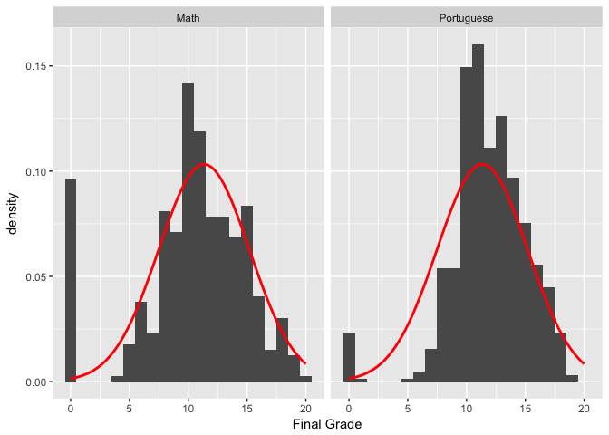
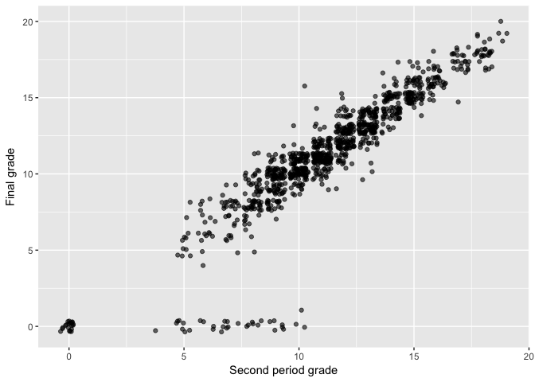
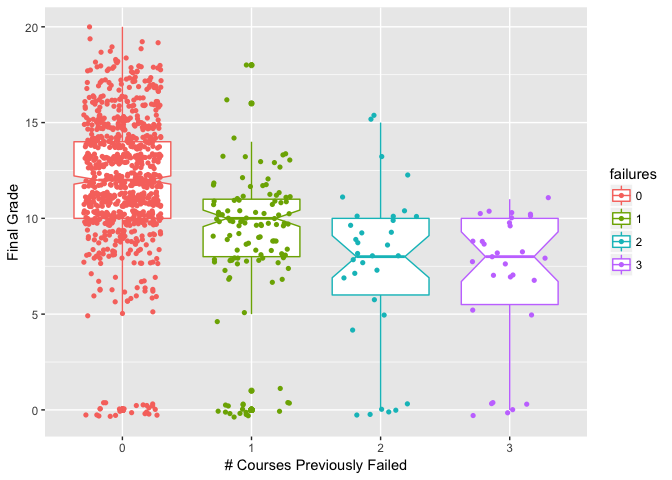
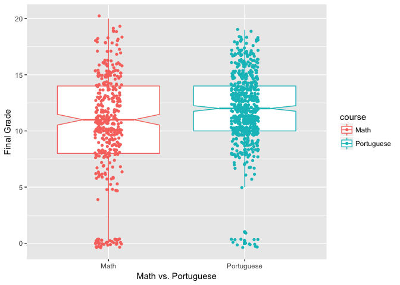

    ## Loading tidyverse: ggplot2
    ## Loading tidyverse: tibble
    ## Loading tidyverse: tidyr
    ## Loading tidyverse: readr
    ## Loading tidyverse: purrr
    ## Loading tidyverse: dplyr

    ## Conflicts with tidy packages ----------------------------------------------

    ## filter(): dplyr, stats
    ## lag():    dplyr, stats

The Problem
===========

Education is a staggeringly large project. In the United States alone, over 55 million children are enrolled in grades preK-12, and over 20 million adults attend American colleges and universities (source: National Center for Educational Statistics, <https://nces.ed.gov/>). Millions more nontraditional students are enrolled in university-sponsored MOOCs and other online programs, such as those offered by Coursera, edX, Khan Academy, and Springboard. The sheer volume of learning going on every day is heartening to all who recognize education as the single best pathway to the full realization of a person's potential.

However, the project of education fails for too many students. Numerous reports show that over a million students drop out of American high schools each year, and nearly half of American college students do not complete a degree within six years. The cost to these individuals in lost opportunity, and the societal cost of increased poverty and alienation, are profound concerns.

Educational institutions and programs need to be able to identify those students most at risk of failure early enough to intervene with appropriate support and remediation. They also need to identify students who may find a course so easy that they would benefit from interventions in the form of extra challenges and advanced opportunities. Data analysis can predict which students would benefit from this extra consideration, greatly increasing learning, graduation rates, and, ultimately, human well-being.

The Data
========

The University of California, Irvine, Machine Learning Repository includes a student performance dataset collected at two secondary schools in Portugal in 2008. It records students' performance in math and/or Portuguese, and also thirty other attributes that vary from mother's level of education to weekend alcohol consumption. The dataset can be found at <http://archive.ics.uci.edu/ml/datasets/Student+Performance>.

Citation: P. Cortez and A. Silva. Using Data Mining to Predict Secondary School Student Performance. In A. Brito and J. Teixeira Eds., Proceedings of 5th FUture BUsiness TEChnology Conference (FUBUTEC 2008) pp. 5-12, Porto, Portugal, April, 2008, EUROSIS, ISBN 978-9077381-39-7.

The dataset includes 34 variables. Five of these (G1 (first period grade), G2 (second period grade), G3 (final grade), school (Gabriel Pereira or Mousinho da Silveira), and number of absences) were gleaned from students' academic records, and the rest were collected through a questionnaire. A description/explanation of each variable can be found here: <https://github.com/gwenrino/Springboard_Data_Science_Intro/blob/master/Capstone/Data/student.txt>

Data Wrangling
==============

The biggest challenge in wrangling and tidying the data was to decide how to deal with the two initial datasets, one of math scores and one of Portuguese scores, since the supplementary information about the data indicated that some students appeared in both datasets. I experimented with various ways to find the intersection between the math and Portuguese datasets, including collapsing the course distinction in the merged dataset by averaging math and Portuguese grades for those students who appeared in both datasets.

Ultimately, I decided that since my goal was to accurately predict final grades, and success in math seems a separate concern from success in Portuguese, it made sense to consider each course (math or Portuguese) to be a distinct and important attribute in and of itself. I created a combined dataset, d\_total, that includes all the observations and also a new attribute for course. In creating this dataset, I also converted many of the predictor variables to factors and renamed the levels for clarity.

Here is my code:

``` r
d_math <- read.csv2("~/Desktop/Springboard_Data_Science_Intro/Capstone/Data/student-mat.csv")
d_port <- read.csv2("~/Desktop/Springboard_Data_Science_Intro/Capstone/Data/student-por.csv")

# Tidy up variable types, labels of variables
d_math$studytime <- factor(d_math$studytime, labels = c("<2 hrs", "2-5 hrs", "5-10 hrs", ">10 hrs"))
d_port$studytime <- factor(d_port$studytime, labels = c("<2 hrs", "2-5 hrs", "5-10 hrs", ">10 hrs"))
d_math$failures <- factor(d_math$failures, labels = c("0", "1", "2", "3"))
d_port$failures <- factor(d_port$failures, labels = c("0", "1", "2", "3"))
d_math$famsize <- factor(d_math$famsize, labels = c(">3", "<=3"))
d_port$famsize <- factor(d_port$famsize, labels = c(">3", "<=3"))
d_math$Medu <- factor(d_math$Medu, labels = c("None", "Primary", "Middle", "Secondary", "Higher"))
d_port$Medu <- factor(d_port$Medu, labels = c("None", "Primary", "Middle", "Secondary", "Higher"))
d_math$Fedu <- factor(d_math$Fedu, labels = c("None", "Primary", "Middle", "Secondary", "Higher"))
d_port$Fedu <- factor(d_port$Fedu, labels = c("None", "Primary", "Middle", "Secondary", "Higher"))
d_math$traveltime <- factor(d_math$traveltime, labels = c("<15 min", "15-30 min", "30-60 min", ">60 min"))
d_port$traveltime <- factor(d_port$traveltime, labels = c("<15 min", "15-30 min", "30-60 min", ">60 min"))
d_math$famrel <- factor(d_math$famrel, labels = c("Very Bad", "Poor", "Fair", "Good", "Excellent"))  
d_port$famrel <- factor(d_port$famrel, labels = c("Very Bad", "Poor", "Fair", "Good", "Excellent")) 
d_math$freetime <- factor(d_math$freetime, labels = c("Very Low", "Low", "Medium", "High", "Very High"))
d_port$freetime <- factor(d_port$freetime, labels = c("Very Low", "Low", "Medium", "High", "Very High"))
d_math$goout <- factor(d_math$goout, labels = c("Very Low", "Low", "Medium", "High", "Very High"))
d_port$goout <- factor(d_port$goout, labels = c("Very Low", "Low", "Medium", "High", "Very High"))
d_math$Dalc <- factor(d_math$Dalc, labels = c("Very Low", "Low", "Medium", "High", "Very High"))
d_port$Dalc <- factor(d_port$Dalc, labels = c("Very Low", "Low", "Medium", "High", "Very High"))
d_math$Walc <- factor(d_math$Walc, labels = c("Very Low", "Low", "Medium", "High", "Very High"))
d_port$Walc <- factor(d_port$Walc, labels = c("Very Low", "Low", "Medium", "High", "Very High"))
d_math$health <- factor(d_math$health, labels = c("Very Bad", "Poor", "Fair", "Good", "Excellent"))  
d_port$health <- factor(d_port$health, labels = c("Very Bad", "Poor", "Fair", "Good", "Excellent")) 

course <- rep("math", times = length(d_math$school))
d_math <- cbind(d_math, course)

course <- rep("port", times = length(d_port$school))
d_port <- cbind(d_port, course)

d_total <- rbind(d_math, d_port)
d_total$course <- factor(d_total$course, labels = c("Math", "Portuguese"))
```

Exploration of the Data
=======================

An exploration of the dependent variable, G3, revealed a near-normal distribution (except for a large density at G3=0), with significant differences between final grades in math and final grades in Portuguese.

``` r
ggplot(d_total, aes(x = G3)) +
  geom_histogram(aes(y = ..density..), binwidth = 1) +
  stat_function(fun = dnorm,
                args = list(mean = mean(d_total$G3, na.rm = TRUE), sd = sd(d_total$G3, na.rm = TRUE)),
                lwd = 1,
                col = "red") +
  xlab("Final Grade") +
  facet_grid(. ~ course) 
```



``` r
t.test(G3 ~ course, data = d_total) # p-value = 2.215e-08, significant
```

    ## 
    ##  Welch Two Sample t-test
    ## 
    ## data:  G3 by course
    ## t = -5.6664, df = 633.3, p-value = 2.215e-08
    ## alternative hypothesis: true difference in means is not equal to 0
    ## 95 percent confidence interval:
    ##  -2.0074678 -0.9741709
    ## sample estimates:
    ##       mean in group Math mean in group Portuguese 
    ##                 10.41519                 11.90601

The most significant predictor variables, by far, are interim grades G1 and G2, which show a very strong linear relationship to G3.

``` r
ggplot(d_total, aes(x=G1, y=G3)) +
         geom_point(position = "jitter", alpha=0.6) +
         xlab("First period grade") + ylab("Final grade")
```


``` r
ggplot(d_total, aes(x=G2, y=G3)) +
  geom_point(position = "jitter", alpha=0.6) +
  xlab("Second period grade") + ylab("Final grade")
```



``` r
summary(aov(G3 ~ G1 + G2, data = d_total)) # ANOVA confirms significance of G1 and G2.
```

    ##               Df Sum Sq Mean Sq F value Pr(>F)    
    ## G1             1  10200   10200    4063 <2e-16 ***
    ## G2             1   2766    2766    1102 <2e-16 ***
    ## Residuals   1041   2614       3                   
    ## ---
    ## Signif. codes:  0 '***' 0.001 '**' 0.01 '*' 0.05 '.' 0.1 ' ' 1

The other most significant predictor variables are "failures" and "course".

FAILURES (previous failures in the subject area)

``` r
ggplot(d_total, aes(x=failures, y=G3,colour=failures)) + 
  geom_boxplot(notch = T) +
  xlab("# Courses Previously Failed") + ylab("Final Grade")+
  geom_jitter(shape=16, position=position_jitter(0.3))
```



``` r
# Calculate percentage of students at each level of "failures" for whom G3 < 2.

nrow(d_total[d_total$G3 < 2 & d_total$failures == 0, ]) / nrow(d_total[d_total$failures == 0, ]) 
```

    ## [1] 0.02787456

``` r
nrow(d_total[d_total$G3 < 2 & d_total$failures == 1, ]) / nrow(d_total[d_total$failures == 1, ])
```

    ## [1] 0.15

``` r
nrow(d_total[d_total$G3 < 2 & d_total$failures == 2, ]) / nrow(d_total[d_total$failures == 2, ]) 
```

    ## [1] 0.1818182

``` r
nrow(d_total[d_total$G3 < 2 & d_total$failures == 3, ]) / nrow(d_total[d_total$failures == 3, ])
```

    ## [1] 0.2

``` r
summary(aov(G3 ~ failures, data = d_total)) # p-value < 2e-16, significant.
```

    ##               Df Sum Sq Mean Sq F value Pr(>F)    
    ## failures       3   2568   856.0   68.43 <2e-16 ***
    ## Residuals   1040  13011    12.5                   
    ## ---
    ## Signif. codes:  0 '***' 0.001 '**' 0.01 '*' 0.05 '.' 0.1 ' ' 1

COURSE (math or Portuguese)

``` r
ggplot(d_total, aes(x=course, y=G3,colour=course)) + 
  geom_boxplot(notch = T) +
  xlab("Math vs. Portuguese") + ylab("Final Grade")+
  geom_jitter(shape=16, position=position_jitter(0.1))
```



``` r
t.test(G3 ~ course, data = d_total) # p-value = 2.215e-08, significant
```

    ## 
    ##  Welch Two Sample t-test
    ## 
    ## data:  G3 by course
    ## t = -5.6664, df = 633.3, p-value = 2.215e-08
    ## alternative hypothesis: true difference in means is not equal to 0
    ## 95 percent confidence interval:
    ##  -2.0074678 -0.9741709
    ## sample estimates:
    ##       mean in group Math mean in group Portuguese 
    ##                 10.41519                 11.90601

Nearly all the predictor variables suggest at least some correlation to G3, so I used forward- and backward- stepwise selection to try to identify the most likely combination of predictor variables for a good model.

First I did this without G1 and G2, because it would be more impactful on educational practice to be able to predict a student's grade BEFORE G1.

Here is my code, and the outcomes:

``` r
library(leaps)
regfit.fwd.1 <- regsubsets(G3 ~ . -G1 -G2, data = d_total, method = "forward")
regfit.bwd.1 <- regsubsets(G3 ~ . -G1 -G2, data = d_total, method = "backward")

summary(regfit.fwd.1) 
# Best 1 var mod = failures1
# Best 2 var mod = + failures3
# Best 3 var mod = + failures2 
# Best 4 var mod = + coursePortuguese
# Best 5 var mod = + higheryes
# Best 6 var mod = + schoolMS
# Best 7 var mod = + MeduHigher
# Best 8 var mod = + schoolsupyes
summary(regfit.bwd.1) 
# Best 1 var mod = failures1
# Best 2 var mod = + failures3
# Best 3 var mod = + failures2 
# Best 4 var mod = + coursePortuguese
# Best 5 var mod = + higheryes
# Best 6 var mod = + schoolMS
# Best 7 var mod = + schoolsupyes
# Best 8 var mod = + studytime5-10 hrs
```

I also used forward- and backward- stepwise selection with G1 and G2 included, with quite different results:

``` r
regfit.fwd.2 <- regsubsets(G3 ~ ., data = d_total, method = "forward")
regfit.bwd.2 <- regsubsets(G3 ~ ., data = d_total, method = "backward")

summary(regfit.fwd.2)
# Best 1 var mod = G2
# Best 2 var mod = + coursePortuguese
# Best 3 var mod = + G1
# Best 4 var mod = + absences
# Best 5 var mod = + failures1
# Best 6 var mod = + traveltime>60 min
# Best 7 var mod = + DalcLow
# Best 8 var mod = + gooutVery High
summary(regfit.bwd.2)
# Best 1 var mod = G2
# Best 2 var mod = + coursePortuguese
# Best 3 var mod = + G1
# Best 4 var mod = + absences
# Best 5 var mod = + failures1
# Best 6 var mod = + traveltime>60 min
# Best 7 var mod = + DalcLow
# Best 8 var mod = + romanticyes
```

Modeling
========

I tried and tested various combinations of the variables identified by stepwise selection to build a linear regression model that would predict G3 as a numeric.

No model that excluded G1 and G2 was a good fit at all, according to F-values and R-squared values. The best one I was able to create, with the variables "failures", "course", "higher", and "school", was still very weak, with R-squ = .226 and F-stat = 50.4

``` r
lin.model.4 <- lm(G3 ~ failures + course + higher + school, data = d_total)
```

All linear regression models that included G1 and/or G2 were significantly better than this, and in fact the very best linear model used only G1 and G2 as predictors. Results: R-squ = .832 and F-stat = 2582

``` r
lin.model.7 <- lm(G3 ~ G1 + G2, data = d_total)
```

This outcome aligns with the conclusions of the original researchers, Cortez and Silva, who wrote, "The obtained results reveal that it is possible to achieve a high predictive accuracy, provided that the first and/or second school period grades are known." However, as I mentioned above, a model that depends on interim grades to predict final grades is not actually very useful for problem-solving in the education field.

Evolving Ideas
==============

Eventually, my understanding evolved to recognize that to be useful for working educators, it was actually less important to predict the numerical grades G3 themselves than to identify students who would benefit from extra help, either remedial help because they are at risk of failing or else extra challenge because the course is too easy for them.

In order to accomplish this, I did one further wrangling step in which I converted G3 to a categorical variable called "outcome" with three levels, "fail", "good", and "too easy".

Here is my code:

``` r
d_math <- d_math %>% mutate(outcome=ifelse(G3<8,"fail",ifelse(G3<16,"good","too easy"))) %>%
  select(-G3)
d_port <- d_port %>% mutate(outcome=ifelse(G3<8,"fail",ifelse(G3<16,"good","too easy"))) %>%
  select(-G3)
d_total <- rbind(d_math, d_port)
```

Now I am busy testing different classification models, LDA and decision trees, to attempt to discover the model that best predicts the newly defined categorical variable "outcome".
